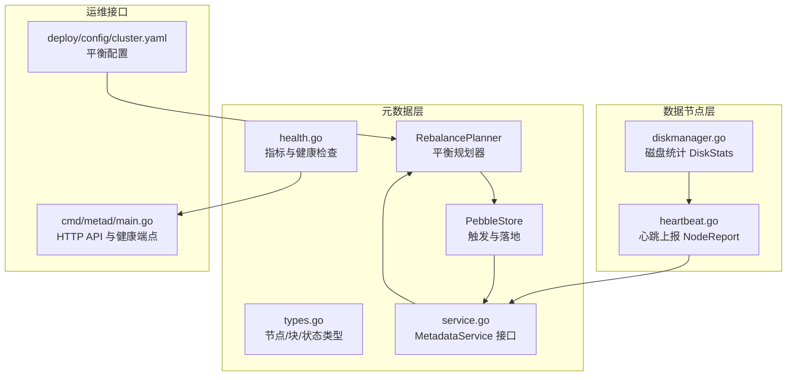
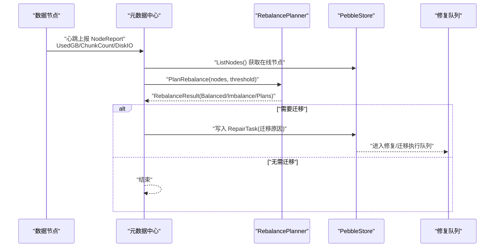
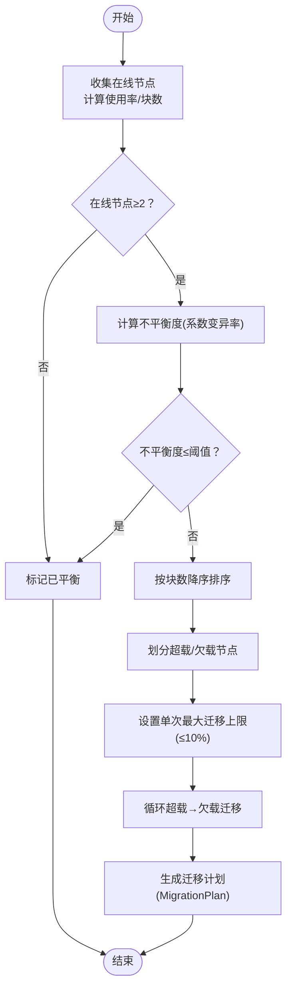
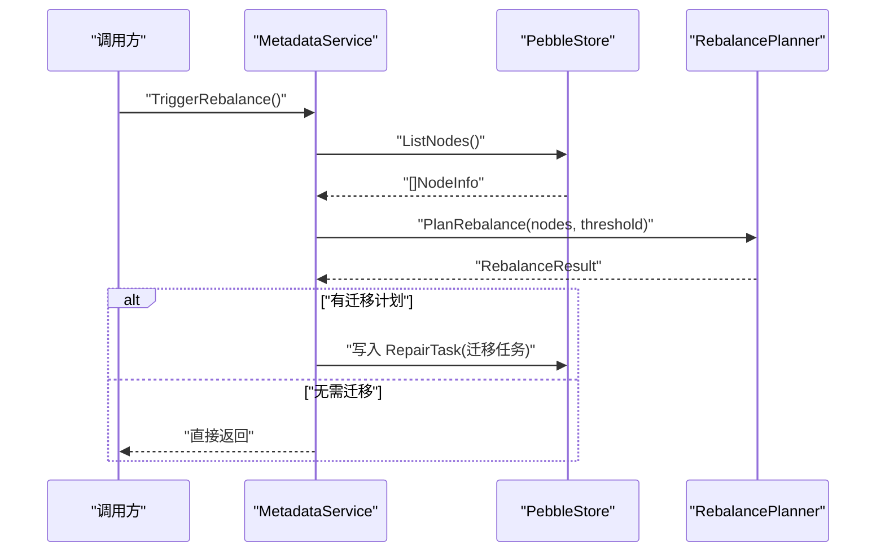
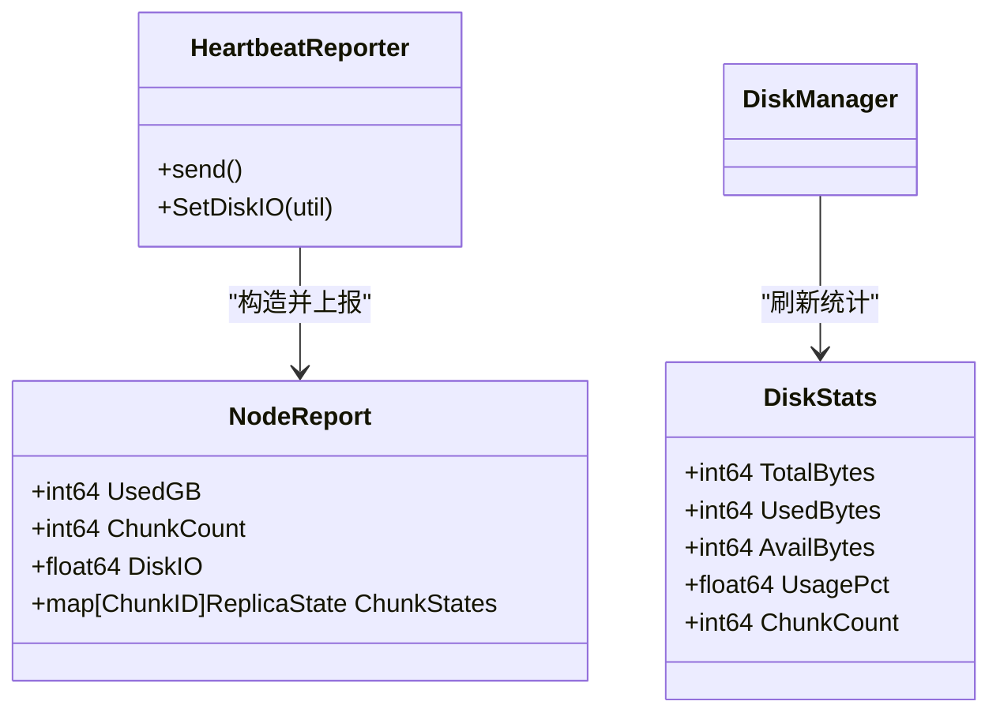
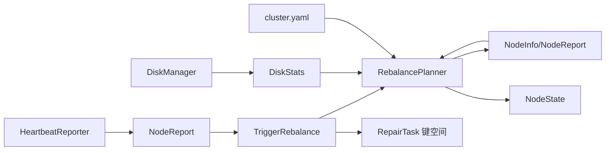

# 数据平衡

<cite>
**本文引用的文件**
- [nufs-core/metadata/balance.go](file://nufs-core/metadata/balance.go)
- [nufs-core/metadata/balance_test.go](file://nufs-core/metadata/balance_test.go)
- [nufs-core/metadata/types.go](file://nufs-core/metadata/types.go)
- [nufs-core/metadata/pebble_store.go](file://nufs-core/metadata/pebble_store.go)
- [nufs-core/metadata/health.go](file://nufs-core/metadata/health.go)
- [nufs-core/metadata/service.go](file://nufs-core/metadata/service.go)
- [nufs-core/datanode/heartbeat.go](file://nufs-core/datanode/heartbeat.go)
- [nufs-core/datanode/diskmanager.go](file://nufs-core/datanode/diskmanager.go)
- [nufs-core/cmd/metad/main.go](file://nufs-core/cmd/metad/main.go)
- [nufs-core/deploy/config/cluster.yaml](file://nufs-core/deploy/config/cluster.yaml)
</cite>

## 目录
1. [简介](#简介)
2. [项目结构](#项目结构)
3. [核心组件](#核心组件)
4. [架构总览](#架构总览)
5. [详细组件分析](#详细组件分析)
6. [依赖分析](#依赖分析)
7. [性能考虑](#性能考虑)
8. [故障排除指南](#故障排除指南)
9. [结论](#结论)
10. [附录](#附录)

## 简介
本文件系统性阐述 NUFS 分布式文件系统的“数据平衡”机制，覆盖以下方面：
- 集群平衡算法与负载均衡策略
- 触发条件与平衡流程
- 磁盘空间监控与节点负载评估
- 数据重新分布策略
- 平衡配置参数、性能影响与监控指标
- 最佳实践与故障排除
- 如何避免频繁迁移与提升平衡效率

## 项目结构
围绕“数据平衡”的关键代码分布在元数据层与数据节点层：
- 元数据层：RebalancePlanner（平衡规划）、PebbleStore（触发与落地）、类型定义（NodeInfo/NodeReport 等）
- 数据节点层：心跳上报（NodeReport）与磁盘统计（DiskManager），用于提供平衡输入
- 运维接口：元数据中心服务暴露触发入口与健康/指标端点
- 配置文件：cluster.yaml 提供阈值、扫描间隔等参数

**图表来源**
- [nufs-core/metadata/balance.go:46-177](file://nufs-core/metadata/balance.go#L46-L177)
- [nufs-core/metadata/pebble_store.go:1135-1163](file://nufs-core/metadata/pebble_store.go#L1135-L1163)
- [nufs-core/metadata/types.go:129-162](file://nufs-core/metadata/types.go#L129-L162)
- [nufs-core/metadata/health.go:16-116](file://nufs-core/metadata/health.go#L16-L116)
- [nufs-core/metadata/service.go:16-67](file://nufs-core/metadata/service.go#L16-L67)
- [nufs-core/datanode/heartbeat.go:71-100](file://nufs-core/datanode/heartbeat.go#L71-L100)
- [nufs-core/datanode/diskmanager.go:47-120](file://nufs-core/datanode/diskmanager.go#L47-L120)
- [nufs-core/cmd/metad/main.go:152-219](file://nufs-core/cmd/metad/main.go#L152-L219)
- [nufs-core/deploy/config/cluster.yaml:58-62](file://nufs-core/deploy/config/cluster.yaml#L58-L62)

**章节来源**
- [nufs-core/metadata/balance.go:46-177](file://nufs-core/metadata/balance.go#L46-L177)
- [nufs-core/metadata/pebble_store.go:1135-1163](file://nufs-core/metadata/pebble_store.go#L1135-L1163)
- [nufs-core/metadata/types.go:129-162](file://nufs-core/metadata/types.go#L129-L162)
- [nufs-core/metadata/health.go:16-116](file://nufs-core/metadata/health.go#L16-L116)
- [nufs-core/metadata/service.go:16-67](file://nufs-core/metadata/service.go#L16-L67)
- [nufs-core/datanode/heartbeat.go:71-100](file://nufs-core/datanode/heartbeat.go#L71-L100)
- [nufs-core/datanode/diskmanager.go:47-120](file://nufs-core/datanode/diskmanager.go#L47-L120)
- [nufs-core/cmd/metad/main.go:152-219](file://nufs-core/cmd/metad/main.go#L152-L219)
- [nufs-core/deploy/config/cluster.yaml:58-62](file://nufs-core/deploy/config/cluster.yaml#L58-L62)

## 核心组件
- RebalancePlanner：负责计算节点负载、评估集群不平衡度、生成迁移计划
- RebalanceResult/MigrationPlan：描述一次平衡的结果与具体迁移任务
- NodeLoad/NodeInfo/NodeReport：承载节点维度的负载与状态信息
- TriggerRebalance：元数据中心服务触发入口，将计划转化为修复任务
- 心跳上报与磁盘统计：为平衡提供输入（UsedGB/ChunkCount/DiskIO）

**章节来源**
- [nufs-core/metadata/balance.go:14-44](file://nufs-core/metadata/balance.go#L14-L44)
- [nufs-core/metadata/types.go:129-162](file://nufs-core/metadata/types.go#L129-L162)
- [nufs-core/metadata/pebble_store.go:1135-1163](file://nufs-core/metadata/pebble_store.go#L1135-L1163)

## 架构总览
下图展示从“心跳上报”到“平衡触发与执行”的完整链路。

**图表来源**
- [nufs-core/datanode/heartbeat.go:71-100](file://nufs-core/datanode/heartbeat.go#L71-L100)
- [nufs-core/metadata/pebble_store.go:1135-1163](file://nufs-core/metadata/pebble_store.go#L1135-L1163)
- [nufs-core/metadata/balance.go:46-177](file://nufs-core/metadata/balance.go#L46-L177)

## 详细组件分析

### 组件一：RebalancePlanner（平衡规划器）
- 输入：节点列表（NodeInfo），包含 ChunkCount/CapacityGB/UsedGB/State 等
- 计算步骤：
  - 过滤离线节点，仅对在线节点进行评估
  - 基于“每节点块数”计算不平衡度（使用系数变异率）
  - 若未达到阈值则返回“已平衡”
  - 否则按块数排序，识别超载/欠载节点
  - 限制单次最大迁移数量（最多总块数的 10%）
  - 生成迁移计划（源节点→目标节点），优先填充欠载节点
- 特殊场景：
  - 节点退役：PlanDecommission 将该节点所有块迁移到可用节点（高优先级）

**图表来源**
- [nufs-core/metadata/balance.go:46-177](file://nufs-core/metadata/balance.go#L46-L177)

**章节来源**
- [nufs-core/metadata/balance.go:46-177](file://nufs-core/metadata/balance.go#L46-L177)
- [nufs-core/metadata/balance_test.go:7-79](file://nufs-core/metadata/balance_test.go#L7-L79)

### 组件二：TriggerRebalance（触发与落地）
- 元数据中心服务提供 TriggerRebalance 接口
- 流程：
  - 列出当前在线节点
  - 调用 RebalancePlanner 生成结果
  - 若需迁移，则将每个迁移计划转换为 RepairTask 写入存储键空间
- 修复执行器读取 RepairTask 并实际发起数据迁移

**图表来源**
- [nufs-core/metadata/pebble_store.go:1135-1163](file://nufs-core/metadata/pebble_store.go#L1135-L1163)
- [nufs-core/metadata/service.go:62-63](file://nufs-core/metadata/service.go#L62-L63)

**章节来源**
- [nufs-core/metadata/pebble_store.go:1135-1163](file://nufs-core/metadata/pebble_store.go#L1135-L1163)
- [nufs-core/metadata/service.go:62-63](file://nufs-core/metadata/service.go#L62-L63)

### 组件三：心跳与磁盘监控（输入来源）
- 心跳上报 NodeReport：包含 UsedGB、ChunkCount、DiskIO、各块副本状态映射
- 磁盘管理 DiskManager：周期刷新磁盘统计（TotalBytes/UsedBytes/ChunkCount/UsagePct）
- 二者共同构成 RebalancePlanner 的输入，用于评估节点负载与容量使用

**图表来源**
- [nufs-core/metadata/types.go:156-162](file://nufs-core/metadata/types.go#L156-L162)
- [nufs-core/datanode/heartbeat.go:71-100](file://nufs-core/datanode/heartbeat.go#L71-L100)
- [nufs-core/datanode/diskmanager.go:47-120](file://nufs-core/datanode/diskmanager.go#L47-L120)

**章节来源**
- [nufs-core/metadata/types.go:156-162](file://nufs-core/metadata/types.go#L156-L162)
- [nufs-core/datanode/heartbeat.go:71-100](file://nufs-core/datanode/heartbeat.go#L71-L100)
- [nufs-core/datanode/diskmanager.go:172-184](file://nufs-core/datanode/diskmanager.go#L172-L184)

### 组件四：运维接口与健康/指标
- 元数据中心提供 /api/v1/metrics 与 /health 等端点，便于观测系统健康与吞吐延迟
- 健康检查包含错误率阈值判断，帮助定位平衡执行期间的异常

**章节来源**
- [nufs-core/cmd/metad/main.go:152-219](file://nufs-core/cmd/metad/main.go#L152-L219)
- [nufs-core/metadata/health.go:16-116](file://nufs-core/metadata/health.go#L16-L116)

## 依赖分析
- RebalancePlanner 依赖 NodeInfo/NodeReport 类型与 NodeState 状态
- TriggerRebalance 依赖 MetadataService 接口与 RepairTask 存储键空间
- 心跳与磁盘统计为 RebalancePlanner 提供实时输入
- 配置文件 cluster.yaml 提供阈值、扫描间隔等参数

**图表来源**
- [nufs-core/metadata/balance.go:46-177](file://nufs-core/metadata/balance.go#L46-L177)
- [nufs-core/metadata/types.go:129-162](file://nufs-core/metadata/types.go#L129-L162)
- [nufs-core/metadata/pebble_store.go:1135-1163](file://nufs-core/metadata/pebble_store.go#L1135-L1163)
- [nufs-core/datanode/heartbeat.go:71-100](file://nufs-core/datanode/heartbeat.go#L71-L100)
- [nufs-core/datanode/diskmanager.go:47-120](file://nufs-core/datanode/diskmanager.go#L47-L120)
- [nufs-core/deploy/config/cluster.yaml:58-62](file://nufs-core/deploy/config/cluster.yaml#L58-L62)

**章节来源**
- [nufs-core/metadata/balance.go:46-177](file://nufs-core/metadata/balance.go#L46-L177)
- [nufs-core/metadata/types.go:129-162](file://nufs-core/metadata/types.go#L129-L162)
- [nufs-core/metadata/pebble_store.go:1135-1163](file://nufs-core/metadata/pebble_store.go#L1135-L1163)
- [nufs-core/datanode/heartbeat.go:71-100](file://nufs-core/datanode/heartbeat.go#L71-L100)
- [nufs-core/datanode/diskmanager.go:47-120](file://nufs-core/datanode/diskmanager.go#L47-L120)
- [nufs-core/deploy/config/cluster.yaml:58-62](file://nufs-core/deploy/config/cluster.yaml#L58-L62)

## 性能考虑
- 时间复杂度
  - RebalancePlanner：O(n log n) 用于排序，整体 O(n) 遍历；n 为在线节点数
  - 单次迁移上限为总块数的 10%，避免大规模抖动
- I/O 与网络
  - 平衡通过 RepairTask 异步执行，不阻塞元数据写路径
  - 心跳上报周期（默认 10s）与扫描间隔（默认 5m）可调，平衡频率与开销折中
- 指标观测
  - 使用 /api/v1/metrics 可观察操作总数、读写延迟、节点在线数等，辅助评估平衡对系统的影响

**章节来源**
- [nufs-core/metadata/balance.go:118-122](file://nufs-core/metadata/balance.go#L118-L122)
- [nufs-core/metadata/health.go:16-116](file://nufs-core/metadata/health.go#L16-L116)
- [nufs-core/cmd/metad/main.go:205-211](file://nufs-core/cmd/metad/main.go#L205-L211)

## 故障排除指南
- 现象：平衡未触发
  - 检查在线节点数是否小于 2
  - 检查不平衡度是否低于阈值
  - 检查心跳上报是否正常（/api/v1/nodes 与 /health）
- 现象：迁移计划过多或过少
  - 调整阈值与扫描间隔；单次最大迁移受“总块数×10%”限制
- 现象：退役节点无法迁移
  - 确认存在在线目标节点；若无可用节点会报错
- 现象：磁盘使用率高但未触发
  - 平衡基于“块数”不平衡度；如节点容量为 0 或未上报 UsedGB，可能影响评估
- 现象：错误率升高
  - 通过 /api/v1/metrics 的错误率阈值判断系统健康状况

**章节来源**
- [nufs-core/metadata/balance_test.go:7-79](file://nufs-core/metadata/balance_test.go#L7-L79)
- [nufs-core/metadata/balance.go:180-224](file://nufs-core/metadata/balance.go#L180-L224)
- [nufs-core/metadata/health.go:275-287](file://nufs-core/metadata/health.go#L275-L287)
- [nufs-core/cmd/metad/main.go:187-194](file://nufs-core/cmd/metad/main.go#L187-L194)

## 结论
NUFS 的数据平衡机制以“块数不平衡度”为核心指标，结合单次迁移上限与优先级策略，实现渐进式、低冲击的集群再平衡。通过心跳与磁盘统计提供输入，配合元数据中心的异步修复执行，既保证了稳定性，又具备良好的可观测性与可调性。

## 附录

### 平衡配置参数
- 阈值 threshold：当不平衡度超过该值时触发平衡（默认 0.1）
- 单次最大迁移上限：不超过总块数的 10%
- 扫描间隔 scan_interval：控制平衡触发频率（默认 5m）
- 心跳间隔 heartbeat_interval：数据节点上报周期（默认 10s）

**章节来源**
- [nufs-core/deploy/config/cluster.yaml:58-62](file://nufs-core/deploy/config/cluster.yaml#L58-L62)
- [nufs-core/metadata/balance.go:51-53](file://nufs-core/metadata/balance.go#L51-L53)
- [nufs-core/metadata/balance.go:118-122](file://nufs-core/metadata/balance.go#L118-L122)
- [nufs-core/datanode/heartbeat.go:38-69](file://nufs-core/datanode/heartbeat.go#L38-L69)

### 监控指标建议
- 集群层面
  - 不平衡度（Imbalance）：衡量当前集群的块数分布均匀性
  - 迁移计划数量与完成数量：反映平衡执行进度
- 节点层面
  - 每节点块数（ChunkCount）与使用率（UsedGB/CapacityGB）
  - 磁盘 I/O 利用率（DiskIO）与写入/读取计数
- 元数据中心
  - 操作总数、读写延迟（P50/P99）、错误率、节点在线数

**章节来源**
- [nufs-core/metadata/balance.go:29-34](file://nufs-core/metadata/balance.go#L29-L34)
- [nufs-core/metadata/types.go:156-162](file://nufs-core/metadata/types.go#L156-L162)
- [nufs-core/metadata/health.go:16-116](file://nufs-core/metadata/health.go#L16-L116)

### 最佳实践
- 合理设置阈值与扫描间隔，避免频繁小幅度迁移引发抖动
- 在业务低峰期执行大规模退役或扩容，减少对在线业务的影响
- 结合磁盘容量与使用率，提前扩容或回收空间，降低平衡压力
- 定期检查 /health 与 /api/v1/metrics，确保系统健康与延迟可控