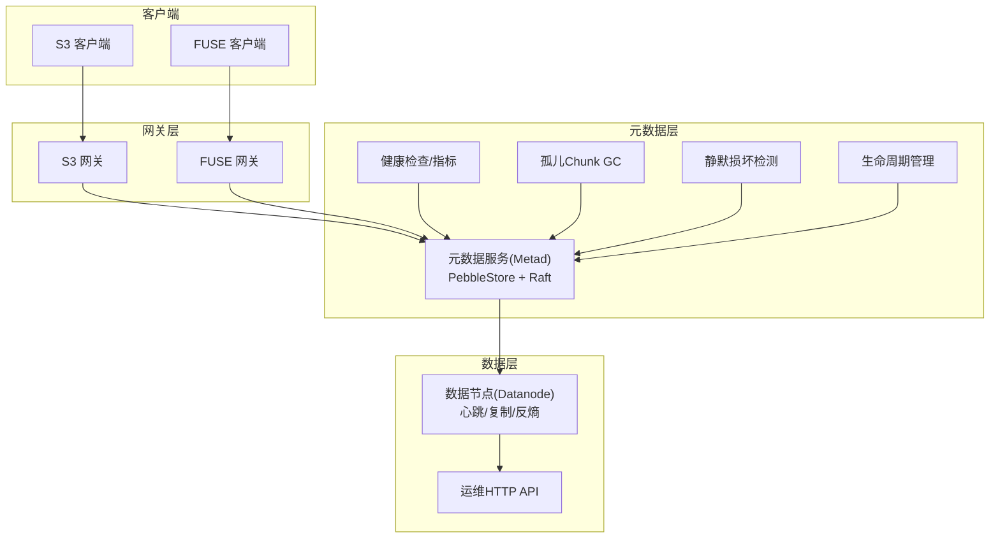
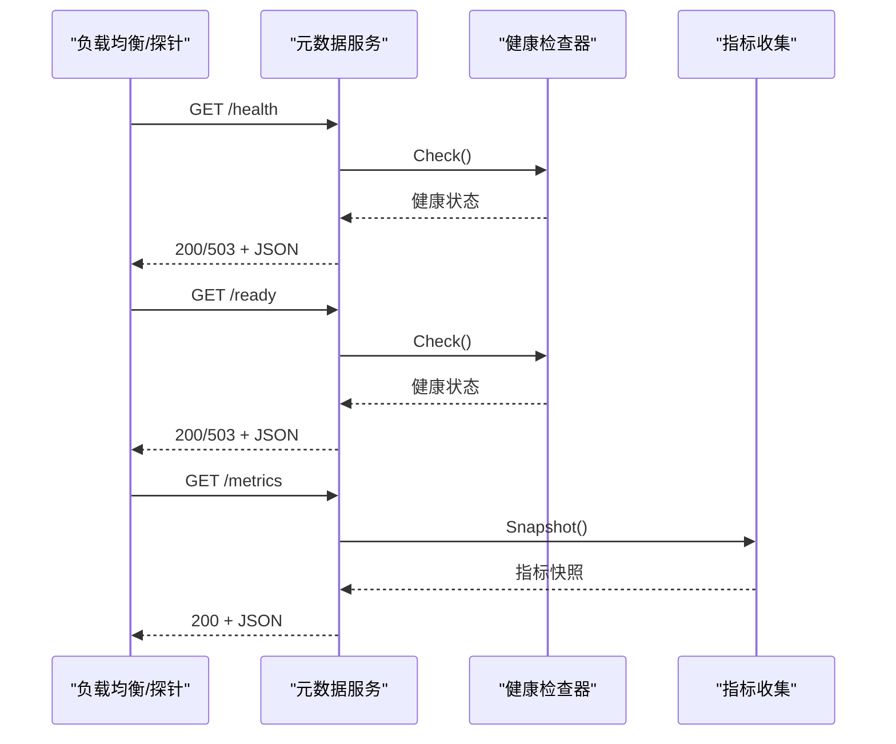
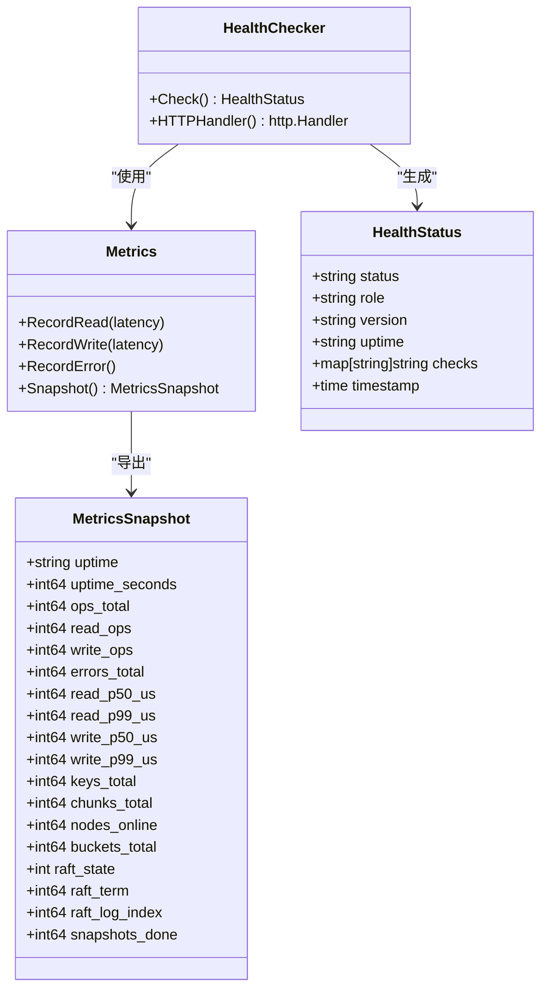
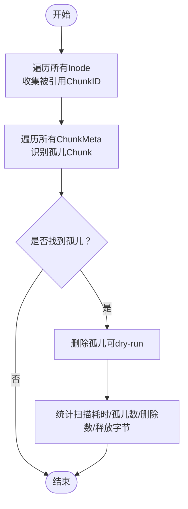
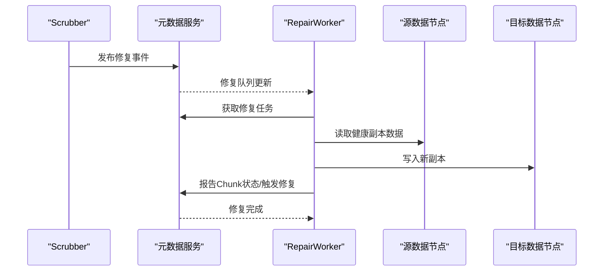
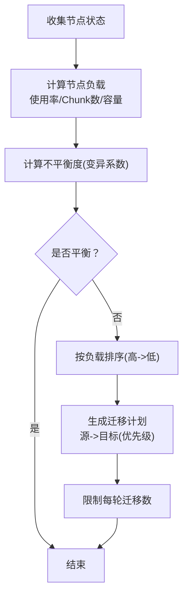
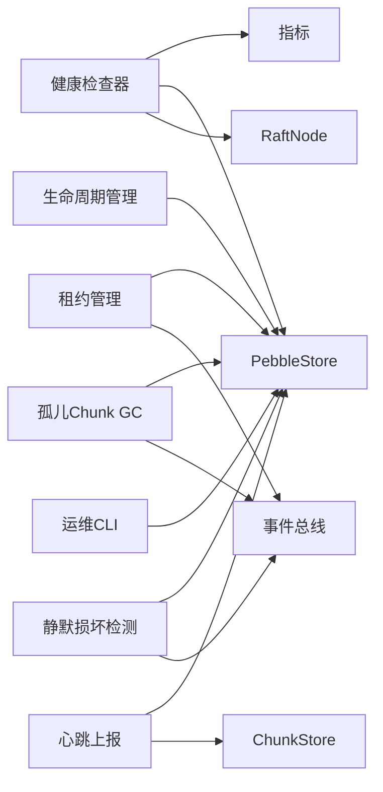

# 运维监控

<cite>
**本文引用的文件**
- [ARCHITECTURE.md](file://nufs-core/ARCHITECTURE.md)
- [cmd/metad/main.go](file://nufs-core/cmd/metad/main.go)
- [metadata/health.go](file://nufs-core/metadata/health.go)
- [metadata/service.go](file://nufs-core/metadata/service.go)
- [metadata/production.go](file://nufs-core/metadata/production.go)
- [metadata/balance.go](file://nufs-core/metadata/balance.go)
- [metadata/lifecycle.go](file://nufs-core/metadata/lifecycle.go)
- [cmd/ctl/main.go](file://nufs-core/cmd/ctl/main.go)
- [cmd/datanode/main.go](file://nufs-core/cmd/datanode/main.go)
- [datanode/heartbeat.go](file://nufs-core/datanode/heartbeat.go)
- [datanode/repair.go](file://nufs-core/datanode/repair.go)
- [deploy/config/cluster.yaml](file://nufs-core/deploy/config/cluster.yaml)
</cite>

## 目录
1. [简介](#简介)
2. [项目结构](#项目结构)
3. [核心组件](#核心组件)
4. [架构总览](#架构总览)
5. [详细组件分析](#详细组件分析)
6. [依赖关系分析](#依赖关系分析)
7. [性能考量](#性能考量)
8. [故障排查指南](#故障排查指南)
9. [结论](#结论)
10. [附录](#附录)

## 简介
本文件面向NUFS分布式文件系统的运维与监控，围绕健康检查、指标监控、垃圾回收、修复与维护、日志与告警、集群平衡与容量管理等主题，提供从架构到落地的完整运维指南。内容基于代码库中的实际实现，覆盖元数据服务、数据节点、网关与运维CLI工具，并给出监控仪表板配置思路与故障诊断流程。

## 项目结构
NUFS采用分层架构：客户端（S3/FUSE）→ 网关层 → 元数据层（Pebble+Raft）→ 数据层（DataNode）。运维监控贯穿各层，包括：
- 元数据服务：内置健康检查端点、指标导出、租约管理、孤儿Chunk GC、静默损坏检测（Scrubber）、生命周期管理、Raft状态
- 数据节点：心跳上报、复制引擎、反熵引擎、运维HTTP API
- 运维CLI：节点/桶查询、集群再平衡计划、触发再平衡、下线节点、查看修复队列、查看Raft Leader

**图表来源**
- [ARCHITECTURE.md](file://nufs-core/ARCHITECTURE.md)
- [cmd/metad/main.go](file://nufs-core/cmd/metad/main.go)
- [cmd/datanode/main.go](file://nufs-core/cmd/datanode/main.go)

**章节来源**
- [ARCHITECTURE.md](file://nufs-core/ARCHITECTURE.md)
- [cmd/metad/main.go](file://nufs-core/cmd/metad/main.go)
- [cmd/datanode/main.go](file://nufs-core/cmd/datanode/main.go)

## 核心组件
- 元数据服务（Metad）
  - 健康检查端点：/health、/ready、/metrics
  - 指标导出：操作总数、读写延迟（P50/P99）、错误计数、键/Chunk/节点/桶统计、Raft状态
  - 生产子系统：租约管理、孤儿Chunk GC、静默损坏检测、生命周期管理、事件总线
- 数据节点（Datanode）
  - 心跳上报：使用率、Chunk数量、磁盘IO、Chunk状态映射
  - 运维HTTP API：节点信息、Chunk列表、状态查询等
  - 复制与反熵：复制引擎、链式复制、反熵扫描
- 运维CLI（ctl）
  - 节点/桶查询、再平衡计划、触发再平衡、下线节点、修复队列、Leader信息

**章节来源**
- [metadata/health.go](file://nufs-core/metadata/health.go)
- [metadata/service.go](file://nufs-core/metadata/service.go)
- [metadata/production.go](file://nufs-core/metadata/production.go)
- [metadata/balance.go](file://nufs-core/metadata/balance.go)
- [metadata/lifecycle.go](file://nufs-core/metadata/lifecycle.go)
- [cmd/ctl/main.go](file://nufs-core/cmd/ctl/main.go)
- [cmd/datanode/main.go](file://nufs-core/cmd/datanode/main.go)

## 架构总览
下图展示运维监控的关键交互：健康检查端点、指标导出、GC/Scrubber/租约、心跳上报与运维CLI。

**图表来源**
- [metadata/health.go](file://nufs-core/metadata/health.go)
- [cmd/metad/main.go](file://nufs-core/cmd/metad/main.go)

**章节来源**
- [metadata/health.go](file://nufs-core/metadata/health.go)
- [cmd/metad/main.go](file://nufs-core/cmd/metad/main.go)

## 详细组件分析

### 健康检查与指标监控
- 健康检查端点
  - /health：综合健康状态（健康/降级/不健康），包含版本、运行时长、各项检查结果
  - /ready：就绪检查，用于Kubernetes就绪探针
  - /metrics：导出当前指标快照（操作总数、读写P50/P99、错误数、键/Chunk/节点/桶、Raft状态）
- 指标采集
  - 操作计数与延迟直方图（微秒级，固定大小环形缓冲）
  - 运行时长、键/Chunk/节点/桶总量、Raft状态/任期/日志索引/快照次数
- 指标来源与导出
  - 元数据服务启动时创建Metrics实例；健康检查器在Check()中汇总状态；/metrics端点直接返回快照

**图表来源**
- [metadata/health.go](file://nufs-core/metadata/health.go)

**章节来源**
- [metadata/health.go](file://nufs-core/metadata/health.go)
- [cmd/metad/main.go](file://nufs-core/cmd/metad/main.go)

### 垃圾回收策略（孤儿Chunk GC）
- 目标：定期扫描并删除无inode引用的孤儿Chunk，回收存储空间
- 流程
  - Phase 1：遍历所有Inode，收集被引用的ChunkID集合
  - Phase 2：遍历所有ChunkMeta，找出不在引用集中的孤儿
  - Phase 3：删除孤儿（dry-run模式仅统计不删除）
- 触发方式：周期性任务，默认间隔可通过服务选项配置
- 输出：扫描耗时、发现孤儿数、删除数、释放字节数

**图表来源**
- [metadata/production.go](file://nufs-core/metadata/production.go)

**章节来源**
- [metadata/production.go](file://nufs-core/metadata/production.go)

### 静默损坏检测与修复
- 静默损坏检测（Scrubber）
  - 规则：无副本、全部副本不健康、Sealed但无Checksum等标记为损坏
  - 行为：发布修复事件，进入修复队列
- 修复流程（数据节点侧）
  - RepairWorker周期扫描修复队列，定位健康源副本与可用目标节点
  - 触发元数据服务更新Chunk状态并生成修复任务
- 修复指标
  - 成功修复/失败计数，可用于告警阈值

**图表来源**
- [metadata/production.go](file://nufs-core/metadata/production.go)
- [datanode/repair.go](file://nufs-core/datanode/repair.go)

**章节来源**
- [metadata/production.go](file://nufs-core/metadata/production.go)
- [datanode/repair.go](file://nufs-core/datanode/repair.go)

### 集群平衡与数据再分配
- 平衡引擎（RebalancePlanner）
  - 输入：节点在线状态、Chunk数量、使用量、容量
  - 指标：不平衡度（基于变异系数）
  - 输出：迁移计划（源节点→目标节点，优先级）
- 下线节点再平衡（Decommission）
  - 生成将某节点所有Chunk迁移到其他节点的计划
- 配置项
  - 不平衡阈值、每轮最大迁移数、扫描间隔

**图表来源**
- [metadata/balance.go](file://nufs-core/metadata/balance.go)

**章节来源**
- [metadata/balance.go](file://nufs-core/metadata/balance.go)

### 生命周期管理与容量规划
- 生命周期规则
  - 过渡：按天数将文件迁移到更低成本的Tier（热→温→冷→归档）
  - 过期：按天数永久删除
- 执行引擎
  - 周期扫描桶内文件，匹配前缀与年龄，更新Tier或设置NLink=0触发删除
- 容量规划建议
  - 基于生命周期自动降级与过期，降低长期热数据占比
  - 结合平衡引擎输出，评估迁移对容量的影响

**章节来源**
- [metadata/lifecycle.go](file://nufs-core/metadata/lifecycle.go)

### 心跳上报与运维HTTP API
- 数据节点心跳
  - 每10秒上报：使用容量GB、Chunk数量、磁盘IO利用率、Chunk状态映射
  - 用于元数据服务评估节点健康与负载
- 运维HTTP API（Datanode）
  - 提供节点状态、Chunk列表、磁盘使用等查询接口
  - 便于自动化巡检与集成监控系统

**章节来源**
- [datanode/heartbeat.go](file://nufs-core/datanode/heartbeat.go)
- [cmd/datanode/main.go](file://nufs-core/cmd/datanode/main.go)

### 运维CLI工具（ctl）
- 功能清单
  - nodes：列出所有数据节点（ID/地址/机架/可用区/Tier/状态/Chunk数/使用/容量）
  - buckets：列出所有桶（名称/根Inode/策略/副本因子/创建时间）
  - rebalance：显示当前集群再平衡计划与不平衡度
  - decommission <id>：标记节点下线并触发迁移
  - repair-queue：查看待修复任务
  - trigger-rebalance：触发一次全集群再平衡
  - leader：显示Raft Leader地址
- 使用场景
  - 日常巡检、容量变更后的再平衡、节点下线前后的健康确认

**章节来源**
- [cmd/ctl/main.go](file://nufs-core/cmd/ctl/main.go)

## 依赖关系分析
- 元数据服务
  - 健康检查器依赖Metrics与PebbleStore/Raft状态
  - 租约管理、GC、Scrubber、生命周期引擎均通过事件总线协作
- 数据节点
  - 心跳上报依赖ChunkStore统计与元数据服务Heartbeat接口
  - 运维HTTP API由OpsServer提供
- CLI
  - 直接连接PebbleStore进行只读/触发式操作

**图表来源**
- [metadata/health.go](file://nufs-core/metadata/health.go)
- [metadata/service.go](file://nufs-core/metadata/service.go)
- [metadata/production.go](file://nufs-core/metadata/production.go)
- [datanode/heartbeat.go](file://nufs-core/datanode/heartbeat.go)
- [cmd/ctl/main.go](file://nufs-core/cmd/ctl/main.go)

**章节来源**
- [metadata/health.go](file://nufs-core/metadata/health.go)
- [metadata/service.go](file://nufs-core/metadata/service.go)
- [metadata/production.go](file://nufs-core/metadata/production.go)
- [datanode/heartbeat.go](file://nufs-core/datanode/heartbeat.go)
- [cmd/ctl/main.go](file://nufs-core/cmd/ctl/main.go)

## 性能考量
- 指标采样
  - 延迟直方图采用固定大小环形缓冲，写入O(1)，分位数计算O(N log N)，适合高QPS场景
- GC与Scrubber
  - 周期性扫描，建议结合业务低峰时段执行，避免与写放大叠加
- 心跳频率
  - 默认10秒，兼顾实时性与开销；可根据磁盘IO波动动态调整
- 再平衡
  - 每轮迁移上限可配置，避免对在线业务造成过大影响

[本节为通用指导，无需特定文件引用]

## 故障排查指南
- 健康检查异常
  - /health返回非健康：检查Pebble可读性、根Inode存在性、Raft状态、错误率阈值
  - /ready返回未就绪：等待初始化完成或检查服务bundle就绪通道
- 指标异常
  - P99延迟升高：结合读写延迟直方图定位热点；检查磁盘IO利用率与Chunk分布
  - 错误率过高：关注错误计数增长趋势，排查网络抖动或节点离线
- 孤儿Chunk与空间回收
  - 若GC未及时回收：确认GC间隔配置与扫描耗时；必要时启用dry-run模式审计
- 静默损坏与修复
  - Scrubber发现损坏：查看修复队列，确认RepairWorker运行状态与成功/失败计数
- 集群不平衡
  - 不平衡度持续偏高：检查阈值与每轮迁移上限；结合再平衡计划执行
- 节点下线与迁移
  - Decommission后Chunk未迁移：检查目标节点容量与可用性；确认再平衡计划生成

**章节来源**
- [metadata/health.go](file://nufs-core/metadata/health.go)
- [metadata/production.go](file://nufs-core/metadata/production.go)
- [metadata/balance.go](file://nufs-core/metadata/balance.go)
- [datanode/repair.go](file://nufs-core/datanode/repair.go)
- [cmd/ctl/main.go](file://nufs-core/cmd/ctl/main.go)

## 结论
NUFS提供了完善的运维监控基础：内置健康检查与指标导出、生产级GC/Scrubber/租约管理、生命周期与再平衡引擎，以及CLI与运维HTTP API。结合本文的监控仪表板配置思路与故障诊断流程，可实现对集群健康、容量与性能的持续可观测与主动治理。

[本节为总结，无需特定文件引用]

## 附录

### 监控仪表板配置建议
- 关键指标
  - 元数据服务：操作QPS、读写P99延迟、错误率、键/Chunk/节点/桶总数、Raft状态/任期/日志索引
  - 数据节点：使用容量GB、Chunk数量、磁盘IO利用率、Chunk状态分布
  - 运维任务：GC扫描耗时/释放字节、Scrubber扫描数/损坏数、修复成功率/失败数、再平衡迁移数
- 告警阈值示例
  - /health非健康、/ready不可用
  - 读P99>阈值、写P99>阈值
  - 错误率>5%、错误数突增
  - GC/Scrubber扫描耗时异常、修复失败累计
  - 集群不平衡度>阈值、再平衡迁移停滞

[本节为通用指导，无需特定文件引用]

### 部署与配置要点
- 集群配置文件包含元数据、数据节点、网关、放置策略、修复与再平衡参数
- 元数据服务支持Raft，需正确配置集群成员与快照/日志策略
- 数据节点需配置监听地址、数据目录、容量、Tier与拓扑信息

**章节来源**
- [deploy/config/cluster.yaml](file://nufs-core/deploy/config/cluster.yaml)