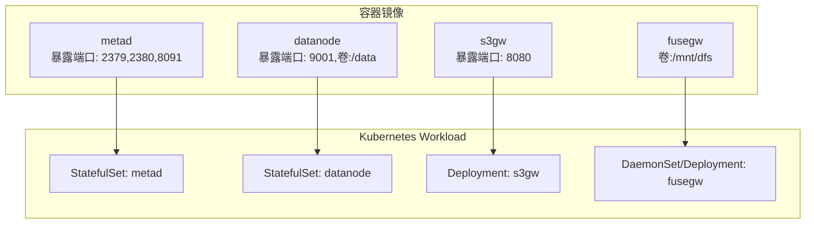
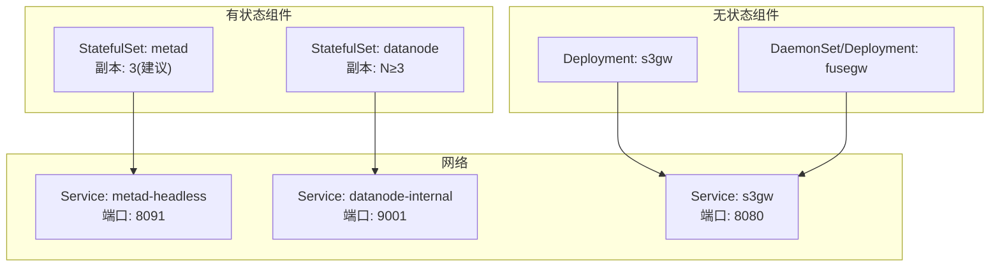
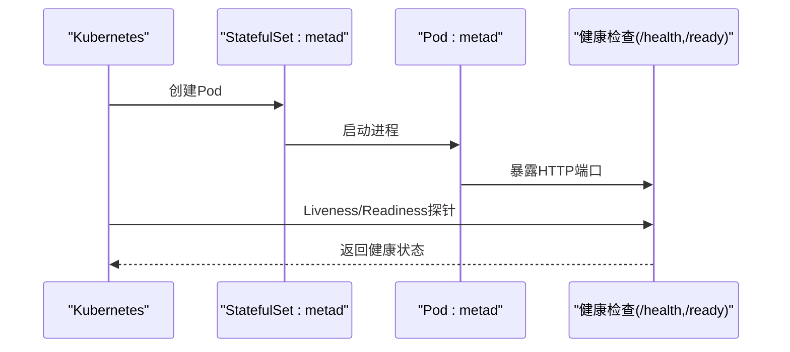
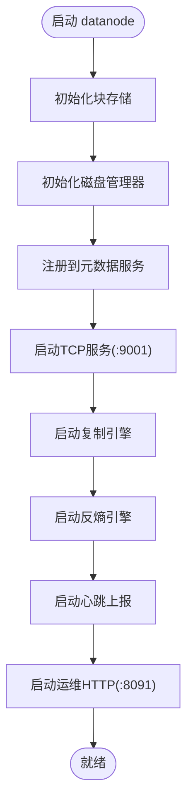
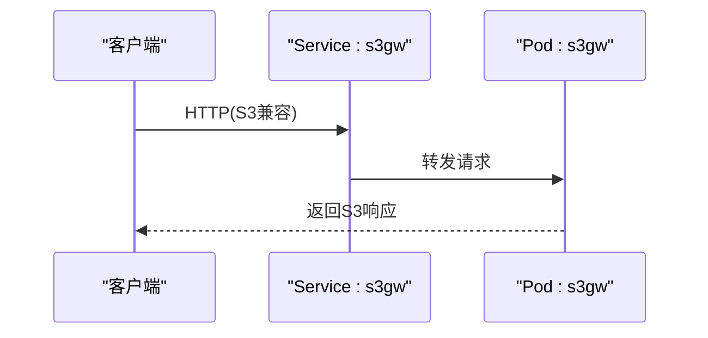
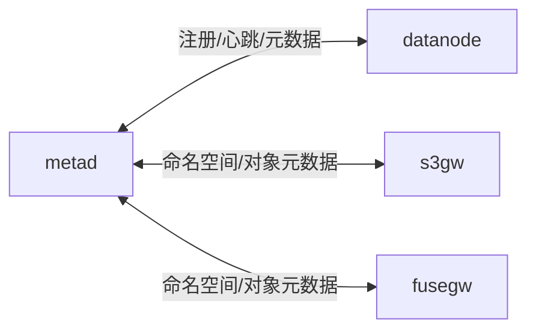

# Kubernetes部署

<cite>
**本文引用的文件**
- [Dockerfile](file://nufs-core/Dockerfile)
- [docker-compose.yml](file://nufs-core/docker-compose.yml)
- [cluster.yaml](file://nufs-core/deploy/config/cluster.yaml)
- [ARCHITECTURE.md](file://nufs-core/ARCHITECTURE.md)
- [main.go（元数据服务）](file://nufs-core/cmd/metad/main.go)
- [main.go（数据节点）](file://nufs-core/cmd/datanode/main.go)
- [main.go（S3网关）](file://nufs-core/cmd/s3gw/main.go)
- [main.go（FUSE网关）](file://nufs-core/cmd/fusegw/main.go)
- [service.go（元数据服务bundle）](file://nufs-core/metadata/service.go)
- [health.go（健康检查）](file://nufs-core/metadata/health.go)
- [ops.go（数据节点运维接口）](file://nufs-core/datanode/ops.go)
- [types.go（放置策略与分层）](file://nufs-core/metadata/types.go)
</cite>

## 目录
1. [简介](#简介)
2. [项目结构](#项目结构)
3. [核心组件](#核心组件)
4. [架构总览](#架构总览)
5. [详细组件分析](#详细组件分析)
6. [依赖关系分析](#依赖关系分析)
7. [性能考量](#性能考量)
8. [故障排查指南](#故障排查指南)
9. [结论](#结论)
10. [附录](#附录)

## 简介
本文件面向在Kubernetes集群中部署NUFS分布式文件系统的工程实践，覆盖以下主题：
- 如何以Deployment、StatefulSet和Service的方式部署各组件
- 持久化存储配置、ConfigMap与Secret管理
- Pod调度策略、资源配额与HPA自动扩缩容
- Helm Chart模板与kubectl部署命令
- 集群监控、日志聚合与故障恢复策略

## 项目结构
NUFS由“元数据服务（metad）+ 数据节点（datanode）+ 网关（S3/FUSE）”构成，容器镜像在Dockerfile中按多阶段构建，分别产出独立镜像，便于在Kubernetes中以不同Workload运行。

图表来源
- [Dockerfile:14-44](file://nufs-core/Dockerfile#L14-L44)

章节来源
- [Dockerfile:1-50](file://nufs-core/Dockerfile#L1-L50)

## 核心组件
- 元数据服务（metad）
  - 作用：KV存储（Pebble）、可选Raft共识、健康检查与运维接口
  - 关键端口：2379/2380（Raft）、8091（运维HTTP）
  - 健康探针：/health、/ready
- 数据节点（datanode）
  - 作用：本地块存储、复制引擎、心跳上报、运维接口
  - 关键端口：9001（数据TCP）、8091（运维HTTP）
  - 持久卷：/data
- S3网关（s3gw）
  - 作用：S3兼容API入口
  - 关键端口：8080
- FUSE网关（fusegw）
  - 作用：Linux挂载POSIX文件系统
  - 关键端口：无（依赖内核FUSE）
  - 持久卷：/mnt/dfs

章节来源
- [Dockerfile:21-44](file://nufs-core/Dockerfile#L21-L44)
- [main.go（元数据服务）:22-36](file://nufs-core/cmd/metad/main.go#L22-L36)
- [main.go（数据节点）:20-28](file://nufs-core/cmd/datanode/main.go#L20-L28)
- [main.go（S3网关）:18-25](file://nufs-core/cmd/s3gw/main.go#L18-L25)
- [main.go（FUSE网关）:17-22](file://nufs-core/cmd/fusegw/main.go#L17-L22)

## 架构总览
NUFS在Kubernetes中的部署遵循“有状态（元数据/数据节点）+ 无状态（网关）”的分离原则，结合持久卷、Headless Service与健康探针，确保高可用与弹性伸缩。

图表来源
- [docker-compose.yml:5-33](file://nufs-core/docker-compose.yml#L5-L33)
- [docker-compose.yml:36-112](file://nufs-core/docker-compose.yml#L36-L112)
- [docker-compose.yml:115-133](file://nufs-core/docker-compose.yml#L115-L133)

## 详细组件分析

### 元数据服务（metad）部署
- Workload类型：StatefulSet
- 副本数量：建议3（Raft多数派），需配合Headless Service
- 持久化：Pebble数据目录与Raft目录（如需）
- 健康探针：/health、/ready
- 运维接口：/api/v1/*（由元数据服务bundle提供）

图表来源
- [main.go（元数据服务）:151-220](file://nufs-core/cmd/metad/main.go#L151-L220)
- [health.go:292-327](file://nufs-core/metadata/health.go#L292-L327)

章节来源
- [main.go（元数据服务）:22-36](file://nufs-core/cmd/metad/main.go#L22-L36)
- [service.go:185-213](file://nufs-core/metadata/service.go#L185-L213)
- [health.go:292-327](file://nufs-core/metadata/health.go#L292-L327)

### 数据节点（datanode）部署
- Workload类型：StatefulSet
- 副本数量：N≥3，建议跨rack/zone分布
- 持久化：/data（块存储卷）
- 运维接口：/health、/ready、/metrics（由datanode内部提供）
- 重要参数：节点ID、监听地址、元数据地址、机架/可用区、容量等

图表来源
- [main.go（数据节点）:50-122](file://nufs-core/cmd/datanode/main.go#L50-L122)
- [ops.go:293-317](file://nufs-core/datanode/ops.go#L293-L317)

章节来源
- [main.go（数据节点）:20-46](file://nufs-core/cmd/datanode/main.go#L20-L46)
- [ops.go:293-317](file://nufs-core/datanode/ops.go#L293-L317)

### S3网关（s3gw）部署
- Workload类型：Deployment
- 副本数量：根据流量与延迟要求扩展
- 健康探针：/health、/ready
- 认证：可配置匿名或AK/SK

图表来源
- [main.go（S3网关）:18-91](file://nufs-core/cmd/s3gw/main.go#L18-L91)

章节来源
- [main.go（S3网关）:18-25](file://nufs-core/cmd/s3gw/main.go#L18-L25)

### FUSE网关（fusegw）部署
- Workload类型：DaemonSet或Deployment（取决于节点亲和）
- 挂载点：/mnt/dfs
- 依赖：内核FUSE支持

章节来源
- [main.go（FUSE网关）:17-22](file://nufs-core/cmd/fusegw/main.go#L17-L22)
- [Dockerfile:39-44](file://nufs-core/Dockerfile#L39-L44)

### 配置与密钥管理
- ConfigMap
  - 用于存放集群配置（如放置策略、拓扑、修复阈值等）
  - 可挂载为只读文件供进程读取
- Secret
  - 用于存放访问凭证（如S3认证AK/SK）
  - 通过环境变量或挂载文件注入

章节来源
- [cluster.yaml:4-62](file://nufs-core/deploy/config/cluster.yaml#L4-L62)

## 依赖关系分析
- 组件耦合
  - datanode依赖metad进行节点注册与元数据交互
  - s3gw依赖metad提供的元数据接口
  - fusegw依赖metad进行文件系统元数据访问
- 外部依赖
  - 元数据服务可选使用Raft（见Docker Compose示例）
  - 网关层通过HTTP与元数据服务交互

图表来源
- [docker-compose.yml:42-50](file://nufs-core/docker-compose.yml#L42-L50)
- [docker-compose.yml:121-124](file://nufs-core/docker-compose.yml#L121-L124)

章节来源
- [docker-compose.yml:5-33](file://nufs-core/docker-compose.yml#L5-L33)
- [docker-compose.yml:36-112](file://nufs-core/docker-compose.yml#L36-L112)
- [docker-compose.yml:115-133](file://nufs-core/docker-compose.yml#L115-L133)

## 性能考量
- 存储层
  - datanode建议使用高性能块设备（SSD/HDD）并合理分配容量
  - 通过拓扑spread（rack/zone）提升副本隔离与可用性
- 网络层
  - datanode间复制与心跳使用独立端口，避免与业务流量争抢
- 并发与资源
  - datanode支持可调的并发读写上限，需结合CPU/IO能力配置
- 可观测性
  - 元数据与数据节点均提供/ready与/metrics端点，建议接入Prometheus

章节来源
- [main.go（数据节点）:40-46](file://nufs-core/cmd/datanode/main.go#L40-L46)
- [health.go:292-327](file://nufs-core/metadata/health.go#L292-L327)

## 故障排查指南
- 健康检查失败
  - 检查/health与/ready返回状态，定位是否处于初始化或降级
- 元数据不可用
  - 确认metad副本健康，Raft多数派可达
- 数据节点异常
  - 查看运维HTTP接口输出，确认心跳、复制与磁盘状态
- 网关连接问题
  - 校验Service与Endpoint，确认metad地址配置正确

章节来源
- [main.go（元数据服务）:151-220](file://nufs-core/cmd/metad/main.go#L151-L220)
- [ops.go:293-317](file://nufs-core/datanode/ops.go#L293-L317)

## 结论
通过将metad与datanode以StatefulSet部署、s3gw以Deployment部署、fusegw按需以DaemonSet或Deployment部署，并结合持久卷、健康探针与运维接口，NUFS可在Kubernetes上实现高可用、可扩展且可观测的分布式文件系统。

## 附录

### Kubernetes部署清单与命令（概要）
- 集群准备
  - 准备存储类与PV模板，确保datanode可绑定持久卷
  - 准备ConfigMap与Secret，注入集群配置与凭证
- 部署步骤（概念性）
  - 创建Namespace与RBAC
  - 部署metad StatefulSet（Headless Service）
  - 部署datanode StatefulSet（ClusterIP Service）
  - 部署s3gw Deployment（Service: NodePort/LoadBalancer）
  - 部署fusegw DaemonSet/Deployment（若需要挂载）
  - 部署HPA（基于CPU/自定义指标）
- 监控与日志
  - 部署Prometheus与Grafana
  - 配置Pod日志采集（如Fluent Bit/Vector）
- 故障恢复
  - 为metad配置副本与备份策略
  - 为datanode配置磁盘监控与告警
  - 为s3gw配置副本与弹性伸缩

### Helm Chart模板要点（概念性）
- values.yaml
  - replicas.metad、replicas.datanode、replicas.s3gw
  - storage.datanode.size、storage.datanode.storageClass
  - config.cluster.yaml（通过ConfigMap注入）
  - secrets.credentials（通过Secret注入）
- templates/
  - statefulset-metad.yaml
  - statefulset-datanode.yaml
  - deployment-s3gw.yaml
  - daemonset-fusegw.yaml
  - service-headless.yaml、service-clusterip.yaml、service-loadbalancer.yaml
  - hpa.yaml（CPU/自定义指标）
  - configmap.yaml、secret.yaml

### kubectl部署命令（概念性）
- 应用清单
  - kubectl apply -f manifests/
- 查看状态
  - kubectl get pods -o wide
  - kubectl describe pod <pod-name>
- 日志
  - kubectl logs -f <pod-name> -c <container-name>
- 扩缩容
  - kubectl scale sts datanode --replicas=N
  - kubectl autoscale deployment s3gw --cpu-percent=70 --min=2 --max=20