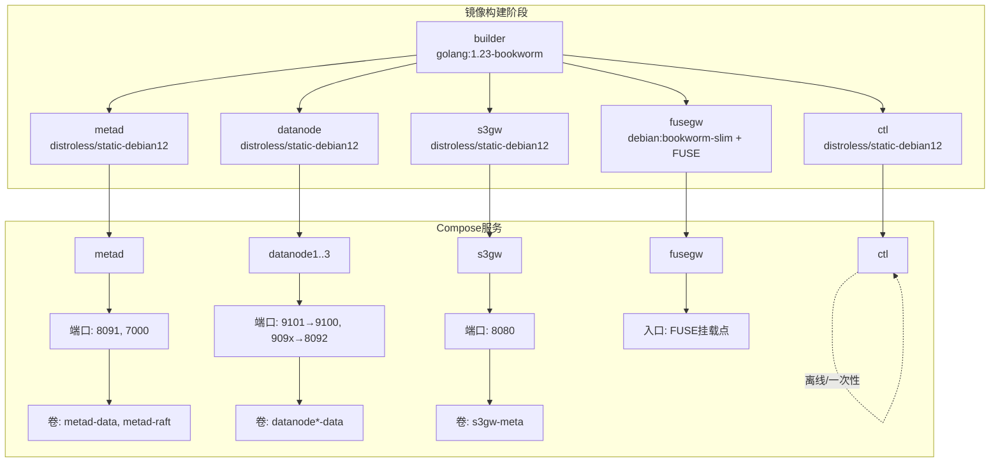
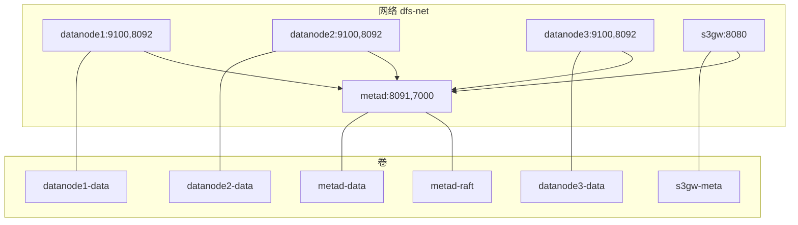
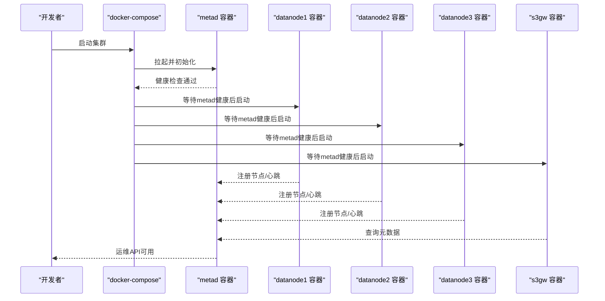
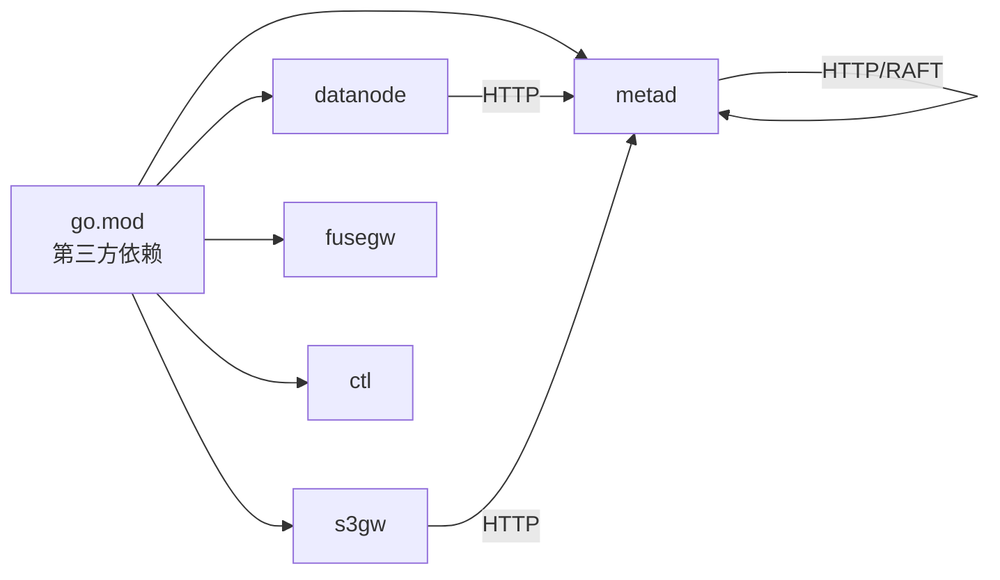

# 容器化部署

<cite>
**本文引用的文件**   
- [Dockerfile](file://nufs-core/Dockerfile)
- [docker-compose.yml](file://nufs-core/docker-compose.yml)
- [cluster.yaml](file://nufs-core/deploy/config/cluster.yaml)
- [go.mod](file://nufs-core/go.mod)
- [ARCHITECTURE.md](file://nufs-core/ARCHITECTURE.md)
- [Makefile](file://nufs-core/Makefile)
- [metad 主程序](file://nufs-core/cmd/metad/main.go)
- [datanode 主程序](file://nufs-core/cmd/datanode/main.go)
- [s3gw 主程序](file://nufs-core/cmd/s3gw/main.go)
- [fusegw 主程序](file://nufs-core/cmd/fusegw/main.go)
- [ctl 主程序](file://nufs-core/cmd/ctl/main.go)
- [TODO.md](file://nufs-core/TODO.md)
</cite>

## 目录
1. [简介](#简介)
2. [项目结构](#项目结构)
3. [核心组件](#核心组件)
4. [架构总览](#架构总览)
5. [详细组件分析](#详细组件分析)
6. [依赖分析](#依赖分析)
7. [性能考虑](#性能考虑)
8. [故障排查指南](#故障排查指南)
9. [结论](#结论)
10. [附录](#附录)

## 简介
本文件面向NUFS分布式文件系统的容器化部署，围绕Dockerfile多阶段构建、镜像优化与安全加固、各服务容器配置与资源限制、健康检查、Docker Compose编排设计与网络配置、最佳实践、监控与日志、以及安全扫描与漏洞修复进行系统化说明。读者可据此在开发环境或生产小集群中快速搭建并稳定运行NUFS。

## 项目结构
NUFS采用“多阶段构建 + 多目标镜像”的Dockerfile设计，分别产出元数据服务、数据节点、S3网关、FUSE网关与运维CLI等独立镜像；配合docker-compose定义服务依赖、端口映射、卷与网络，形成可一键启动的小型生产集群。

**图表来源**
- [Dockerfile:1-50](file://nufs-core/Dockerfile#L1-L50)
- [docker-compose.yml:1-148](file://nufs-core/docker-compose.yml#L1-L148)

**章节来源**
- [Dockerfile:1-50](file://nufs-core/Dockerfile#L1-L50)
- [docker-compose.yml:1-148](file://nufs-core/docker-compose.yml#L1-L148)

## 核心组件
- 元数据服务（metad）：基于Pebble存储与可选Raft共识，提供HTTP运维接口与健康检查端点。
- 数据节点（datanode）：本地块存储、复制引擎、心跳上报与运维HTTP API。
- S3网关（s3gw）：兼容S3的HTTP网关，支持鉴权与CORS。
- FUSE网关（fusegw）：Linux下将DFS挂载为本地文件系统，需宿主机具备FUSE支持。
- 运维CLI（ctl）：集群运维工具，查询节点、桶、触发再平衡与查看修复队列等。

**章节来源**
- [metad 主程序:21-149](file://nufs-core/cmd/metad/main.go#L21-L149)
- [datanode 主程序:19-133](file://nufs-core/cmd/datanode/main.go#L19-L133)
- [s3gw 主程序:18-90](file://nufs-core/cmd/s3gw/main.go#L18-L90)
- [fusegw 主程序:17-62](file://nufs-core/cmd/fusegw/main.go#L17-L62)
- [ctl 主程序:17-66](file://nufs-core/cmd/ctl/main.go#L17-L66)

## 架构总览
下图展示容器化部署下的服务交互与网络边界，强调健康检查、端口暴露与卷挂载。

**图表来源**
- [docker-compose.yml:5-133](file://nufs-core/docker-compose.yml#L5-L133)

**章节来源**
- [docker-compose.yml:1-148](file://nufs-core/docker-compose.yml#L1-L148)

## 详细组件分析

### Dockerfile 多阶段构建与镜像优化
- 构建阶段（builder）
  - 基于golang官方镜像，先复制模块文件以利用缓存，再复制源码并并行构建所有二进制，关闭CGO与静态链接，产物位于/bin下。
- 运行阶段（多目标镜像）
  - metad/datanode/s3gw/ctl：基于distroless静态镜像，仅包含必要运行时，最小化攻击面。
  - fusegw：基于debian slim，安装FUSE与证书，满足挂载需求。
- 体积与安全收益
  - distroless镜像不含包管理器与shell，显著降低漏洞面；静态编译消除对GLIBC等动态库依赖。
  - 多目标镜像将服务拆分，便于按需拉取与升级。

**章节来源**
- [Dockerfile:1-50](file://nufs-core/Dockerfile#L1-L50)

### 各服务容器配置与健康检查
- 元数据服务（metad）
  - 暴露端口：8091（运维HTTP）、7000（Raft通信）。
  - 健康检查：通过wget探测/health，周期10s，超时5s，重试5次，启动延时15s。
  - 关键参数：数据目录、Raft地址与目录、是否引导、运维API地址等。
- 数据节点（datanode）
  - 暴露端口：9100（数据TCP）、8092（运维HTTP）。
  - 依赖：需等待metad健康后再启动。
  - 关键参数：节点ID、监听地址、元数据地址、数据目录、机架/可用区、容量等。
- S3网关（s3gw）
  - 暴露端口：8080（HTTP）。
  - 依赖：需等待metad健康后再启动。
  - 关键参数：监听地址、元数据目录、可选鉴权。
- FUSE网关（fusegw）
  - 依赖：需宿主机具备FUSE与内核支持。
  - 关键参数：挂载点、元数据目录。
- 运维CLI（ctl）
  - 作为一次性工具，不常驻容器，通过命令行连接元数据目录进行运维。

**章节来源**
- [docker-compose.yml:5-133](file://nufs-core/docker-compose.yml#L5-L133)
- [metad 主程序:21-149](file://nufs-core/cmd/metad/main.go#L21-L149)
- [datanode 主程序:19-133](file://nufs-core/cmd/datanode/main.go#L19-L133)
- [s3gw 主程序:18-90](file://nufs-core/cmd/s3gw/main.go#L18-L90)
- [fusegw 主程序:17-62](file://nufs-core/cmd/fusegw/main.go#L17-L62)

### Docker Compose 编排设计与网络
- 服务依赖
  - datanode与s3gw均依赖metad健康（service_healthy），确保元数据可用后再启动数据面服务。
- 端口映射
  - metad: 8091、7000；datanode: 9101→9100、909x→8092；s3gw: 8080。
- 卷管理
  - 元数据与Raft目录、数据节点数据目录、S3网关元数据目录均声明为命名卷，保障持久化。
- 网络
  - 使用自定义bridge网络dfs-net，服务间通过服务名互通。

**章节来源**
- [docker-compose.yml:1-148](file://nufs-core/docker-compose.yml#L1-L148)

### 部署与启动流程（序列图）

**图表来源**
- [docker-compose.yml:5-133](file://nufs-core/docker-compose.yml#L5-L133)
- [metad 主程序:78-126](file://nufs-core/cmd/metad/main.go#L78-L126)
- [datanode 主程序:78-91](file://nufs-core/cmd/datanode/main.go#L78-L91)
- [s3gw 主程序:30-52](file://nufs-core/cmd/s3gw/main.go#L30-L52)

## 依赖分析
- 构建与运行时依赖
  - Go版本与第三方库由go.mod声明，其中包含Pebble、Raft、go-fuse等核心依赖。
- 服务间依赖
  - datanode与s3gw均依赖metad提供的元数据服务；metad内部可启用Raft共识。
- 容器间依赖
  - compose通过depends_on: service_healthy实现软依赖，结合健康检查确保启动顺序与一致性。

**图表来源**
- [go.mod:1-51](file://nufs-core/go.mod#L1-L51)
- [ARCHITECTURE.md:103-115](file://nufs-core/ARCHITECTURE.md#L103-L115)

**章节来源**
- [go.mod:1-51](file://nufs-core/go.mod#L1-L51)
- [ARCHITECTURE.md:103-115](file://nufs-core/ARCHITECTURE.md#L103-L115)

## 性能考虑
- 镜像与运行时
  - distroless镜像减少启动与运行时开销；静态编译避免运行时库解析成本。
- 端口与网络
  - 将数据面与控制面端口分离，避免相互影响；使用自定义bridge网络降低DNS解析与路由开销。
- 存储与I/O
  - 数据节点与元数据目录使用命名卷，建议在宿主机上配置高性能块设备并开启合适的文件系统参数。
- 并发与资源
  - datanode主程序中对并发读写做了上限配置，建议根据宿主机CPU与磁盘能力调整节点数量与副本因子。

**章节来源**
- [Dockerfile:1-50](file://nufs-core/Dockerfile#L1-L50)
- [docker-compose.yml:1-148](file://nufs-core/docker-compose.yml#L1-L148)
- [datanode 主程序:33-46](file://nufs-core/cmd/datanode/main.go#L33-L46)

## 故障排查指南
- 健康检查失败
  - 检查metad的/health端点是否可达；确认Raft端口与运维端口未被占用；查看容器日志定位错误。
- 服务启动顺序问题
  - 确认compose中depends_on: service_healthy已生效；若metad未进入健康，datanode与s3gw不会启动。
- 端口冲突
  - 若宿主机端口已被占用，修改docker-compose中的hostPort映射或释放端口。
- FUSE挂载失败
  - 确认宿主机已安装FUSE并具备相应权限；检查fusegw容器的挂载点参数与卷挂载。
- 运维与诊断
  - 使用ctl工具连接元数据目录，查询节点、桶、修复队列与触发再平衡；结合metad的/ready与/metrics端点进行诊断。

**章节来源**
- [docker-compose.yml:28-33](file://nufs-core/docker-compose.yml#L28-L33)
- [metad 主程序:152-212](file://nufs-core/cmd/metad/main.go#L152-L212)
- [ctl 主程序:86-212](file://nufs-core/cmd/ctl/main.go#L86-L212)

## 结论
NUFS的容器化部署以多阶段构建与distroless镜像为核心，实现了轻量、安全与可维护的目标。通过compose编排与健康检查，能够在开发与小规模生产环境中稳定运行。建议在生产中进一步完善资源限制、监控与日志采集、安全扫描与补丁管理，并结合架构文档中的运维与可观测性能力进行落地。

## 附录

### 容器化部署最佳实践
- 镜像与构建
  - 使用静态编译与distroless运行时，避免不必要的运行时依赖；在CI中缓存模块下载与构建产物。
- 资源与隔离
  - 为每个服务设置合理的CPU/内存限制与重启策略；将数据卷与配置卷分离，便于备份与迁移。
- 健康与可观测性
  - 启用健康检查与/ready端点；结合Prometheus抓取指标；集中化采集容器日志。
- 安全加固
  - 使用只读根文件系统、drop多余Linux capabilities；限制网络访问，仅开放必要端口；定期扫描基础镜像与应用镜像。
- 升级与回滚
  - 采用滚动升级策略，确保元数据服务的高可用；为数据节点与网关预留优雅停机窗口。

### 监控与日志
- 指标采集
  - 在metad与datanode的运维HTTP接口中暴露指标端点，接入Prometheus；关注节点状态、副本健康、读写延迟与容量使用率。
- 日志收集
  - 将容器标准输出重定向至集中式日志系统；为关键服务设置细粒度日志级别；保留必要的审计与错误日志。

### 安全扫描与漏洞修复
- 基础镜像扫描
  - 对distroless与debian slim镜像进行漏洞扫描，优先修复高危与严重漏洞。
- 应用镜像扫描
  - 扫描业务镜像中的二进制与依赖；结合go.mod锁定版本，及时更新第三方库。
- 补丁与升级
  - 制定补丁发布流程，先在测试环境验证，再滚动升级生产；对元数据服务优先升级，确保一致性。

### 配置参考与示例
- 集群配置样例
  - 可参考deploy/config/cluster.yaml中的字段组织方式，将生产参数注入容器环境变量或配置文件卷。
- 常用命令
  - 使用Makefile中的docker、docker-up、docker-down、docker-logs等目标快速构建与运维。

**章节来源**
- [cluster.yaml:1-62](file://nufs-core/deploy/config/cluster.yaml#L1-L62)
- [Makefile:54-76](file://nufs-core/Makefile#L54-L76)
- [TODO.md:128-143](file://nufs-core/TODO.md#L128-L143)