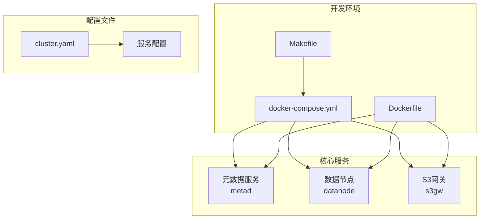
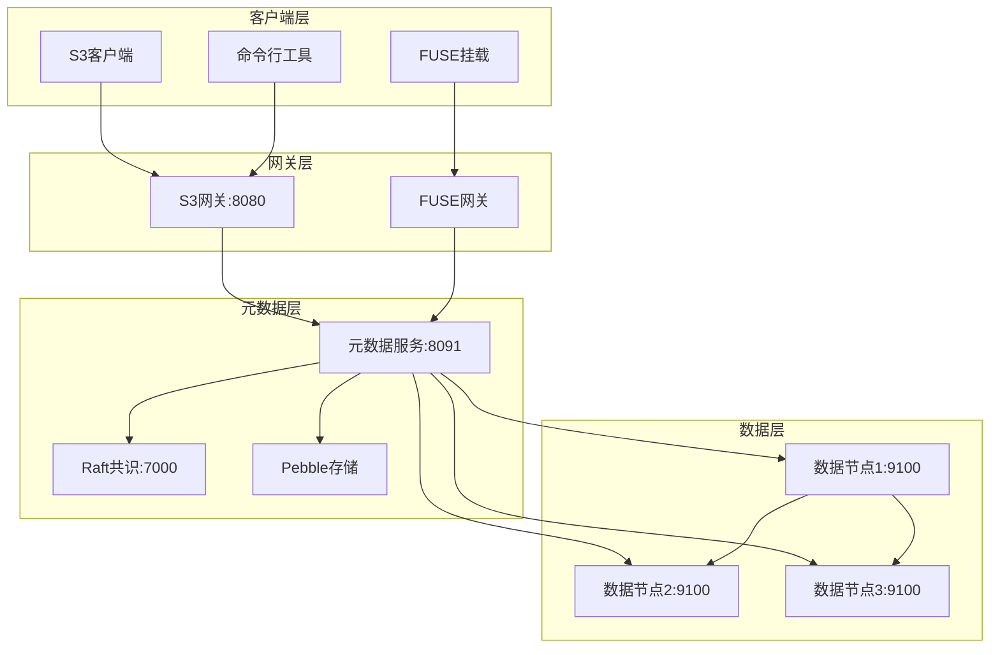
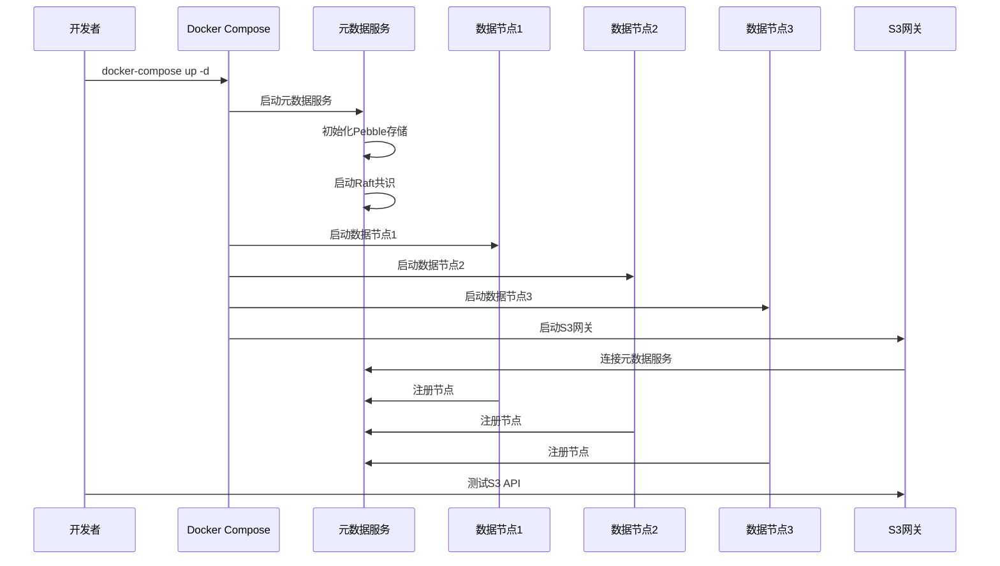
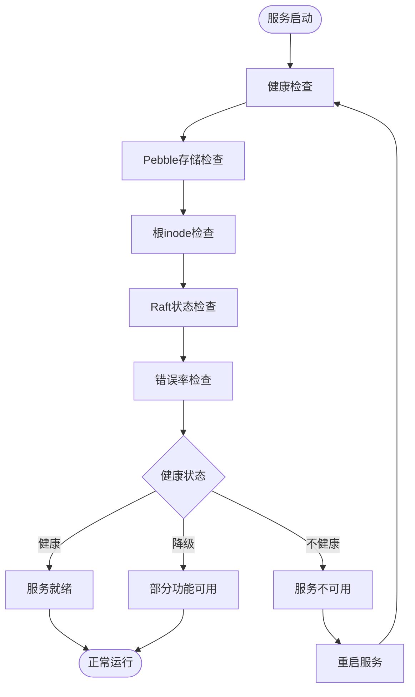
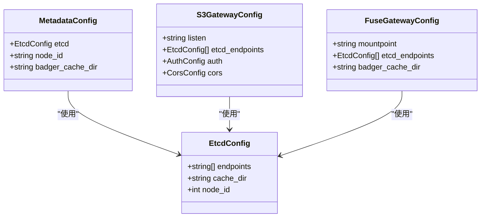
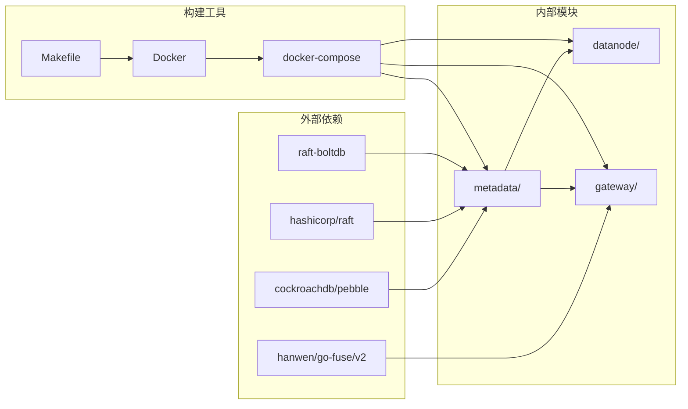

# 开发环境配置

<cite>
**本文档引用的文件**
- [docker-compose.yml](file://nufs-core/docker-compose.yml)
- [Dockerfile](file://nufs-core/Dockerfile)
- [Makefile](file://nufs-core/Makefile)
- [cluster.yaml](file://nufs-core/deploy/config/cluster.yaml)
- [ARCHITECTURE.md](file://nufs-core/ARCHITECTURE.md)
- [main.go](file://nufs-core/cmd/metad/main.go)
- [main.go](file://nufs-core/cmd/datanode/main.go)
- [main.go](file://nufs-core/cmd/s3gw/main.go)
- [pebble_raft.go](file://nufs-core/metadata/pebble_raft.go)
- [health.go](file://nufs-core/metadata/health.go)
- [go.mod](file://nufs-core/go.mod)
</cite>

## 目录
1. [简介](#简介)
2. [项目结构概览](#项目结构概览)
3. [核心组件](#核心组件)
4. [架构总览](#架构总览)
5. [详细组件分析](#详细组件分析)
6. [依赖关系分析](#依赖关系分析)
7. [性能考虑](#性能考虑)
8. [故障排除指南](#故障排除指南)
9. [结论](#结论)

## 简介

NUFS分布式文件系统是一个现代化的分布式存储解决方案，采用Go语言开发，支持S3 API兼容性和FUSE挂载功能。本文档专注于帮助开发者快速搭建本地开发环境，通过Docker Compose实现元数据服务、数据节点和网关服务的一键部署。

该系统采用微服务架构，包含三个核心服务：
- **元数据服务 (metad)**: 基于Pebble存储引擎和HashiCorp Raft共识算法
- **数据节点服务 (datanode)**: 分布式块存储和复制引擎
- **S3网关服务 (s3gw)**: S3兼容的REST API接口

## 项目结构概览



**图表来源**
- [docker-compose.yml:1-148](file://nufs-core/docker-compose.yml#L1-L148)
- [Dockerfile:1-50](file://nufs-core/Dockerfile#L1-L50)

**章节来源**
- [docker-compose.yml:1-148](file://nufs-core/docker-compose.yml#L1-L148)
- [Dockerfile:1-50](file://nufs-core/Dockerfile#L1-L50)
- [ARCHITECTURE.md:1-1005](file://nufs-core/ARCHITECTURE.md#L1-L1005)

## 核心组件

### 元数据服务 (metad)

元数据服务是整个分布式文件系统的核心，负责管理命名空间、Chunk映射、集群拓扑和放置策略。它采用双存储引擎架构，支持Pebble LSM-Tree作为主要存储后端。

**关键特性**:
- 基于HashiCorp Raft的共识算法
- Pebble LSM-Tree作为KV存储引擎
- MVCC乐观并发控制
- 一致性哈希分片路由
- 内置健康检查和指标监控

**启动参数**:
- `-data-dir`: Pebble数据目录，默认 `/var/lib/dfs/metadata`
- `-node-id`: 元数据节点ID，默认 1
- `-raft`: 启用Raft共识，默认 true
- `-raft-addr`: Raft绑定地址，默认 0.0.0.0:7000
- `-raft-dir`: Raft数据目录，默认 `/var/lib/dfs/raft`
- `-raft-bootstrap`: 引导新Raft集群
- `-ops-addr`: 运维HTTP API地址，默认 0.0.0.0:8091

**端口映射**:
- 8091: 运维API (HTTP)
- 7000: Raft共识通信 (TCP)

**数据卷配置**:
- `metad-data`: 元数据存储
- `metad-raft`: Raft日志存储

### 数据节点服务 (datanode)

数据节点服务负责分布式块存储和复制引擎，每个节点管理本地磁盘存储并处理读写请求。

**关键特性**:
- TCP协议通信 (端口9100)
- 异步复制引擎
- 心跳上报机制
- 磁盘管理功能
- 副本修复和再平衡

**启动参数**:
- `-node-id`: 数据节点唯一ID，默认 1
- `-listen`: TCP监听地址，默认 0.0.0.0:9100
- `-data-dir`: 块存储根目录，默认 /data
- `-metadata`: 元数据服务地址，默认 localhost:8091
- `-rack`: 机架标识符，默认 rack-1
- `-zone`: 可用区标识符，默认 zone-1
- `-capacity`: 节点存储容量(GB)，默认 1000
- `-ops-addr`: 运维HTTP API地址，默认 0.0.0.0:8092

**端口映射**:
- 9100: 数据传输 (TCP)
- 8092: 运维API (HTTP)

**数据卷配置**:
- `datanode1-data`, `datanode2-data`, `datanode3-data`: 块存储数据

### S3网关服务 (s3gw)

S3网关服务提供S3兼容的REST API接口，支持标准的S3操作如创建桶、上传下载对象等。

**关键特性**:
- S3兼容的REST API
- AWS签名V4认证
- 中间件链处理
- 跨域资源共享(CORS)
- 内置认证机制

**启动参数**:
- `-listen`: HTTP监听地址，默认 :8080
- `-meta-dir`: 元数据存储目录，默认 /var/lib/dfs/metadata
- `-access-key`: 访问密钥
- `-secret-key`: 密钥

**端口映射**:
- 8080: S3 API (HTTP)

**数据卷配置**:
- `s3gw-meta`: 元数据缓存

**章节来源**
- [main.go:21-150](file://nufs-core/cmd/metad/main.go#L21-L150)
- [main.go:19-135](file://nufs-core/cmd/datanode/main.go#L19-L135)
- [main.go:18-91](file://nufs-core/cmd/s3gw/main.go#L18-L91)

## 架构总览



**图表来源**
- [ARCHITECTURE.md:37-101](file://nufs-core/ARCHITECTURE.md#L37-L101)
- [docker-compose.yml:3-148](file://nufs-core/docker-compose.yml#L3-L148)

## 详细组件分析

### Docker Compose配置详解

Docker Compose提供了完整的开发环境配置，包含三个数据节点以模拟生产环境的高可用性。



**图表来源**
- [docker-compose.yml:3-148](file://nufs-core/docker-compose.yml#L3-L148)

### 健康检查机制

系统实现了多层次的健康检查机制，确保服务的可靠运行。



**图表来源**
- [health.go:218-290](file://nufs-core/metadata/health.go#L218-L290)

### embedded etcd配置方式

虽然项目文档显示使用Pebble + Raft而非etcd，但在生产配置中可以看到etcd的配置方式：



**图表来源**
- [cluster.yaml:8-46](file://nufs-core/deploy/config/cluster.yaml#L8-L46)

**章节来源**
- [docker-compose.yml:28-33](file://nufs-core/docker-compose.yml#L28-L33)
- [health.go:292-327](file://nufs-core/metadata/health.go#L292-L327)
- [cluster.yaml:8-62](file://nufs-core/deploy/config/cluster.yaml#L8-L62)

## 依赖关系分析



**图表来源**
- [go.mod:5-10](file://nufs-core/go.mod#L5-L10)
- [Dockerfile:21-44](file://nufs-core/Dockerfile#L21-L44)

**章节来源**
- [go.mod:1-51](file://nufs-core/go.mod#L1-L51)
- [Dockerfile:1-50](file://nufs-core/Dockerfile#L1-L50)

## 性能考虑

### 端口映射策略

开发环境中采用了合理的端口映射策略，避免端口冲突并便于调试：

| 服务 | 容器端口 | 主机端口 | 用途 |
|------|----------|----------|------|
| 元数据服务 | 8091 | 8091 | 运维API |
| 元数据服务 | 7000 | 7000 | Raft共识 |
| 数据节点1 | 9100 | 9101 | 数据传输 |
| 数据节点2 | 9100 | 9102 | 数据传输 |
| 数据节点3 | 9100 | 9103 | 数据传输 |
| 数据节点1 | 8092 | 9091 | 运维API |
| 数据节点2 | 8092 | 9092 | 运维API |
| 数据节点3 | 8092 | 9093 | 运维API |
| S3网关 | 8080 | 8080 | S3 API |

### 数据卷设计

采用独立的数据卷设计，确保数据持久化和隔离：

```mermaid
graph TB
subgraph "数据卷隔离"
MD[metad-data]
MR[metad-raft]
D1[datanode1-data]
D2[datanode2-data]
D3[datanode3-data]
S3[s3gw-meta]
end
subgraph "容器数据目录"
MD --> MDD[/var/lib/dfs/metadata]
MR --> MRD[/var/lib/dfs/raft]
D1 --> D1D[/data]
D2 --> D2D[/data]
D3 --> D3D[/data]
S3 --> S3D[/var/lib/dfs/metadata]
end
```

**图表来源**
- [docker-compose.yml:136-142](file://nufs-core/docker-compose.yml#L136-L142)

## 故障排除指南

### 常见启动问题

**问题1: 元数据服务无法启动**
- 检查端口占用情况
- 验证数据目录权限
- 查看Raft日志初始化

**问题2: 数据节点注册失败**
- 确认元数据服务已就绪
- 检查网络连接
- 验证节点ID唯一性

**问题3: S3网关连接异常**
- 检查元数据存储路径
- 验证认证配置
- 查看防火墙设置

### 调试技巧

**使用Makefile进行开发**:
```bash
# 构建所有二进制文件
make build

# 启动Docker集群
make docker-up

# 查看服务日志
make docker-logs

# 停止服务
make docker-down
```

**开发调试建议**:
- 使用 `docker-compose logs -f` 实时查看日志
- 通过 `/health` 和 `/ready` 端点检查服务状态
- 利用 `/metrics` 端点监控性能指标
- 在本地修改代码后重新构建镜像

**热重载配置建议**:
- 使用 `docker-compose up -d --build` 实现镜像重建
- 开发阶段使用较小的数据卷以便快速清理
- 配置适当的日志级别便于问题定位

**章节来源**
- [Makefile:54-76](file://nufs-core/Makefile#L54-L76)
- [docker-compose.yml:28-33](file://nufs-core/docker-compose.yml#L28-L33)

## 结论

NUFS分布式文件系统的开发环境配置提供了完整的一键部署方案，通过Docker Compose实现了元数据服务、数据节点和网关服务的协调运行。该配置具有以下优势：

1. **完整的功能覆盖**: 包含所有核心服务组件
2. **高可用性模拟**: 三个数据节点提供故障转移能力
3. **清晰的配置分离**: 独立的数据卷确保数据持久化
4. **完善的健康检查**: 多层次的健康检查机制
5. **便捷的开发工具**: Makefile提供丰富的开发辅助功能

对于生产环境，建议参考 `deploy/config/cluster.yaml` 中的配置模板，并根据实际需求调整节点数量、存储容量和网络配置。开发环境的配置为生产部署提供了良好的基础和参考。