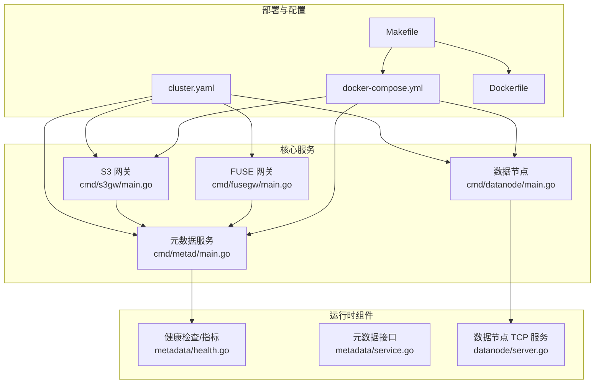
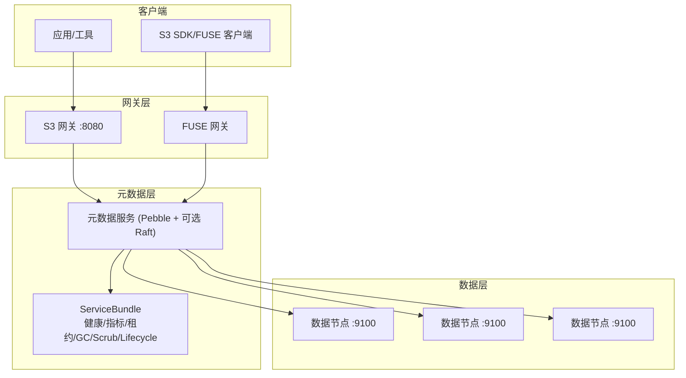
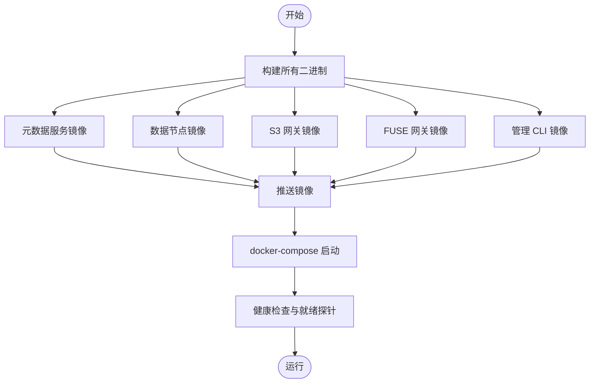
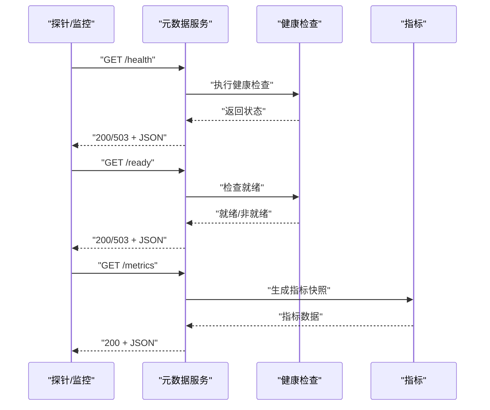
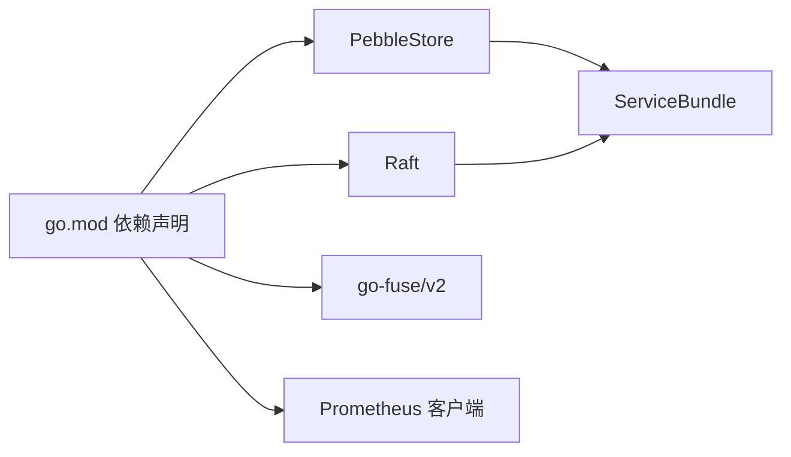

# 生产环境部署

<cite>
**本文引用的文件**
- [cluster.yaml](file://nufs-core/deploy/config/cluster.yaml)
- [Dockerfile](file://nufs-core/Dockerfile)
- [Makefile](file://nufs-core/Makefile)
- [docker-compose.yml](file://nufs-core/docker-compose.yml)
- [go.mod](file://nufs-core/go.mod)
- [ARCHITECTURE.md](file://nufs-core/ARCHITECTURE.md)
- [main.go（元数据服务）](file://nufs-core/cmd/metad/main.go)
- [main.go（数据节点）](file://nufs-core/cmd/datanode/main.go)
- [main.go（S3 网关）](file://nufs-core/cmd/s3gw/main.go)
- [main.go（FUSE 网关）](file://nufs-core/cmd/fusegw/main.go)
- [service.go（元数据服务接口）](file://nufs-core/metadata/service.go)
- [health.go（健康检查与指标）](file://nufs-core/metadata/health.go)
- [server.go（数据节点 TCP 服务）](file://nufs-core/datanode/server.go)
- [README.md（MinFS 说明）](file://nufs-fuse/README.md)
</cite>

## 目录
1. [简介](#简介)
2. [项目结构](#项目结构)
3. [核心组件](#核心组件)
4. [架构总览](#架构总览)
5. [详细组件分析](#详细组件分析)
6. [依赖关系分析](#依赖关系分析)
7. [性能考虑](#性能考虑)
8. [故障排查指南](#故障排查指南)
9. [结论](#结论)
10. [附录](#附录)

## 简介
本文件面向生产环境，提供 NUFS 分布式文件系统的完整部署指南，覆盖集群配置管理、高可用部署策略、性能调优、镜像构建、自动化部署流程、安全配置、监控与告警、备份策略以及容量规划与扩缩容最佳实践。内容基于仓库中的配置文件、构建脚本与核心源码进行梳理与提炼，确保读者能够快速落地并稳定运行。

## 项目结构
NUFS 采用模块化组织方式，核心代码位于 nufs-core，包含元数据服务、数据节点、网关层、元数据存储与一致性组件；nufs-fuse 提供 FUSE 客户端相关文档与说明。生产部署主要涉及以下文件：
- 配置：cluster.yaml（集群参数）、docker-compose.yml（容器编排）
- 构建：Dockerfile（多阶段镜像）、Makefile（构建与自动化）
- 服务入口：各组件 main.go（元数据、数据节点、S3 网关、FUSE 网关）
- 运维与可观测性：metadata 包中的健康检查与指标

**图表来源**
- [cluster.yaml:1-62](file://nufs-core/deploy/config/cluster.yaml#L1-L62)
- [docker-compose.yml:1-148](file://nufs-core/docker-compose.yml#L1-L148)
- [Makefile:1-76](file://nufs-core/Makefile#L1-L76)
- [Dockerfile:1-50](file://nufs-core/Dockerfile#L1-L50)
- [main.go（元数据服务）:1-220](file://nufs-core/cmd/metad/main.go#L1-L220)
- [main.go（数据节点）:1-134](file://nufs-core/cmd/datanode/main.go#L1-L134)
- [main.go（S3 网关）:1-91](file://nufs-core/cmd/s3gw/main.go#L1-L91)
- [main.go（FUSE 网关）:1-63](file://nufs-core/cmd/fusegw/main.go#L1-L63)
- [health.go（健康检查与指标）:1-328](file://nufs-core/metadata/health.go#L1-L328)
- [service.go（元数据服务接口）:1-200](file://nufs-core/metadata/service.go#L1-L200)
- [server.go（数据节点 TCP 服务）:1-200](file://nufs-core/datanode/server.go#L1-L200)

**章节来源**
- [cluster.yaml:1-62](file://nufs-core/deploy/config/cluster.yaml#L1-L62)
- [docker-compose.yml:1-148](file://nufs-core/docker-compose.yml#L1-L148)
- [Makefile:1-76](file://nufs-core/Makefile#L1-L76)
- [Dockerfile:1-50](file://nufs-core/Dockerfile#L1-L50)

## 核心组件
- 元数据服务（metad）：基于 Pebble + 可选 Raft，提供命名空间、Chunk 映射、租约、GC、Scrub、生命周期等生产级能力，并暴露健康检查与指标接口。
- 数据节点（datanode）：提供 TCP 协议的数据读写与复制，维护磁盘与 Chunk 存储，上报心跳并支持再平衡与反熵。
- S3 网关（s3gw）：兼容 S3 API 的 HTTP 网关，支持认证与 CORS，连接元数据服务。
- FUSE 网关（fusegw）：Linux 下的 POSIX 文件系统挂载，基于 go-fuse/v2，连接元数据服务。
- 配置与编排：cluster.yaml 定义集群参数；docker-compose.yml 定义服务与网络；Makefile 提供构建与自动化命令。

**章节来源**
- [main.go（元数据服务）:1-220](file://nufs-core/cmd/metad/main.go#L1-L220)
- [main.go（数据节点）:1-134](file://nufs-core/cmd/datanode/main.go#L1-L134)
- [main.go（S3 网关）:1-91](file://nufs-core/cmd/s3gw/main.go#L1-L91)
- [main.go（FUSE 网关）:1-63](file://nufs-core/cmd/fusegw/main.go#L1-L63)
- [service.go（元数据服务接口）:1-200](file://nufs-core/metadata/service.go#L1-L200)
- [health.go（健康检查与指标）:1-328](file://nufs-core/metadata/health.go#L1-L328)

## 架构总览
NUFS 采用“网关层-元数据层-数据层”的三层架构，支持 S3 API 与 FUSE 挂载，元数据采用 Pebble + Raft 保障一致性，数据层以 Chunk 为单位进行复制与放置，具备租约、GC、Scrub、再平衡等运维能力。

**图表来源**
- [ARCHITECTURE.md:37-101](file://nufs-core/ARCHITECTURE.md#L37-L101)
- [main.go（元数据服务）:1-220](file://nufs-core/cmd/metad/main.go#L1-L220)
- [main.go（数据节点）:1-134](file://nufs-core/cmd/datanode/main.go#L1-L134)
- [main.go（S3 网关）:1-91](file://nufs-core/cmd/s3gw/main.go#L1-L91)
- [main.go（FUSE 网关）:1-63](file://nufs-core/cmd/fusegw/main.go#L1-L63)

## 详细组件分析

### 集群配置管理（cluster.yaml）
cluster.yaml 是生产集群的集中配置入口，定义了集群名称、区域、元数据与数据节点、网关、放置策略、修复与再平衡等参数。关键字段说明如下：
- cluster.name/region：集群标识与区域信息
- metadata.etcd_endpoints：元数据服务依赖的外部键值/共识组件地址（示例中为 etcd）
- metadata.badger_cache_dir：元数据缓存目录
- metadata.node_id：元数据节点 ID（用于生成 ChunkID）
- datanode.listen/data_dir/capacity_gb/tier/rack/zone/heartbeat_interval：数据节点监听地址、数据目录、容量、分层、机架、可用区与心跳间隔
- s3gw.listen/etcd_endpoints/auth/cors：S3 网关监听地址、认证开关与凭据、CORS 配置
- fusegw.mountpoint/etcd_endpoints/badger_cache_dir：FUSE 挂载点、元数据缓存目录
- placement.replication_factor/topology_spread/storage_tier：默认副本数、拓扑分布策略与存储分层
- repair.scan_interval/max_concurrent_repairs：修复扫描与并发修复限制
- rebalance.threshold/max_migrations_per_run/scan_interval：再平衡阈值、单次最大迁移数与扫描间隔

建议：
- 在生产中将 etcd_endpoints 指向高可用 etcd 集群
- datanode.tier/rack/zone 应与实际硬件拓扑一致，确保拓扑感知生效
- s3gw.auth.enabled 建议开启并配置访问密钥
- fusegw.mountpoint 与 badger_cache_dir 需要持久化卷挂载

**章节来源**
- [cluster.yaml:1-62](file://nufs-core/deploy/config/cluster.yaml#L1-L62)

### 高可用性部署策略
- 元数据层：推荐使用 Raft 模式（可选），至少 3 节点形成多数派共识，结合健康检查与指标实现自动探测与恢复。
- 数据层：至少 3 个数据节点跨机架部署，结合拓扑感知与副本策略，确保单点故障不影响服务。
- 网关层：S3 网关与 FUSE 网关可水平扩展，前端通过负载均衡器接入。
- 网络：使用独立桥接网络隔离服务间通信，确保端口映射与健康检查可达。

**章节来源**
- [docker-compose.yml:1-148](file://nufs-core/docker-compose.yml#L1-L148)
- [health.go（健康检查与指标）:1-328](file://nufs-core/metadata/health.go#L1-L328)

### 性能调优配置
- 元数据服务（metad）：MemTable 大小、租约 TTL、GC 与 Scrub 间隔、Raft 快照与尾随日志阈值等可通过启动参数调整。
- 数据节点（datanode）：并发读写上限、心跳间隔、容量与分层策略影响 IO 与复制效率。
- 网关层：S3 网关的读写超时、匿名/认证模式对吞吐与安全性有直接影响。
- 客户端缓存：FUSE/S3 客户端侧的属性与数据缓存显著降低延迟，需根据工作负载调优 TTL。

**章节来源**
- [main.go（元数据服务）:21-149](file://nufs-core/cmd/metad/main.go#L21-L149)
- [main.go（数据节点）:19-133](file://nufs-core/cmd/datanode/main.go#L19-L133)
- [main.go（S3 网关）:18-90](file://nufs-core/cmd/s3gw/main.go#L18-L90)
- [ARCHITECTURE.md:641-684](file://nufs-core/ARCHITECTURE.md#L641-L684)

### Docker 镜像构建与自动化部署
- 多阶段构建：分别构建 metad、datanode、s3gw、fusegw、ctl 二进制，最终以 distroless 或 slim 基础镜像运行，减小攻击面。
- Makefile：提供 build、build-linux、docker、docker-up、docker-down、docker-logs、test、lint、fmt、tidy 等常用命令。
- docker-compose：定义服务、卷、网络与健康检查，便于本地与小规模生产快速拉起。

**图表来源**
- [Dockerfile:1-50](file://nufs-core/Dockerfile#L1-L50)
- [Makefile:54-69](file://nufs-core/Makefile#L54-L69)
- [docker-compose.yml:1-148](file://nufs-core/docker-compose.yml#L1-L148)

**章节来源**
- [Dockerfile:1-50](file://nufs-core/Dockerfile#L1-L50)
- [Makefile:1-76](file://nufs-core/Makefile#L1-L76)
- [docker-compose.yml:1-148](file://nufs-core/docker-compose.yml#L1-L148)

### 安全配置
- S3 网关认证：通过 access-key/secret-key 启用签名认证；生产建议关闭匿名模式。
- CORS：允许来源与方法需按最小权限原则配置。
- 网络隔离：服务间通过独立桥接网络通信，限制暴露端口。
- 证书与传输加密：建议在边缘或反向代理层启用 TLS，结合安全组与防火墙策略。

**章节来源**
- [cluster.yaml:28-39](file://nufs-core/deploy/config/cluster.yaml#L28-L39)
- [main.go（S3 网关）:18-90](file://nufs-core/cmd/s3gw/main.go#L18-L90)

### 监控与告警
- 元数据服务内置健康检查与指标接口，包括 /health、/ready、/metrics，可用于容器编排健康探针与外部监控系统采集。
- 指标维度：操作总数、读写延迟（P50/P99）、错误率、在线节点数、Key/Chunk 数量、Raft 状态等。
- 建议：对接 Prometheus 与 Grafana，设置错误率、延迟、节点离线等告警规则。

**图表来源**
- [health.go（健康检查与指标）:292-327](file://nufs-core/metadata/health.go#L292-L327)
- [main.go（元数据服务）:151-220](file://nufs-core/cmd/metad/main.go#L151-L220)

**章节来源**
- [health.go（健康检查与指标）:1-328](file://nufs-core/metadata/health.go#L1-L328)
- [main.go（元数据服务）:107-149](file://nufs-core/cmd/metad/main.go#L107-L149)

### 备份策略
- 元数据备份：Raft 快照与 WAL 保留策略（快照阈值、尾随日志数）决定恢复窗口与开销；建议定期导出快照并异地保存。
- 数据节点备份：数据节点以本地文件存储 Chunk，建议对数据目录进行周期性快照或备份。
- 配置备份：cluster.yaml 与 docker-compose.yml 作为配置基线，纳入版本控制与变更审计。

**章节来源**
- [main.go（元数据服务）:61-89](file://nufs-core/cmd/metad/main.go#L61-L89)
- [ARCHITECTURE.md:169-174](file://nufs-core/ARCHITECTURE.md#L169-L174)

### 容量规划与扩缩容最佳实践
- 容量规划：依据业务对象数量、平均对象大小与小文件占比估算 Chunk 数量与磁盘占用；结合小文件合并策略与存储分层（热/温/冷/归档）降低存储成本。
- 扩展：新增数据节点时，确保 rack/zone 与 tier 设置正确；触发再平衡以恢复集群均衡；观察修复队列与复制进度。
- 缩容：通过 DecommissionNode 下线节点，由再平衡引擎迁移 Chunk；完成后清理节点资源。

**章节来源**
- [ARCHITECTURE.md:589-638](file://nufs-core/ARCHITECTURE.md#L589-L638)
- [ARCHITECTURE.md:764-795](file://nufs-core/ARCHITECTURE.md#L764-L795)
- [service.go（元数据服务接口）:51-67](file://nufs-core/metadata/service.go#L51-L67)

## 依赖关系分析
- go.mod 声明了核心依赖：Pebble（KV 存储）、Raft（共识）、go-fuse/v2（FUSE）、Prometheus 客户端等。
- 元数据服务通过 ServiceBundle 组合健康检查、指标、租约、GC、Scrub、Lifecycle 等子系统。
- 数据节点通过 TCP 协议与元数据服务交互，负责 Chunk 的读写与复制。

**图表来源**
- [go.mod:1-51](file://nufs-core/go.mod#L1-L51)
- [service.go（元数据服务接口）:76-134](file://nufs-core/metadata/service.go#L76-L134)

**章节来源**
- [go.mod:1-51](file://nufs-core/go.mod#L1-L51)
- [service.go（元数据服务接口）:1-200](file://nufs-core/metadata/service.go#L1-L200)

## 性能考虑
- 写入路径：S3 网关 → 元数据服务（分配 Chunk 与拓扑选择）→ 数据节点并行写入 → 元数据提交与密封 → 客户端返回。
- 读取路径：S3 网关 → 元数据服务（定位 Chunk 与副本）→ 数据节点就近读取 → 客户端缓存命中。
- 延迟与吞吐：通过并发读写、副本就近、缓存与压缩策略优化；结合指标监控识别瓶颈。
- 小文件优化：合并存储显著降低元数据与空间浪费，提升整体性能与成本效率。

**章节来源**
- [ARCHITECTURE.md:347-437](file://nufs-core/ARCHITECTURE.md#L347-L437)
- [ARCHITECTURE.md:589-638](file://nufs-core/ARCHITECTURE.md#L589-L638)

## 故障排查指南
- 健康检查失败：检查 /health 与 /ready 返回状态，关注错误率、Raft 状态与根 inode 存在性。
- 元数据异常：查看 /metrics 中延迟与错误统计，确认快照与 WAL 策略是否合理。
- 数据节点问题：检查 TCP 服务监听、心跳上报、复制队列与磁盘使用情况。
- 网关问题：确认认证配置、CORS 设置与元数据服务连通性。

**章节来源**
- [health.go（健康检查与指标）:218-290](file://nufs-core/metadata/health.go#L218-L290)
- [main.go（元数据服务）:151-220](file://nufs-core/cmd/metad/main.go#L151-L220)
- [server.go（数据节点 TCP 服务）:36-126](file://nufs-core/datanode/server.go#L36-L126)

## 结论
通过 cluster.yaml 的集中配置、Docker 多阶段镜像与 Makefile 自动化脚本，NUFS 可在本地与生产环境中快速部署。结合 Raft 高可用、拓扑感知与副本策略、健康检查与指标体系，以及小文件优化与容量规划，可实现稳定、高性能且易于运维的分布式文件系统。建议在生产中完善安全策略、监控告警与备份恢复流程，并持续基于指标进行性能调优。

## 附录

### 关键参数速查
- 元数据服务（metad）：数据目录、缓存目录、节点 ID、MemTable 大小、Raft 开关与地址、操作 API 地址、租约 TTL、GC/Scrub 间隔
- 数据节点（datanode）：节点 ID、监听地址、数据目录、元数据地址、机架/可用区、容量、心跳间隔、并发读写上限
- S3 网关（s3gw）：监听地址、元数据目录、认证凭据、CORS
- FUSE 网关（fusegw）：挂载点、元数据目录
- 放置策略：副本因子、拓扑分布、存储分层
- 修复与再平衡：扫描间隔、并发修复、再平衡阈值与迁移上限

**章节来源**
- [main.go（元数据服务）:21-149](file://nufs-core/cmd/metad/main.go#L21-L149)
- [main.go（数据节点）:19-133](file://nufs-core/cmd/datanode/main.go#L19-L133)
- [main.go（S3 网关）:18-90](file://nufs-core/cmd/s3gw/main.go#L18-L90)
- [main.go（FUSE 网关）:17-62](file://nufs-core/cmd/fusegw/main.go#L17-L62)
- [cluster.yaml:4-62](file://nufs-core/deploy/config/cluster.yaml#L4-L62)