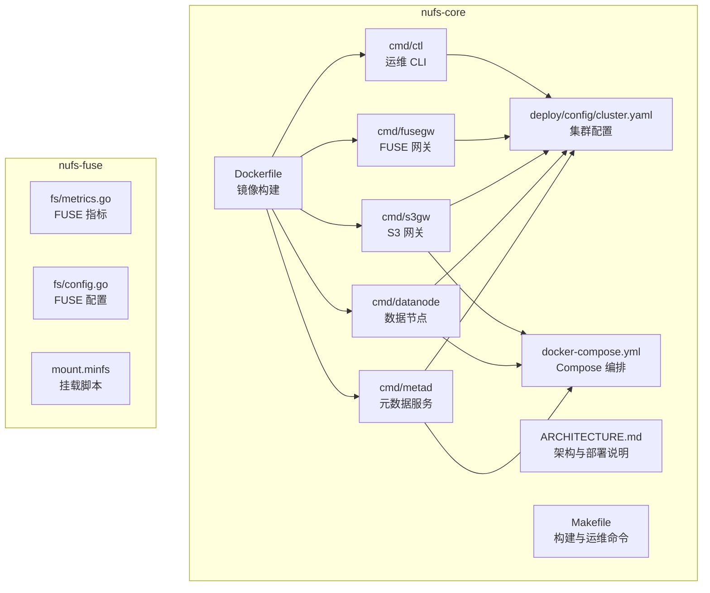
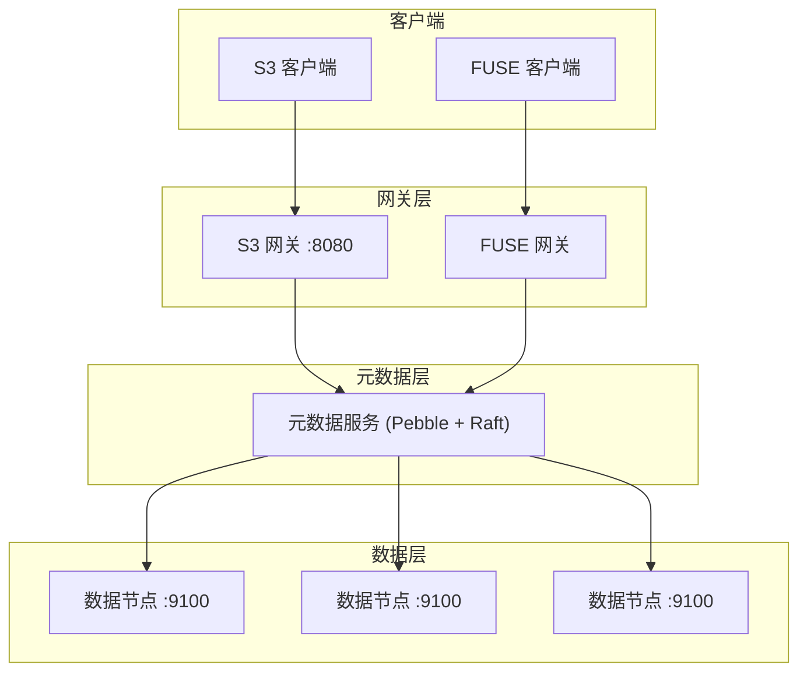
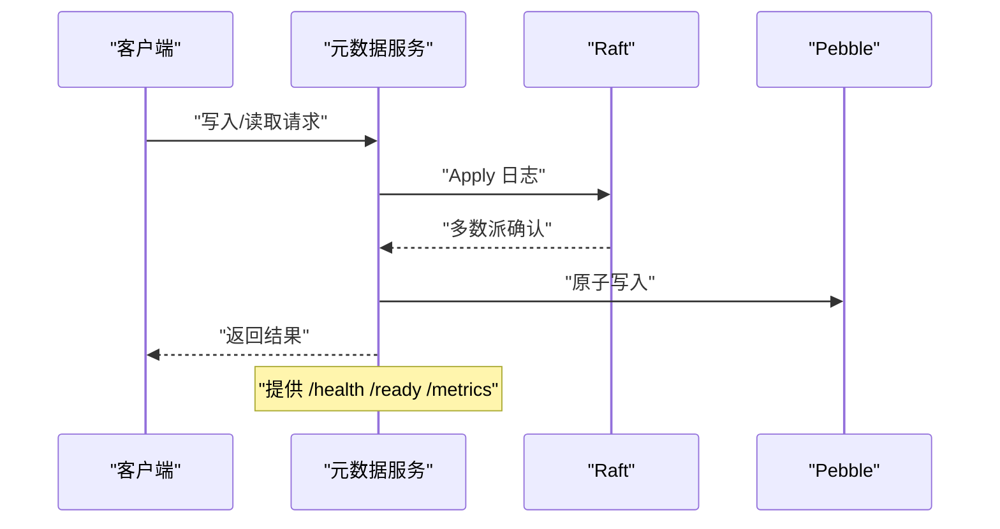
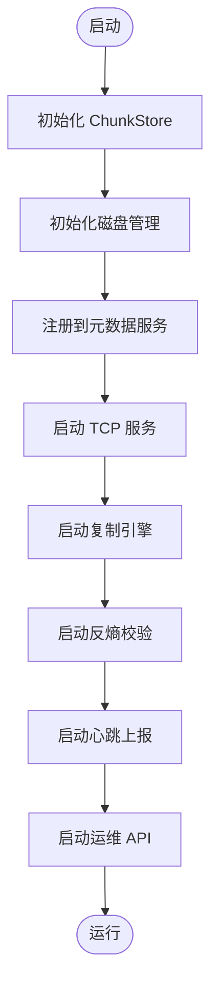
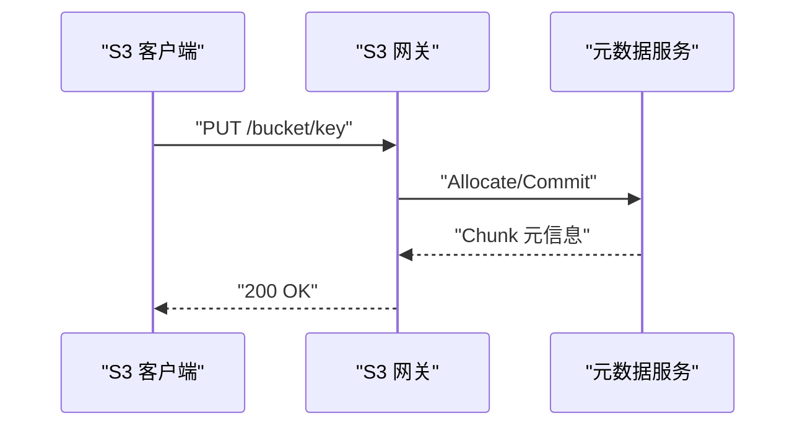
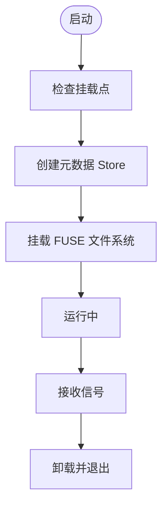
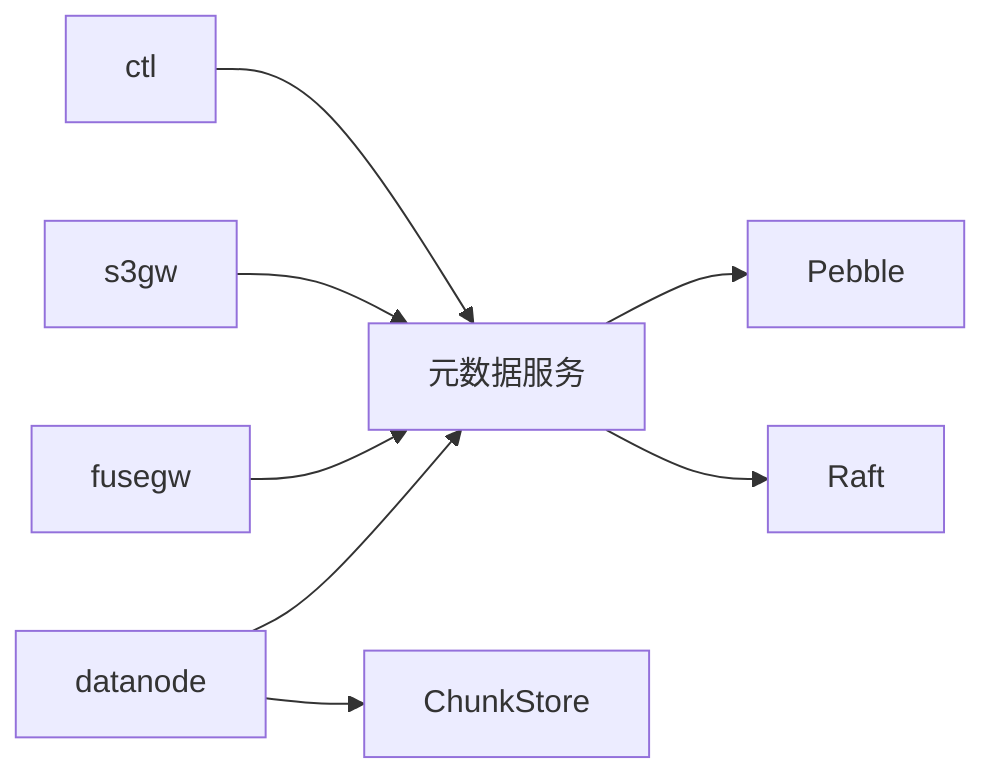

# 部署配置

<cite>
**本文引用的文件**
- [cluster.yaml](file://nufs-core/deploy/config/cluster.yaml)
- [docker-compose.yml](file://nufs-core/docker-compose.yml)
- [Dockerfile](file://nufs-core/Dockerfile)
- [ARCHITECTURE.md](file://nufs-core/ARCHITECTURE.md)
- [Makefile](file://nufs-core/Makefile)
- [metad 主程序](file://nufs-core/cmd/metad/main.go)
- [datanode 主程序](file://nufs-core/cmd/datanode/main.go)
- [s3gw 主程序](file://nufs-core/cmd/s3gw/main.go)
- [fusegw 主程序](file://nufs-core/cmd/fusegw/main.go)
- [ctl 管理工具](file://nufs-core/cmd/ctl/main.go)
- [元数据类型定义](file://nufs-core/metadata/types.go)
- [元数据健康与指标](file://nufs-core/metadata/health.go)
- [数据节点运维接口](file://nufs-core/datanode/ops.go)
- [FUSE 客户端指标](file://nufs-fuse/fs/metrics.go)
- [FUSE 配置初始化](file://nufs-fuse/fs/config.go)
- [FUSE 挂载脚本](file://nufs-fuse/mount.minfs)
</cite>

## 目录
1. [简介](#简介)
2. [项目结构](#项目结构)
3. [核心组件](#核心组件)
4. [架构总览](#架构总览)
5. [详细组件分析](#详细组件分析)
6. [依赖关系分析](#依赖关系分析)
7. [性能考虑](#性能考虑)
8. [故障排除指南](#故障排除指南)
9. [结论](#结论)
10. [附录](#附录)

## 简介
本文件面向运维与开发人员，提供 NUFS 分布式文件系统的完整部署与配置指南。内容覆盖开发环境搭建、生产环境部署、容器化与编排、集群配置管理、高可用与性能调优、监控与可观测性，以及常见问题排查。文档同时给出多种部署模式（单机、Docker Compose、Kubernetes）的配置要点与最佳实践。

## 项目结构
NUFS 仓库包含两个主要模块：
- nufs-core：分布式文件系统核心，包含元数据、数据节点、网关、CLI 管理工具与部署配置。
- nufs-fuse：FUSE 客户端与挂载工具，提供本地 POSIX 文件系统挂载能力。

图表来源
- [cluster.yaml:1-62](file://nufs-core/deploy/config/cluster.yaml#L1-L62)
- [docker-compose.yml:1-148](file://nufs-core/docker-compose.yml#L1-L148)
- [Dockerfile:1-50](file://nufs-core/Dockerfile#L1-L50)
- [ARCHITECTURE.md:764-833](file://nufs-core/ARCHITECTURE.md#L764-L833)

章节来源
- [ARCHITECTURE.md:764-833](file://nufs-core/ARCHITECTURE.md#L764-L833)
- [Makefile:1-76](file://nufs-core/Makefile#L1-L76)

## 核心组件
- 元数据服务（metad）：基于 Pebble + Raft 的元数据中心，提供命名空间、Inode、Chunk 映射与租约管理等能力。
- 数据节点（datanode）：负责本地 Chunk 存储、复制、心跳上报与运维 API。
- S3 网关（s3gw）：提供 S3 兼容 API，支持鉴权与 CORS。
- FUSE 网关（fusegw）：Linux 下的 POSIX 文件系统挂载，支持内核页缓存与用户态缓存。
- 运维 CLI（ctl）：集群状态查询、节点管理、触发再平衡与修复队列查看等。
- 部署配置（cluster.yaml）：生产环境集群参数模板，包括元数据、数据节点、网关、放置策略、修复与再平衡等。

章节来源
- [metad 主程序:21-150](file://nufs-core/cmd/metad/main.go#L21-L150)
- [datanode 主程序:19-135](file://nufs-core/cmd/datanode/main.go#L19-L135)
- [s3gw 主程序:18-91](file://nufs-core/cmd/s3gw/main.go#L18-L91)
- [fusegw 主程序:17-63](file://nufs-core/cmd/fusegw/main.go#L17-L63)
- [ctl 管理工具:17-228](file://nufs-core/cmd/ctl/main.go#L17-L228)
- [cluster.yaml:1-62](file://nufs-core/deploy/config/cluster.yaml#L1-L62)

## 架构总览
NUFS 采用“网关层-元数据层-数据层”的三层架构。网关（S3/FUSE）面向客户端；元数据层以 Pebble + Raft 保证强一致；数据层由多个数据节点组成，负责 Chunk 存储与复制。

图表来源
- [ARCHITECTURE.md:37-101](file://nufs-core/ARCHITECTURE.md#L37-L101)

章节来源
- [ARCHITECTURE.md:37-101](file://nufs-core/ARCHITECTURE.md#L37-L101)

## 详细组件分析

### 元数据服务（metad）
- 关键参数
  - 数据目录与缓存目录：用于 Pebble 数据与读缓存。
  - 节点 ID：用于生成 ChunkID 的节点标识。
  - Raft 开关、绑定地址、快照阈值、日志尾随数、引导标志。
  - 运维 API 地址：提供健康检查、就绪检查与指标查询。
  - 租约 TTL、GC 扫描间隔、静默损坏扫描间隔等运行参数。
- 健康与指标
  - /health、/ready、/metrics 提供健康探针与指标导出。
- 部署建议
  - 生产环境启用 Raft，至少 3 节点形成多数派。
  - 通过运维 API 对接容器健康检查与外部监控系统。

图表来源
- [metad 主程序:21-150](file://nufs-core/cmd/metad/main.go#L21-L150)
- [元数据健康与指标:292-327](file://nufs-core/metadata/health.go#L292-L327)

章节来源
- [metad 主程序:21-150](file://nufs-core/cmd/metad/main.go#L21-L150)
- [元数据健康与指标:16-116](file://nufs-core/metadata/health.go#L16-L116)
- [元数据健康与指标:292-327](file://nufs-core/metadata/health.go#L292-L327)

### 数据节点（datanode）
- 关键参数
  - 节点 ID、监听地址、数据目录、元数据服务地址、机架/可用区、容量、运维 API 地址。
  - 并发读写限制、心跳间隔、拓扑与层级信息。
- 能力
  - TCP 服务处理 Chunk 读写、复制、列举与健康检查。
  - 心跳上报、复制引擎、反熵校验与运维 API。
- 部署建议
  - 不同机架/可用区部署多节点，提升容灾能力。
  - 通过运维 API 检查节点状态与指标。

图表来源
- [datanode 主程序:19-135](file://nufs-core/cmd/datanode/main.go#L19-L135)
- [数据节点运维接口:293-317](file://nufs-core/datanode/ops.go#L293-L317)

章节来源
- [datanode 主程序:19-135](file://nufs-core/cmd/datanode/main.go#L19-L135)
- [数据节点运维接口:293-317](file://nufs-core/datanode/ops.go#L293-L317)

### S3 网关（s3gw）
- 关键参数
  - 监听地址、元数据目录、访问密钥与密钥（匿名模式可关闭）。
- 能力
  - S3 兼容 API、中间件链（恢复、请求 ID、CORS、日志、鉴权）、对象/桶操作、分段上传等。
- 部署建议
  - 在生产环境启用鉴权，结合反向代理做 TLS 终止与限流。

图表来源
- [s3gw 主程序:18-91](file://nufs-core/cmd/s3gw/main.go#L18-L91)

章节来源
- [s3gw 主程序:18-91](file://nufs-core/cmd/s3gw/main.go#L18-L91)

### FUSE 网关（fusegw）
- 关键参数
  - 挂载点、元数据目录。
- 能力
  - 基于 go-fuse 的 POSIX 文件系统挂载，支持目录/文件/符号链接、属性与扩展属性。
- 部署建议
  - 仅在 Linux 环境使用；挂载点需存在且具备权限；结合内核页缓存与用户态缓存提升性能。

图表来源
- [fusegw 主程序:17-63](file://nufs-core/cmd/fusegw/main.go#L17-L63)

章节来源
- [fusegw 主程序:17-63](file://nufs-core/cmd/fusegw/main.go#L17-L63)

### 运维 CLI（ctl）
- 能力
  - 节点列表、桶列表、再平衡计划、下线节点、修复队列、触发再平衡、查看 Raft 领导者等。
- 使用场景
  - 集群巡检、容量与状态评估、维护窗口内的再平衡与节点下线。

章节来源
- [ctl 管理工具:17-228](file://nufs-core/cmd/ctl/main.go#L17-L228)

### 集群配置（cluster.yaml）
- 作用
  - 生产环境集群参数模板，定义集群名称与区域、元数据、数据节点、网关、放置策略、修复与再平衡等默认值。
- 关键项
  - cluster：集群名与区域。
  - metadata：etcd 端点、Badger 缓存目录、节点 ID。
  - datanode：监听地址、数据目录、容量、层级、机架/可用区、心跳间隔。
  - s3gw：监听地址、etcd 端点、鉴权开关与凭据、CORS。
  - fusegw：挂载点、etcd 端点、Badger 缓存目录。
  - placement：复制因子、拓扑分布（node/rack/zone）、存储层级。
  - repair/rebalance：扫描间隔、最大并发修复、再平衡阈值与扫描间隔。

章节来源
- [cluster.yaml:1-62](file://nufs-core/deploy/config/cluster.yaml#L1-L62)

## 依赖关系分析
- 组件耦合
  - 数据节点依赖元数据服务进行节点注册、Chunk 分配与状态上报。
  - 网关依赖元数据服务进行命名空间与对象元信息查询。
  - 运维 CLI 直连元数据存储进行状态查询与管理。
- 外部依赖
  - 元数据层：Pebble、HashiCorp Raft、bolt（Raft WAL）。
  - 网关层：net/http、go-fuse（FUSE）。
  - 容器与编排：Docker、Docker Compose、Kubernetes（Helm/StatefulSet）。

图表来源
- [ARCHITECTURE.md:103-115](file://nufs-core/ARCHITECTURE.md#L103-L115)
- [metad 主程序:21-150](file://nufs-core/cmd/metad/main.go#L21-L150)
- [datanode 主程序:19-135](file://nufs-core/cmd/datanode/main.go#L19-L135)
- [s3gw 主程序:18-91](file://nufs-core/cmd/s3gw/main.go#L18-L91)
- [fusegw 主程序:17-63](file://nufs-core/cmd/fusegw/main.go#L17-L63)

章节来源
- [ARCHITECTURE.md:103-115](file://nufs-core/ARCHITECTURE.md#L103-L115)

## 性能考虑
- 元数据层
  - 使用 Pebble 作为 LSM-Tree 存储，支持批量原子写入与 MVCC 乐观并发控制，满足亿级元数据规模。
  - Raft 快照与日志尾随策略降低日志体积，提升启动与复制效率。
- 数据层
  - 数据节点并发读写信号量控制，复制引擎多 Worker 并行复制，支持指数退避重试。
  - Chunk 文件格式带校验，配合静默损坏检测与修复。
- 网关层
  - S3/FUSE 客户端缓存（属性与数据），结合内核页缓存，显著降低延迟与提升吞吐。
- 监控与指标
  - 元数据服务提供 /metrics 输出延迟直方图与运行时统计；数据节点提供运维 API 指标。
  - FUSE 客户端提供操作计数与延迟直方图，便于定位热点与异常。

章节来源
- [ARCHITECTURE.md:917-950](file://nufs-core/ARCHITECTURE.md#L917-L950)
- [元数据健康与指标:16-116](file://nufs-core/metadata/health.go#L16-L116)
- [FUSE 客户端指标:83-120](file://nufs-fuse/fs/metrics.go#L83-L120)

## 故障排除指南
- 健康检查失败
  - 检查 /health 与 /ready 探针返回状态，关注错误率与 Raft 状态。
  - 若错误率过高，查看指标与日志，定位慢查询或资源瓶颈。
- 元数据服务不可用
  - 确认 Raft 集群多数派在线；若为单节点模式，确认禁用 Raft 的正确性。
  - 通过 /metrics 检查 KeysTotal、ChunksTotal、NodesOnline 等关键指标。
- 数据节点异常
  - 检查心跳是否正常、Chunk 数量与使用量是否异常。
  - 通过运维 API 获取节点状态与指标，必要时触发修复或再平衡。
- S3 网关连接问题
  - 确认元数据目录与凭据配置；检查 CORS 设置与鉴权开关。
- FUSE 挂载失败
  - 确认挂载点存在且具备权限；检查内核版本与 FUSE 支持；查看挂载脚本输出。

章节来源
- [元数据健康与指标:292-327](file://nufs-core/metadata/health.go#L292-L327)
- [数据节点运维接口:293-317](file://nufs-core/datanode/ops.go#L293-L317)
- [s3gw 主程序:18-91](file://nufs-core/cmd/s3gw/main.go#L18-L91)
- [fusegw 主程序:17-63](file://nufs-core/cmd/fusegw/main.go#L17-L63)
- [FUSE 配置初始化:77-126](file://nufs-fuse/fs/config.go#L77-L126)
- [FUSE 挂载脚本:72-101](file://nufs-fuse/mount.minfs#L72-L101)

## 结论
NUFS 提供从开发到生产的完整部署路径：单机容器、Docker Compose 小集群与 Kubernetes 大规模部署。通过明确的配置模板、完善的运维 API 与可观测性接口，可在不同规模环境中实现高可用、高性能与易维护的分布式文件系统。建议在生产中启用 Raft、合理规划拓扑与层级、开启监控与告警，并结合 ctl 工具进行日常运维与容量治理。

## 附录

### 开发环境配置
- 本地编译与运行
  - 使用 Makefile 构建所有二进制，或交叉编译 Linux 版本。
  - 使用 docker-compose 启动元数据、数据节点与 S3 网关的小集群。
- 常用命令
  - 构建：make build 或 make build-linux
  - 容器编排：make docker-up / make docker-down / make docker-logs
  - 测试与覆盖率：make test / make test-cover
  - 代码规范与静态检查：make fmt / make lint / make vet

章节来源
- [Makefile:17-76](file://nufs-core/Makefile#L17-L76)
- [docker-compose.yml:1-148](file://nufs-core/docker-compose.yml#L1-L148)

### 生产环境部署
- Docker Compose
  - 服务：metad、datanode1/2/3、s3gw；网络与卷定义；健康检查与重启策略。
  - 端口映射：metad(8091/7000)、datanode(9100/8091)、s3gw(8080)。
- Kubernetes（Helm/StatefulSet）
  - 建议：StatefulSet + PVC + Service + Ingress；滚动升级策略。
  - 参数：副本数、存储容量、Tier 策略等通过 Helm Values 调整。

章节来源
- [docker-compose.yml:1-148](file://nufs-core/docker-compose.yml#L1-L148)
- [ARCHITECTURE.md:796-833](file://nufs-core/ARCHITECTURE.md#L796-L833)

### 集群配置管理
- 配置项说明
  - cluster.name/region：集群标识与区域。
  - metadata.etcd_endpoints/badger_cache_dir/node_id：元数据后端与缓存。
  - datanode.listen/data_dir/capacity_gb/tier/rack/zone/heartbeat_interval：数据节点拓扑与容量。
  - s3gw.listen/etcd_endpoints/auth/cors：网关监听与鉴权/CORS。
  - fusegw.mountpoint/etcd_endpoints/badger_cache_dir：FUSE 挂载点与缓存。
  - placement.replication_factor/topology_spread/storage_tier：默认放置策略。
  - repair.scan_interval/max_concurrent_repairs：修复扫描与并发。
  - rebalance.threshold/max_migrations_per_run/scan_interval：再平衡阈值与频率。
- 调优建议
  - 复制因子与拓扑分布：根据可用性与成本平衡选择 rack/zone。
  - 心跳与扫描间隔：在稳定性与及时性之间折中。
  - 再平衡阈值：避免频繁迁移，结合业务负载调整。

章节来源
- [cluster.yaml:1-62](file://nufs-core/deploy/config/cluster.yaml#L1-L62)
- [元数据类型定义:172-208](file://nufs-core/metadata/types.go#L172-L208)

### 高可用性配置
- 元数据层
  - Raft 多节点集群，多数派选举与自动故障转移。
  - 快照与日志尾随策略，缩短启动时间与减小日志体积。
- 数据层
  - 跨机架/可用区部署数据节点，拓扑感知放置与复制。
  - 心跳与租约机制，节点离线自动触发修复与再平衡。
- 网关层
  - 多实例部署与负载均衡；鉴权与 CORS 配置保障安全与兼容。

章节来源
- [ARCHITECTURE.md:537-586](file://nufs-core/ARCHITECTURE.md#L537-L586)
- [metad 主程序:58-90](file://nufs-core/cmd/metad/main.go#L58-L90)
- [datanode 主程序:79-92](file://nufs-core/cmd/datanode/main.go#L79-L92)

### 性能调优与监控
- 性能指标
  - 元数据：/metrics 输出延迟直方图、操作总数、错误率、Raft 状态。
  - 数据节点：运维 API 指标、Chunk 数量与使用量。
  - FUSE：操作计数与延迟直方图。
- 调优方向
  - 并发读写与复制 Worker 数量、缓存大小与 TTL、日志快照策略、再平衡频率。
  - 结合压测与监控告警，持续迭代参数。

章节来源
- [元数据健康与指标:72-116](file://nufs-core/metadata/health.go#L72-L116)
- [数据节点运维接口:293-317](file://nufs-core/datanode/ops.go#L293-L317)
- [FUSE 客户端指标:83-120](file://nufs-fuse/fs/metrics.go#L83-L120)

### 常见问题与解决方案
- 容器健康检查失败
  - 检查 /health 与 /ready；确认元数据服务就绪后再启动数据节点。
- 数据节点无法注册
  - 核对元数据服务地址与端口；确认节点拓扑与容量参数。
- S3 网关鉴权无效
  - 检查 access-key/secret-key 是否正确；确认匿名模式与 CORS 设置。
- FUSE 挂载点不存在或权限不足
  - 创建挂载点并赋予合适权限；确认内核与 FUSE 支持。

章节来源
- [s3gw 主程序:18-91](file://nufs-core/cmd/s3gw/main.go#L18-L91)
- [fusegw 主程序:17-63](file://nufs-core/cmd/fusegw/main.go#L17-L63)
- [FUSE 配置初始化:77-126](file://nufs-fuse/fs/config.go#L77-L126)
- [FUSE 挂载脚本:72-101](file://nufs-fuse/mount.minfs#L72-L101)