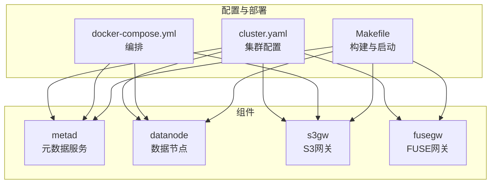
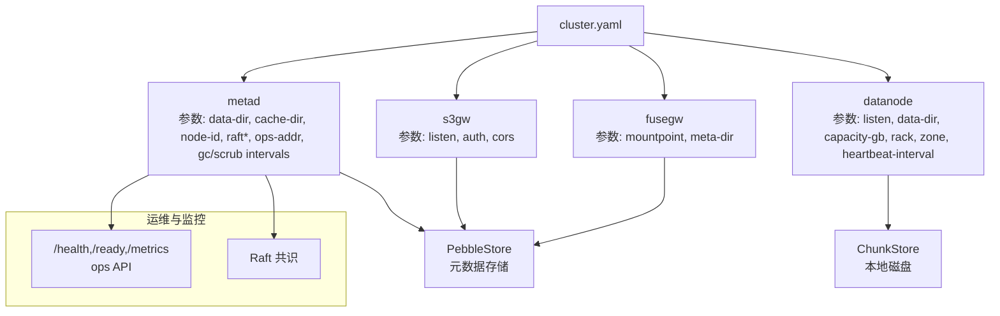
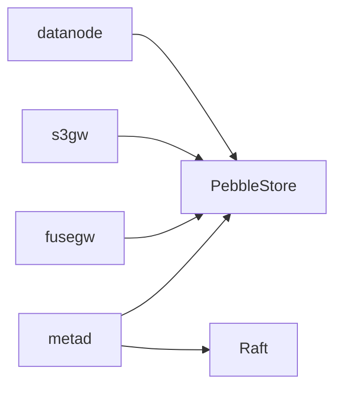

# 配置管理

<cite>
**本文引用的文件**
- [cluster.yaml](file://nufs-core/deploy/config/cluster.yaml)
- [main.go（datanode）](file://nufs-core/cmd/datanode/main.go)
- [main.go（metad）](file://nufs-core/cmd/metad/main.go)
- [main.go（s3gw）](file://nufs-core/cmd/s3gw/main.go)
- [main.go（fusegw）](file://nufs-core/cmd/fusegw/main.go)
- [types.go（metadata）](file://nufs-core/metadata/types.go)
- [types.go（datanode）](file://nufs-core/datanode/types.go)
- [service.go（metadata）](file://nufs-core/metadata/service.go)
- [production.go（metadata）](file://nufs-core/metadata/production.go)
- [pebble_raft.go（metadata）](file://nufs-core/metadata/pebble_raft.go)
- [auth.go（s3）](file://nufs-core/gateway/s3/auth.go)
- [docker-compose.yml](file://nufs-core/docker-compose.yml)
- [Makefile](file://nufs-core/Makefile)
- [ARCHITECTURE.md](file://nufs-core/ARCHITECTURE.md)
</cite>

## 目录
1. [简介](#简介)
2. [项目结构](#项目结构)
3. [核心组件](#核心组件)
4. [架构总览](#架构总览)
5. [详细组件分析](#详细组件分析)
6. [依赖关系分析](#依赖关系分析)
7. [性能考量](#性能考量)
8. [故障排查指南](#故障排查指南)
9. [结论](#结论)
10. [附录](#附录)

## 简介
本章节面向NUFS分布式文件系统的配置管理，围绕cluster.yaml配置文件、各组件配置项、参数优先级、动态配置与热加载、配置验证与回滚策略进行系统化说明，并提供不同部署场景的配置模板与最佳实践，同时覆盖配置安全、敏感信息保护与配置审计建议。

## 项目结构
NUFS配置相关的关键位置如下：
- 集群配置文件：nufs-core/deploy/config/cluster.yaml
- 各组件入口与命令行参数：cmd/* 主程序
- 元数据服务配置与运行参数：metadata/service.go、metadata/production.go、metadata/pebble_raft.go
- S3网关鉴权与配置：gateway/s3/auth.go
- 部署与编排：docker-compose.yml、Makefile
- 架构与运维参考：ARCHITECTURE.md

图表来源
- [cluster.yaml:1-62](file://nufs-core/deploy/config/cluster.yaml#L1-L62)
- [docker-compose.yml:1-148](file://nufs-core/docker-compose.yml#L1-L148)
- [Makefile:1-76](file://nufs-core/Makefile#L1-L76)

章节来源
- [cluster.yaml:1-62](file://nufs-core/deploy/config/cluster.yaml#L1-L62)
- [docker-compose.yml:1-148](file://nufs-core/docker-compose.yml#L1-L148)
- [Makefile:1-76](file://nufs-core/Makefile#L1-L76)

## 核心组件
- 集群配置文件（cluster.yaml）
  - 作用：集中定义集群名称、区域、元数据、数据节点、S3网关、FUSE网关、放置策略、维修与再平衡等默认参数。
  - 适用范围：生产部署的统一入口，便于CI/CD与自动化编排。
- 元数据服务（metad）
  - 作用：提供命名空间、Chunk映射、租约、GC、清洗、Raft共识等能力。
  - 关键配置：数据目录、缓存目录、节点ID、MemTable大小、Raft开关与地址、操作API地址、租约TTL、GC与清洗周期等。
- 数据节点（datanode）
  - 作用：本地磁盘存储、读写处理、复制、心跳上报、运维API等。
  - 关键配置：监听地址、数据目录、容量、机架/可用区、心跳间隔、并发读写限制、存储层级等。
- S3网关（s3gw）
  - 作用：S3兼容REST接口、鉴权（AWS Signature V4）、CORS、中间件链。
  - 关键配置：监听地址、元数据目录、访问密钥/密钥、CORS允许来源与方法。
- FUSE网关（fusegw）
  - 作用：Linux FUSE挂载，将DFS暴露为本地文件系统。
  - 关键配置：挂载点、元数据目录。

章节来源
- [main.go（metad）:22-36](file://nufs-core/cmd/metad/main.go#L22-L36)
- [main.go（datanode）:19-46](file://nufs-core/cmd/datanode/main.go#L19-L46)
- [main.go（s3gw）:18-24](file://nufs-core/cmd/s3gw/main.go#L18-L24)
- [main.go（fusegw）:17-22](file://nufs-core/cmd/fusegw/main.go#L17-L22)

## 架构总览
下图展示配置在系统中的流转与影响面：

图表来源
- [cluster.yaml:4-61](file://nufs-core/deploy/config/cluster.yaml#L4-L61)
- [main.go（metad）:22-36](file://nufs-core/cmd/metad/main.go#L22-L36)
- [main.go（datanode）:19-46](file://nufs-core/cmd/datanode/main.go#L19-L46)
- [main.go（s3gw）:18-24](file://nufs-core/cmd/s3gw/main.go#L18-L24)
- [main.go（fusegw）:17-22](file://nufs-core/cmd/fusegw/main.go#L17-L22)

## 详细组件分析

### cluster.yaml 参数说明与默认值
- cluster
  - name：集群名称（字符串），示例："dfs-cluster-01"
  - region：区域标识（字符串），示例："us-east-1"
- metadata
  - etcd_endpoints：元数据服务依赖的外部存储端点列表（数组）
  - badger_cache_dir：Badger缓存目录（字符串）
  - node_id：元数据节点ID（整数）
- datanode
  - listen：数据节点监听地址（字符串），示例：":9001"
  - data_dir：数据根目录（字符串），示例："/var/lib/dfs/datanode"
  - capacity_gb：节点容量（GB，整数），示例：1000
  - tier：存储层级（字符串），取值："hot"|"warm"|"cold"|"archive"
  - rack：机架标识（字符串），示例："rack1"
  - zone：可用区标识（字符串），示例："zone1"
  - heartbeat_interval：心跳间隔（字符串，时长），示例："10s"
- s3gw
  - listen：监听地址（字符串），示例：":8080"
  - etcd_endpoints：依赖的外部存储端点列表（数组）
  - auth.enabled：是否启用鉴权（布尔）
  - auth.access_key：访问密钥（字符串）
  - auth.secret_key：密钥（字符串）
  - cors.allow_origins：允许的来源（数组），示例：["*"]
  - cors.allow_methods：允许的方法（数组），示例：["GET","PUT","POST","DELETE","HEAD"]
- fusegw
  - mountpoint：挂载点（字符串），示例："/mnt/dfs"
  - etcd_endpoints：依赖的外部存储端点列表（数组）
  - badger_cache_dir：Badger缓存目录（字符串）
- placement
  - replication_factor：复制因子（整数），示例：3
  - topology_spread：拓扑分布策略（字符串），取值："node"|"rack"|"zone"
  - storage_tier：默认存储层级（字符串），取值："hot"|"warm"|"cold"|"archive"
- repair
  - scan_interval：扫描间隔（字符串，时长），示例："30s"
  - max_concurrent_repairs：最大并发修复任务数（整数），示例：5
- rebalance
  - threshold：触发再平衡的不平衡阈值（浮点数，百分比），示例：0.1（即10%）
  - max_migrations_per_run：每次运行的最大迁移数（整数），示例：100
  - scan_interval：扫描间隔（字符串，时长），示例："5m"

章节来源
- [cluster.yaml:4-61](file://nufs-core/deploy/config/cluster.yaml#L4-L61)

### 元数据服务（metad）配置项与参数优先级
- 关键参数
  - data-dir：Pebble数据目录（字符串）
  - cache-dir：Pebble读缓存目录（字符串，可选）
  - node-id：元数据节点ID（整数）
  - memtable-size：Pebble MemTable大小（字节，整数）
  - raft：是否启用Raft（布尔）
  - raft-addr：Raft绑定地址（字符串）
  - raft-dir：Raft数据目录（字符串）
  - raft-bootstrap：是否引导新Raft集群（布尔）
  - ops-addr：运维HTTP API地址（字符串）
  - lease-ttl：节点租约TTL（时长）
  - gc-interval：孤儿Chunk GC扫描间隔（时长）
  - gc-dry-run：GC干跑模式（布尔）
  - scrub-interval：数据清洗扫描间隔（时长）
- 参数优先级
  - 命令行参数 > 环境变量 > 配置文件（cluster.yaml）
  - 对于metad，命令行参数直接构造PebbleStore与RaftNode配置；cluster.yaml中的metadata部分为外部依赖（如etcd_endpoints）的示例，实际运行中需结合具体部署环境调整
- 动态配置与热加载
  - 代码中未见metad对运行时参数的热加载逻辑；运维通常通过重启服务应用新配置
- 验证规则
  - 未见显式的参数校验函数；可通过健康检查与运维API辅助验证（/health、/ready、/metrics）

章节来源
- [main.go（metad）:22-36](file://nufs-core/cmd/metad/main.go#L22-L36)
- [service.go（metadata）:218-272](file://nufs-core/metadata/service.go#L218-L272)
- [production.go（metadata）:220-242](file://nufs-core/metadata/production.go#L220-L242)

### 数据节点（datanode）配置项与参数优先级
- 关键参数
  - node-id：节点ID（整数）
  - listen：监听地址（字符串）
  - data-dir：数据目录（字符串）
  - metadata：元数据服务地址（字符串）
  - rack：机架（字符串）
  - zone：可用区（字符串）
  - capacity：容量（GB，整数）
- 参数优先级
  - 命令行参数 > 配置文件（cluster.yaml）
  - datanode默认配置在代码中定义，若未指定命令行参数，则采用默认值
- 动态配置与热加载
  - 代码中未见datanode对运行时参数的热加载逻辑；运维通常通过重启服务应用新配置
- 验证规则
  - 未见显式的参数校验函数；可通过节点注册与心跳上报辅助验证

章节来源
- [main.go（datanode）:19-46](file://nufs-core/cmd/datanode/main.go#L19-L46)
- [types.go（datanode）:56-70](file://nufs-core/datanode/types.go#L56-L70)

### S3网关（s3gw）配置项与参数优先级
- 关键参数
  - listen：监听地址（字符串）
  - meta-dir：元数据目录（字符串）
  - access-key：访问密钥（字符串）
  - secret-key：密钥（字符串）
- 参数优先级
  - 命令行参数 > 环境变量 > 配置文件（cluster.yaml）
- 动态配置与热加载
  - 代码中未见s3gw对运行时参数的热加载逻辑；运维通常通过重启服务应用新配置
- 验证规则
  - 未见显式的参数校验函数；可通过鉴权验证与CORS设置辅助验证

章节来源
- [main.go（s3gw）:18-24](file://nufs-core/cmd/s3gw/main.go#L18-L24)
- [auth.go（s3）:14-29](file://nufs-core/gateway/s3/auth.go#L14-L29)

### FUSE网关（fusegw）配置项与参数优先级
- 关键参数
  - mount：挂载点（字符串）
  - meta-dir：元数据目录（字符串）
- 参数优先级
  - 命令行参数 > 配置文件（cluster.yaml）
- 动态配置与热加载
  - 代码中未见fusegw对运行时参数的热加载逻辑；运维通常通过卸载/挂载应用新配置
- 验证规则
  - 未见显式的参数校验函数；可通过挂载点存在性与权限辅助验证

章节来源
- [main.go（fusegw）:17-22](file://nufs-core/cmd/fusegw/main.go#L17-L22)

### 配置验证规则
- 参数类型与取值范围
  - cluster.metadata.etcd_endpoints：数组，元素为字符串
  - cluster.datanode.tier：枚举值"hot"|"warm"|"cold"|"archive"
  - cluster.placement.topology_spread：枚举值"node"|"rack"|"zone"
  - cluster.repair.scan_interval、rebalance.scan_interval：字符串形式的时长
  - cluster.repair.max_concurrent_repairs、rebalance.max_migrations_per_run：正整数
  - cluster.rebalance.threshold：0~1之间的浮点数
- 建议的验证策略
  - 在CI阶段对cluster.yaml进行YAML语法与字段存在性校验
  - 在部署脚本中对关键字段（如listen、data_dir、capacity_gb等）进行格式与范围检查
  - 通过健康检查与运维API辅助运行时验证

章节来源
- [cluster.yaml:4-61](file://nufs-core/deploy/config/cluster.yaml#L4-L61)

### 动态配置更新机制
- 现状
  - 各组件均未实现运行时参数的热加载；通常通过重启服务应用新配置
- 建议
  - 对于非关键参数（如扫描间隔、日志级别），可在运维层面引入“优雅重启”与“滚动升级”
  - 对于敏感参数（如鉴权凭据），建议通过外部密钥管理服务注入，避免明文写入配置文件

章节来源
- [main.go（metad）:128-149](file://nufs-core/cmd/metad/main.go#L128-L149)
- [main.go（datanode）:125-133](file://nufs-core/cmd/datanode/main.go#L125-L133)
- [main.go（s3gw）:72-90](file://nufs-core/cmd/s3gw/main.go#L72-L90)
- [main.go（fusegw）:52-62](file://nufs-core/cmd/fusegw/main.go#L52-L62)

### 配置热加载与回滚策略
- 热加载
  - 当前代码未实现热加载；建议通过外部配置中心或文件变更监控，在变更时触发“优雅重启”
- 回滚策略
  - 采用“蓝绿/金丝雀”发布，逐步替换实例，失败时快速回滚
  - 保留最近N份配置备份，配合健康检查与运维API进行回滚验证

章节来源
- [docker-compose.yml:28-33](file://nufs-core/docker-compose.yml#L28-L33)
- [ARCHITECTURE.md:822-831](file://nufs-core/ARCHITECTURE.md#L822-L831)

### 不同部署场景下的配置模板与最佳实践
- 单机开发（all-in-one）
  - 使用docker-compose或单容器运行，简化调试与演示
  - 参考：[docker-compose.yml:768-778](file://nufs-core/docker-compose.yml#L768-L778)
- 生产小集群（Docker Compose）
  - 1个元数据服务 + 3个数据节点（跨rack），1个S3网关
  - 参考：[docker-compose.yml:780-794](file://nufs-core/docker-compose.yml#L780-L794)
- 大规模（Kubernetes）
  - 使用Helm部署，StatefulSet + PVC + Service + Ingress
  - 参考：[docker-compose.yml:796-804](file://nufs-core/docker-compose.yml#L796-L804)
- 最佳实践
  - 将敏感信息（如access_key/secret_key）置于密钥管理服务，避免硬编码
  - 为每个组件设置独立的健康检查与就绪探针
  - 为元数据与数据节点分别配置独立持久卷，确保数据安全

章节来源
- [docker-compose.yml:768-804](file://nufs-core/docker-compose.yml#L768-L804)
- [ARCHITECTURE.md:808-821](file://nufs-core/ARCHITECTURE.md#L808-L821)

### 配置安全、敏感信息保护与配置审计
- 安全与敏感信息保护
  - S3网关鉴权：通过AWS Signature V4实现，支持匿名模式与预签名URL
  - 凭据管理：建议使用外部密钥管理服务注入，避免明文写入配置文件
  - CORS：严格限制allow_origins与allow_methods
- 配置审计
  - 通过运维API（/health、/ready、/metrics）记录服务状态与指标
  - 建议在CI/CD中记录配置变更历史与审批流程

章节来源
- [auth.go（s3）:31-98](file://nufs-core/gateway/s3/auth.go#L31-L98)
- [main.go（metad）:151-219](file://nufs-core/cmd/metad/main.go#L151-L219)

## 依赖关系分析
- 组件耦合
  - datanode依赖元数据服务（注册、心跳、运维API）
  - s3gw/fusegw依赖元数据服务（PebbleStore）
  - metad可选启用Raft共识，提升一致性与可用性
- 外部依赖
  - cluster.yaml中的etcd_endpoints为示例，实际部署需根据环境调整
- 循环依赖
  - 未发现循环依赖；组件间通过服务接口与HTTP API交互

图表来源
- [main.go（datanode）:69-76](file://nufs-core/cmd/datanode/main.go#L69-L76)
- [main.go（s3gw）:30-37](file://nufs-core/cmd/s3gw/main.go#L30-L37)
- [main.go（fusegw）:34-41](file://nufs-core/cmd/fusegw/main.go#L34-L41)
- [pebble_raft.go（metadata）:464-484](file://nufs-core/metadata/pebble_raft.go#L464-L484)

章节来源
- [main.go（datanode）:69-91](file://nufs-core/cmd/datanode/main.go#L69-L91)
- [main.go（s3gw）:30-52](file://nufs-core/cmd/s3gw/main.go#L30-L52)
- [main.go（fusegw）:34-48](file://nufs-core/cmd/fusegw/main.go#L34-L48)
- [pebble_raft.go（metadata）:464-496](file://nufs-core/metadata/pebble_raft.go#L464-L496)

## 性能考量
- 参数调优建议
  - datanode：合理设置并发读写限制与心跳间隔，避免资源争用
  - metad：根据数据规模调整MemTable大小与GC/清洗周期
  - placement：根据业务特性选择合适的拓扑分布与存储层级
- 监控与指标
  - 通过运维API获取指标，结合Kubernetes探针进行健康检查

章节来源
- [types.go（datanode）:37-41](file://nufs-core/datanode/types.go#L37-L41)
- [service.go（metadata）:229-237](file://nufs-core/metadata/service.go#L229-L237)
- [production.go（metadata）:318-422](file://nufs-core/metadata/production.go#L318-L422)

## 故障排查指南
- 常见问题定位
  - 元数据服务：检查/health与/ready状态，确认Raft角色与Leader地址
  - 数据节点：检查注册状态、心跳上报、磁盘使用率与Chunk状态
  - S3网关：检查鉴权与CORS配置，验证签名流程
- 建议流程
  - 通过运维API获取状态与指标
  - 结合日志与探针进行定位
  - 采用回滚策略快速恢复

章节来源
- [main.go（metad）:151-219](file://nufs-core/cmd/metad/main.go#L151-L219)
- [ARCHITECTURE.md:837-854](file://nufs-core/ARCHITECTURE.md#L837-L854)

## 结论
NUFS的配置管理以cluster.yaml为核心，结合各组件命令行参数实现集中化与模块化的配置体系。当前代码未实现运行时热加载，建议通过外部配置中心与“优雅重启/滚动升级”实现动态配置更新与回滚。在安全方面，应强化敏感信息保护与配置审计，确保生产环境的合规与稳定。

## 附录
- 配置模板与示例
  - cluster.yaml：参见[nufs-core/deploy/config/cluster.yaml:1-62](file://nufs-core/deploy/config/cluster.yaml#L1-L62)
  - docker-compose：参见[nufs-core/docker-compose.yml:1-148](file://nufs-core/docker-compose.yml#L1-L148)
  - Makefile：参见[nufs-core/Makefile:1-76](file://nufs-core/Makefile#L1-L76)
- 运维与可观测性
  - 参见[nufs-core/ARCHITECTURE.md:835-854](file://nufs-core/ARCHITECTURE.md#L835-L854)