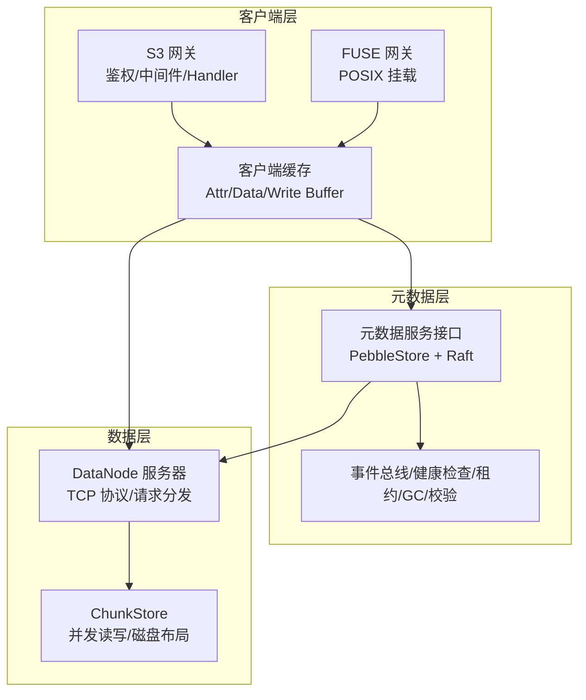
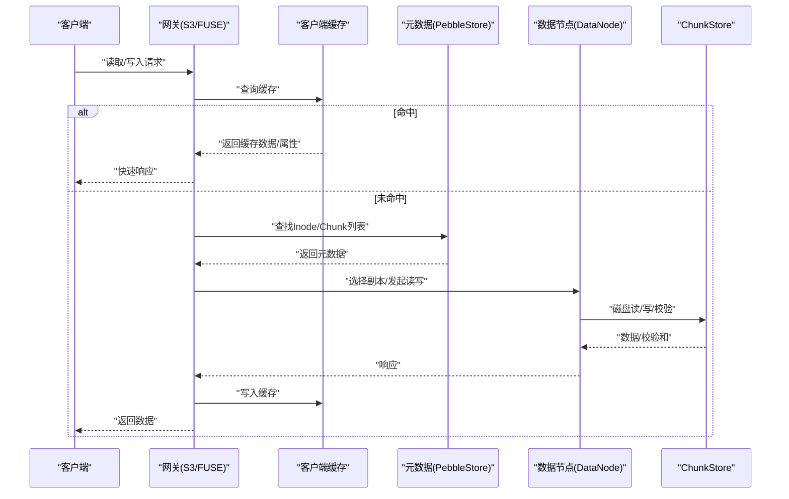
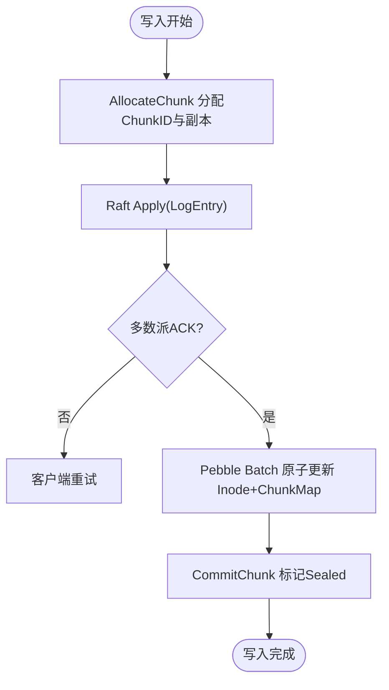
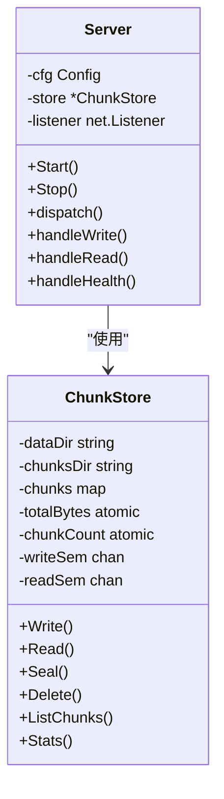
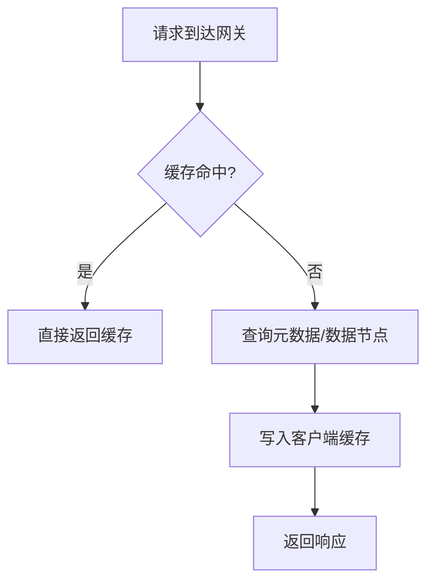
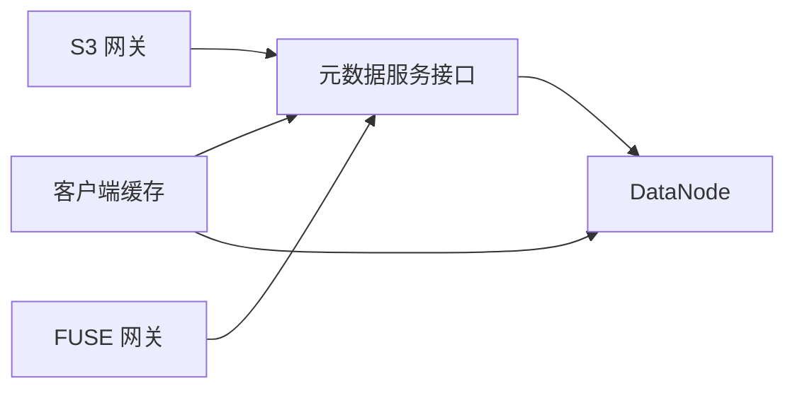

# 性能指标

<cite>
**本文引用的文件**
- [ARCHITECTURE.md](file://nufs-core/ARCHITECTURE.md)
- [go.mod](file://nufs-core/go.mod)
- [chunkstore.go](file://nufs-core/datanode/chunkstore.go)
- [server.go](file://nufs-core/datanode/server.go)
- [service.go](file://nufs-core/metadata/service.go)
- [production.go](file://nufs-core/metadata/production.go)
- [pebble_store.go](file://nufs-core/metadata/pebble_store.go)
- [cache.go](file://nufs-core/gateway/cache.go)
- [metrics.go](file://nufs-fuse/fs/metrics.go)
- [cluster.yaml](file://nufs-core/deploy/config/cluster.yaml)
- [main.go (metad)](file://nufs-core/cmd/metad/main.go)
- [main.go (datanode)](file://nufs-core/cmd/datanode/main.go)
- [main.go (s3gw)](file://nufs-core/cmd/s3gw/main.go)
- [main.go (fusegw)](file://nufs-core/cmd/fusegw/main.go)
</cite>

## 目录
1. [简介](#简介)
2. [项目结构](#项目结构)
3. [核心组件](#核心组件)
4. [架构总览](#架构总览)
5. [详细组件分析](#详细组件分析)
6. [依赖关系分析](#依赖关系分析)
7. [性能考量](#性能考量)
8. [故障排除指南](#故障排除指南)
9. [结论](#结论)
10. [附录](#附录)

## 简介
本文件面向NUFS分布式文件系统的性能指标与调优，围绕以下目标展开：
- 明确性能目标：读取P99<10ms，写入P99<20ms；同时给出吞吐量、可扩展性与资源利用率的评估维度。
- 基于代码实现解析系统的关键路径与瓶颈，结合可观测性指标，形成可落地的测试方法、基准结果解读与优化策略。
- 阐述缓存策略、网络协议与存储布局对性能的影响，并提供不同部署模式下的对比与容量规划建议。

## 项目结构
NUFS采用分层架构：客户端网关（S3/FUSE）→元数据层（Pebble+Raft）→数据层（DataNode ChunkStore）。各组件均提供可观测性与运维接口，便于性能监控与调优。

图表来源
- [ARCHITECTURE.md:38-101](file://nufs-core/ARCHITECTURE.md#L38-L101)
- [cache.go:17-56](file://nufs-core/gateway/cache.go#L17-L56)
- [service.go:16-67](file://nufs-core/metadata/service.go#L16-L67)
- [server.go:18-34](file://nufs-core/datanode/server.go#L18-L34)
- [chunkstore.go:18-31](file://nufs-core/datanode/chunkstore.go#L18-L31)

章节来源
- [ARCHITECTURE.md:25-116](file://nufs-core/ARCHITECTURE.md#L25-L116)

## 核心组件
- 元数据服务（PebbleStore + Raft）：提供命名空间、Inode/Chunk映射、租约、GC、校验等能力，支撑强一致写与最终一致读。
- 数据节点（DataNode）：提供TCP协议的数据读写、复制与健康上报，ChunkStore负责本地磁盘存储与并发控制。
- 网关层（S3/FUSE）：提供客户端缓存（Attr/Data/Write Buffer），降低元数据与数据往返开销。
- 可观测性：内置Metrics直方图与Prometheus导出，提供延迟直方图、计数器与健康探针。

章节来源
- [service.go:16-67](file://nufs-core/metadata/service.go#L16-L67)
- [production.go:216-271](file://nufs-core/metadata/production.go#L216-L271)
- [chunkstore.go:18-31](file://nufs-core/datanode/chunkstore.go#L18-L31)
- [cache.go:17-56](file://nufs-core/gateway/cache.go#L17-L56)
- [metrics.go:85-137](file://nufs-fuse/fs/metrics.go#L85-L137)

## 架构总览
NUFS的性能目标与实现要点：
- 性能目标：读P99<10ms，写P99<20ms；支持百亿元数据规模，可用性≥99.99%。
- 一致性与容错：Raft保证写入顺序与多数派确认；MVCC乐观锁；租约检测与GC/校验保障数据健康。
- 客户端缓存：Attr缓存（TTL 5s）、Data缓存（TTL 50s）、写缓冲（默认500MB）与定时刷写，显著降低延迟与提升吞吐。
- 存储布局：Chunk文件带二进制头+数据体+可选元数据边车；256分片目录避免单目录文件过多；并发读写信号量限制。

图表来源
- [ARCHITECTURE.md:349-417](file://nufs-core/ARCHITECTURE.md#L349-L417)
- [cache.go:103-172](file://nufs-core/gateway/cache.go#L103-L172)
- [server.go:128-179](file://nufs-core/datanode/server.go#L128-L179)
- [chunkstore.go:169-227](file://nufs-core/datanode/chunkstore.go#L169-L227)

章节来源
- [ARCHITECTURE.md:27-36](file://nufs-core/ARCHITECTURE.md#L27-L36)
- [ARCHITECTURE.md:349-417](file://nufs-core/ARCHITECTURE.md#L349-L417)

## 详细组件分析

### 元数据层（PebbleStore + Raft）
- 写入路径：S3/FUSE → 网关 → 元数据服务（AllocateChunk/CommitChunk）→ Raft日志（多数派ACK）→ Pebble批量写入Inode+ChunkMap。
- 一致性模型：Raft强一致写；MVCC乐观锁避免冲突；最终一致读走任意副本。
- 生产子系统：事件总线、健康检查、租约管理（30s TTL）、孤儿Chunk GC（默认10分钟）、数据校验（默认1小时）。

图表来源
- [ARCHITECTURE.md:349-383](file://nufs-core/ARCHITECTURE.md#L349-L383)
- [service.go:76-93](file://nufs-core/metadata/service.go#L76-L93)
- [production.go:216-271](file://nufs-core/metadata/production.go#L216-L271)

章节来源
- [pebble_store.go:49-89](file://nufs-core/metadata/pebble_store.go#L49-L89)
- [service.go:16-67](file://nufs-core/metadata/service.go#L16-L67)
- [production.go:216-271](file://nufs-core/metadata/production.go#L216-L271)

### 数据层（DataNode）
- TCP协议：长度前缀消息格式，支持写/读/复制/信息/列表/健康检查等请求类型。
- ChunkStore：并发读写信号量（默认写64/读256）；磁盘布局256分片目录；写入后校验与封印（Seal）更新头信息。
- 服务器：连接接受循环、请求分发、响应写出；健康上报包含容量/Chunk数量/磁盘IO等。

图表来源
- [chunkstore.go:18-31](file://nufs-core/datanode/chunkstore.go#L18-L31)
- [server.go:18-34](file://nufs-core/datanode/server.go#L18-L34)

章节来源
- [server.go:18-126](file://nufs-core/datanode/server.go#L18-L126)
- [chunkstore.go:73-127](file://nufs-core/datanode/chunkstore.go#L73-L127)

### 网关层（S3/FUSE）与客户端缓存
- 客户端缓存：Attr缓存（LRU，TTL 5s）、Data缓存（LRU，TTL 50s）、写缓冲（默认500MB，10s定时刷写）。
- FUSE侧提供延迟直方图与Prometheus导出，便于观测读写延迟分布。

图表来源
- [cache.go:103-172](file://nufs-core/gateway/cache.go#L103-L172)
- [metrics.go:165-171](file://nufs-fuse/fs/metrics.go#L165-L171)

章节来源
- [cache.go:17-56](file://nufs-core/gateway/cache.go#L17-L56)
- [metrics.go:85-137](file://nufs-fuse/fs/metrics.go#L85-L137)

## 依赖关系分析
- 技术栈与外部依赖：Pebble LSM-Tree、Raft、go-fuse、Prometheus客户端等。
- 组件耦合：网关依赖元数据服务接口；DataNode依赖元数据服务进行节点注册与心跳上报；客户端缓存贯穿读写路径。

图表来源
- [go.mod:5-50](file://nufs-core/go.mod#L5-L50)
- [service.go:16-67](file://nufs-core/metadata/service.go#L16-L67)
- [cache.go:17-56](file://nufs-core/gateway/cache.go#L17-L56)

章节来源
- [go.mod:1-51](file://nufs-core/go.mod#L1-L51)

## 性能考量

### 性能目标与指标定义
- 延迟目标：读P99<10ms，写P99<20ms（基于架构文档设计目标）。
- 吞吐量：以OPS（每秒操作数）与字节速率衡量；结合直方图统计P50/P90/P95/P99延迟。
- 可扩展性：水平扩展元数据（分片路由/一致性哈希）与数据节点；跨机房复制与再平衡。
- 资源利用率：CPU/内存/磁盘I/O/网络带宽；DataNode磁盘使用率与Chunk数量。

章节来源
- [ARCHITECTURE.md:27-36](file://nufs-core/ARCHITECTURE.md#L27-L36)

### 测试方法与基准
- 基准工具：可使用fio、radosbench、或自定义压测脚本模拟S3/FUSE工作负载。
- 指标采集：启用Prometheus导出（/metrics），抓取延迟直方图、错误计数、活跃句柄数、S3/FUSE操作计数。
- 场景覆盖：冷热数据混合、小文件合并、高并发读写、跨机房复制、节点故障注入。

章节来源
- [metrics.go:203-301](file://nufs-fuse/fs/metrics.go#L203-L301)

### 缓存策略对性能的影响
- Attr缓存（TTL 5s）：ls/stat等元数据操作接近内核页缓存级别延迟。
- Data缓存（TTL 50s）：热数据本地读取，显著降低网络往返与磁盘寻道。
- 写缓冲（默认500MB/10s）：聚合小写入，提高写入吞吐并降低元数据写放大。

章节来源
- [ARCHITECTURE.md:641-684](file://nufs-core/ARCHITECTURE.md#L641-L684)
- [cache.go:17-56](file://nufs-core/gateway/cache.go#L17-L56)

### 网络优化技术
- 请求/响应长度前缀协议，避免粘包；合理的超时设置（读/写/空闲）。
- 副本就近选择（同Rack/Zone）减少跨机房延迟。
- 并发控制：DataNode默认最大并发读256、写64，避免磁盘争用导致抖动。

章节来源
- [server.go:273-337](file://nufs-core/datanode/server.go#L273-L337)
- [ARCHITECTURE.md:413-417](file://nufs-core/ARCHITECTURE.md#L413-L417)
- [main.go (datanode):33-46](file://nufs-core/cmd/datanode/main.go#L33-L46)

### 存储优化方案
- Chunk文件头+数据体+可选元数据边车，减少额外索引开销。
- 256分片目录分散文件，避免单目录过大影响遍历与FS性能。
- 写入后Seal计算CRC32，确保数据完整性；读取时校验避免脏数据传播。

章节来源
- [ARCHITECTURE.md:511-534](file://nufs-core/ARCHITECTURE.md#L511-L534)
- [chunkstore.go:230-275](file://nufs-core/datanode/chunkstore.go#L230-L275)

### 不同部署模式下的性能对比
- 单机开发（all-in-one）：适合本地开发与小规模测试，延迟低但吞吐受限。
- Docker Compose（小集群）：元数据+数据节点分离，具备基本可扩展性。
- Kubernetes（大规模）：水平扩展元数据与数据节点，支持跨机房复制与再平衡。

章节来源
- [ARCHITECTURE.md:764-800](file://nufs-core/ARCHITECTURE.md#L764-L800)
- [cluster.yaml:1-62](file://nufs-core/deploy/config/cluster.yaml#L1-L62)

### 容量规划建议
- DataNode容量：根据Tier（热/温/冷/归档）与介质选择合理容量与副本因子（默认3）。
- 元数据容量：Pebble LSM-Tree支持十亿级键值，结合分片路由与快照策略保障稳定性。
- 再平衡阈值：当集群变异系数超过阈值（默认10%）触发迁移，保持均衡。

章节来源
- [cluster.yaml:18-62](file://nufs-core/deploy/config/cluster.yaml#L18-L62)
- [ARCHITECTURE.md:98-100](file://nufs-core/ARCHITECTURE.md#L98-L100)

### 性能监控指标
- 延迟直方图：S3 Get/Put/List、FUSE Read/Write。
- 计数器：S3/FUSE操作总数、错误数、重试次数。
- 运行状态：活跃句柄数、运行时长、熔断器状态。
- 元数据/数据：租约到期、GC扫描、数据校验、Chunk数量/容量。

章节来源
- [metrics.go:85-137](file://nufs-fuse/fs/metrics.go#L85-L137)
- [main.go (metad):151-212](file://nufs-core/cmd/metad/main.go#L151-L212)

## 故障排除指南
- 常见问题
  - 读取延迟升高：检查客户端缓存命中率、DataNode磁盘IO、副本选择是否就近。
  - 写入延迟升高：关注元数据写入（Raft日志）与ChunkStore并发限制。
  - 数据不一致：确认Chunk已Sealed且Checksum正确；检查校验扫描与修复队列。
- 排查步骤
  - 查看/health与/ready健康端点状态。
  - 抓取/ops/metrics与Prometheus指标，定位P99异常。
  - 检查租约（默认30s TTL）与GC/Scrub运行周期。
  - 观察DataNode健康上报（容量/Chunk数量/磁盘IO）。

章节来源
- [main.go (metad):151-212](file://nufs-core/cmd/metad/main.go#L151-L212)
- [production.go:216-271](file://nufs-core/metadata/production.go#L216-L271)
- [server.go:256-271](file://nufs-core/datanode/server.go#L256-L271)

## 结论
NUFS通过客户端缓存、就近副本选择、Raft强一致写与MVCC乐观锁、以及Pebble LSM-Tree与分片路由，实现了低延迟与高可扩展性的分布式文件系统。结合Prometheus直方图与运维接口，可在不同部署模式下进行性能验证与持续优化，达成读P99<10ms、写P99<20ms的目标。

## 附录

### 关键参数与默认值
- 客户端缓存
  - 最大缓存大小：1GB
  - Attr TTL：5s
  - 写缓冲：500MB
  - 刷写间隔：10s
- DataNode
  - 最大并发读：256
  - 最大并发写：64
  - 心跳间隔：10s
- 元数据
  - 租约TTL：30s
  - GC间隔：10分钟
  - Scrub间隔：1小时
  - Raft快照阈值：8192条日志/2分钟

章节来源
- [cache.go:17-56](file://nufs-core/gateway/cache.go#L17-L56)
- [main.go (datanode):33-46](file://nufs-core/cmd/datanode/main.go#L33-L46)
- [main.go (metad):32-36](file://nufs-core/cmd/metad/main.go#L32-L36)
- [ARCHITECTURE.md:169-174](file://nufs-core/ARCHITECTURE.md#L169-L174)