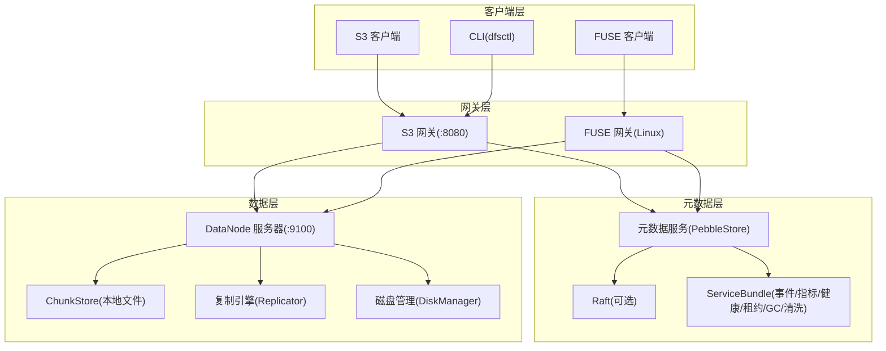
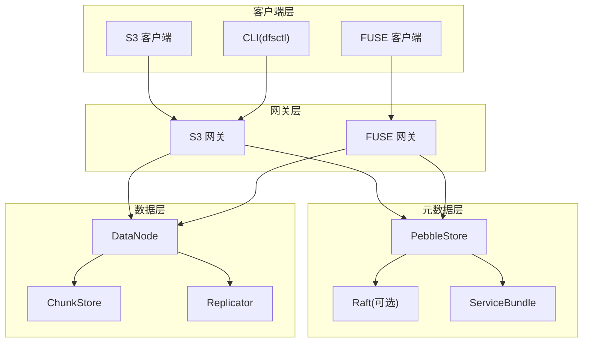
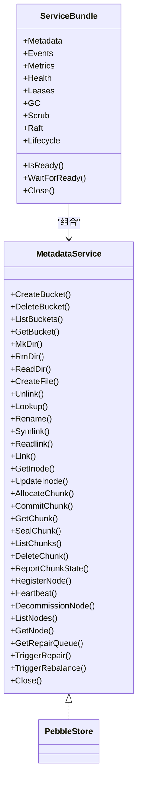
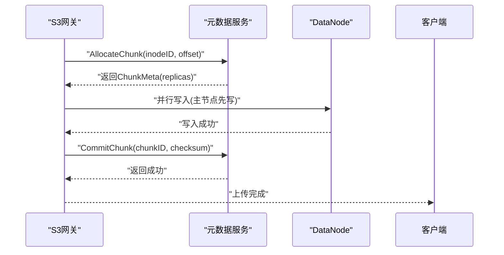
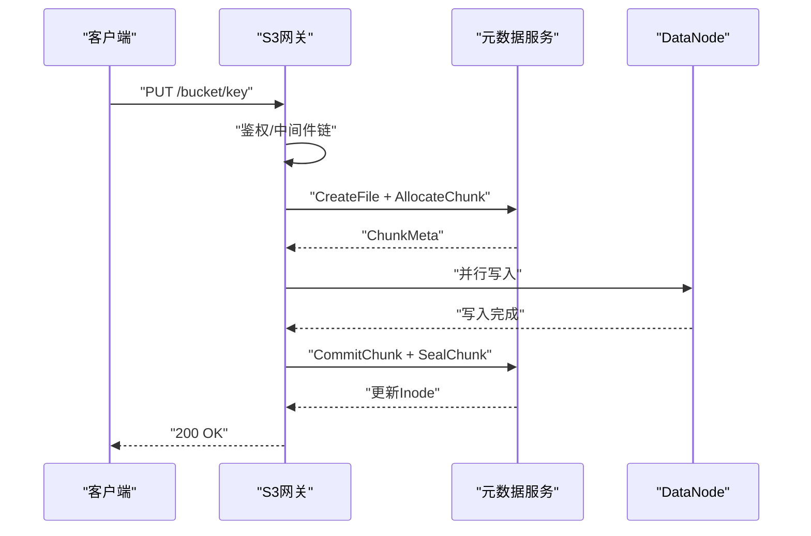
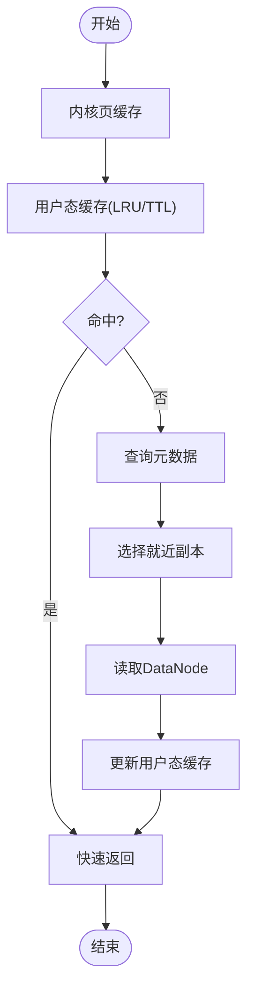
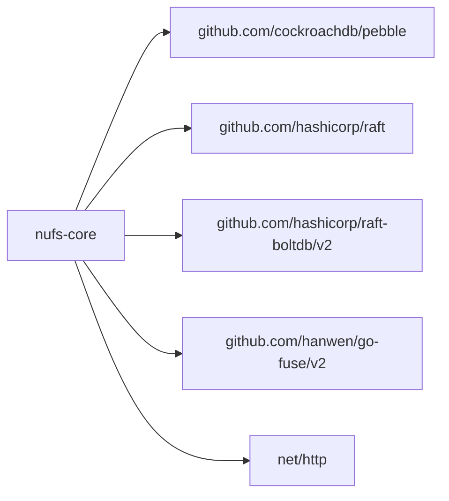

# 技术架构

<cite>
**本文引用的文件**
- [ARCHITECTURE.md](file://nufs-core/ARCHITECTURE.md)
- [go.mod](file://nufs-core/go.mod)
- [docker-compose.yml](file://nufs-core/docker-compose.yml)
- [cluster.yaml](file://nufs-core/deploy/config/cluster.yaml)
- [cmd/metad/main.go](file://nufs-core/cmd/metad/main.go)
- [cmd/datanode/main.go](file://nufs-core/cmd/datanode/main.go)
- [cmd/s3gw/main.go](file://nufs-core/cmd/s3gw/main.go)
- [cmd/fusegw/main.go](file://nufs-core/cmd/fusegw/main.go)
- [metadata/service.go](file://nufs-core/metadata/service.go)
- [datanode/server.go](file://nufs-core/datanode/server.go)
- [datanode/chunkstore.go](file://nufs-core/datanode/chunkstore.go)
- [gateway/s3/handler.go](file://nufs-core/gateway/s3/handler.go)
- [gateway/fuse/fs.go](file://nufs-core/gateway/fuse/fs.go)
</cite>

## 目录
1. [引言](#引言)
2. [项目结构](#项目结构)
3. [核心组件](#核心组件)
4. [架构总览](#架构总览)
5. [详细组件分析](#详细组件分析)
6. [依赖关系分析](#依赖关系分析)
7. [性能考量](#性能考量)
8. [故障排查指南](#故障排查指南)
9. [结论](#结论)
10. [附录](#附录)

## 引言
本技术架构文档面向NUFS分布式文件系统，系统采用分层架构与微服务模式，围绕“客户端层—网关层—元数据层—数据层”的边界进行设计。系统以S3 API与POSIX挂载（FUSE）作为对外接口，内部以Pebble+Raft提供元数据一致性与高可用，以数据节点（DataNode）提供块存储与复制能力，并通过放置引擎、租约管理、GC与清洗等运维子系统保障可靠性与可维护性。

## 项目结构
仓库采用模块化组织方式，核心位于nufs-core，包含元数据、数据节点、网关（S3/FUSE）、部署配置与构建脚本；nufs-fuse为独立的FUSE客户端实现模块。

图表来源
- [docker-compose.yml:1-148](file://nufs-core/docker-compose.yml#L1-L148)
- [cmd/s3gw/main.go:18-91](file://nufs-core/cmd/s3gw/main.go#L18-L91)
- [cmd/fusegw/main.go:17-63](file://nufs-core/cmd/fusegw/main.go#L17-L63)
- [cmd/metad/main.go:21-149](file://nufs-core/cmd/metad/main.go#L21-L149)
- [cmd/datanode/main.go:19-134](file://nufs-core/cmd/datanode/main.go#L19-L134)

章节来源
- [docker-compose.yml:1-148](file://nufs-core/docker-compose.yml#L1-L148)
- [go.mod:1-51](file://nufs-core/go.mod#L1-L51)

## 核心组件
- 元数据服务（PebbleStore + 可选 Raft）
  - 提供统一的元数据接口（桶、命名空间、Inode、Chunk、集群节点、修复与再平衡等），并通过ServiceBundle组合事件总线、指标、健康检查、租约、GC、清洗与生命周期引擎。
- 数据节点（DataNode）
  - 提供TCP协议的数据读写、复制、健康上报、磁盘管理与运维API。
- 网关层
  - S3网关：提供S3兼容REST API与中间件链（恢复、请求ID、CORS、日志、鉴权）。
  - FUSE网关：基于go-fuse在Linux上提供POSIX挂载。
- 客户端缓存
  - S3/FUSE客户端侧的属性与数据缓存、写缓冲与异步刷盘策略，提升热数据访问性能。

章节来源
- [metadata/service.go:16-135](file://nufs-core/metadata/service.go#L16-L135)
- [metadata/service.go:136-273](file://nufs-core/metadata/service.go#L136-L273)
- [datanode/server.go:18-127](file://nufs-core/datanode/server.go#L18-L127)
- [gateway/s3/handler.go:11-54](file://nufs-core/gateway/s3/handler.go#L11-L54)
- [gateway/fuse/fs.go:17-71](file://nufs-core/gateway/fuse/fs.go#L17-L71)

## 架构总览
系统采用三层架构与微服务拆分：
- 客户端层：S3 SDK、FUSE挂载、CLI工具。
- 网关层：S3网关与FUSE网关，负责协议适配、鉴权与中间件链。
- 元数据层：PebbleKV + 可选Raft共识，提供强一致写与MVCC乐观并发控制。
- 数据层：DataNode以块为单位存储，支持并行复制与副本修复。

图表来源
- [ARCHITECTURE.md:37-101](file://nufs-core/ARCHITECTURE.md#L37-L101)
- [cmd/s3gw/main.go:18-91](file://nufs-core/cmd/s3gw/main.go#L18-L91)
- [cmd/fusegw/main.go:17-63](file://nufs-core/cmd/fusegw/main.go#L17-L63)
- [cmd/metad/main.go:21-149](file://nufs-core/cmd/metad/main.go#L21-L149)
- [cmd/datanode/main.go:19-134](file://nufs-core/cmd/datanode/main.go#L19-L134)

## 详细组件分析

### 元数据服务（PebbleStore + ServiceBundle）
- 统一接口：提供桶、命名空间、Inode、Chunk、集群节点、修复与再平衡等操作。
- 一致性与并发：
  - Raft共识（可选）：日志复制、多数派确认、快照与尾随日志保留策略。
  - MVCC乐观并发：CAS更新Inode，冲突时客户端重试。
- 运维子系统：
  - 租约管理：节点注册与心跳续租，超时标记离线并触发修复。
  - GC：定期扫描孤儿Chunk并删除或dry-run。
  - 清洗：基于副本健康度检测损坏Chunk并发布修复事件。
  - 生命周期：按规则自动迁移与删除对象。
- 分片路由：一致性哈希分片，降低扩容迁移影响面。

图表来源
- [metadata/service.go:16-67](file://nufs-core/metadata/service.go#L16-L67)
- [metadata/service.go:76-135](file://nufs-core/metadata/service.go#L76-L135)

章节来源
- [metadata/service.go:16-273](file://nufs-core/metadata/service.go#L16-L273)
- [ARCHITECTURE.md:156-174](file://nufs-core/ARCHITECTURE.md#L156-L174)
- [ARCHITECTURE.md:202-246](file://nufs-core/ARCHITECTURE.md#L202-L246)

### 数据节点（DataNode）
- TCP协议：长度前缀消息，支持写、读、删除、复制、信息查询、列表与健康检查。
- ChunkStore：本地文件存储，带二进制头、校验与分片目录，支持并发读写信号量。
- 复制引擎：多Worker并行复制，指数退避重试，支持修复流程。
- 心跳上报：周期性上报磁盘使用、Chunk状态与IO指标。
- 磁盘管理：容量与健康监控，配合GC与清洗。

图表来源
- [ARCHITECTURE.md:349-383](file://nufs-core/ARCHITECTURE.md#L349-L383)
- [datanode/server.go:103-126](file://nufs-core/datanode/server.go#L103-L126)
- [datanode/chunkstore.go:73-127](file://nufs-core/datanode/chunkstore.go#L73-L127)

章节来源
- [datanode/server.go:18-462](file://nufs-core/datanode/server.go#L18-L462)
- [datanode/chunkstore.go:18-200](file://nufs-core/datanode/chunkstore.go#L18-L200)
- [ARCHITECTURE.md:248-287](file://nufs-core/ARCHITECTURE.md#L248-L287)

### 网关层（S3/FUSE）
- S3网关：路由解析、中间件链（恢复、请求ID、CORS、日志、鉴权V4）、桶/对象/分片上传等API。
- FUSE网关：基于go-fuse在Linux上挂载，Inode映射与属性转换，目录/文件/符号链接支持。

图表来源
- [gateway/s3/handler.go:70-166](file://nufs-core/gateway/s3/handler.go#L70-L166)
- [cmd/s3gw/main.go:18-91](file://nufs-core/cmd/s3gw/main.go#L18-L91)
- [ARCHITECTURE.md:349-383](file://nufs-core/ARCHITECTURE.md#L349-L383)

章节来源
- [gateway/s3/handler.go:11-184](file://nufs-core/gateway/s3/handler.go#L11-L184)
- [gateway/fuse/fs.go:17-128](file://nufs-core/gateway/fuse/fs.go#L17-L128)
- [cmd/fusegw/main.go:17-63](file://nufs-core/cmd/fusegw/main.go#L17-L63)

### 客户端缓存策略
- 层次化缓存：内核页缓存、用户态属性与数据缓存、写缓冲与异步刷盘。
- 一致性：TTL过期后重新验证；写缓冲超过阈值或定时刷新。
- 效果：热数据读延迟显著降低，写路径异步化。

图表来源
- [ARCHITECTURE.md:641-684](file://nufs-core/ARCHITECTURE.md#L641-L684)

章节来源
- [ARCHITECTURE.md:641-684](file://nufs-core/ARCHITECTURE.md#L641-L684)

## 依赖关系分析
- 技术栈与第三方依赖
  - 元数据-共识：hashicorp/raft
  - 元数据-存储：cockroachdb/pebble
  - 网关-S3：net/http
  - 网关-FUSE：hanwen/go-fuse/v2
  - 可观测：Prometheus兼容指标
- 版本与兼容性
  - Go版本：1.23.3
  - 关键依赖版本：pebble v1.1.5、raft v1.6.0、raft-boltdb v2.3.1、go-fuse/v2 v2.10.1

图表来源
- [go.mod:5-50](file://nufs-core/go.mod#L5-L50)

章节来源
- [go.mod:1-51](file://nufs-core/go.mod#L1-L51)

## 性能考量
- 写入路径：强一致Raft写入，随后异步复制，Seal后Ready，Batch原子更新Inode+ChunkMap，确保线性一致性与读写一致性。
- 读取路径：Attr与Data双缓存，就近/低负载副本选择，缓存命中率高时延迟极低。
- 小文件优化：小文件合并存储（Block），显著降低元数据与磁盘浪费。
- 并发控制：ChunkStore读写信号量限制并发，DataNode复制引擎多Worker并行。
- 可扩展性：分片路由一致性哈希，Raft分组隔离，跨机房异步多活+CRDT冲突解决。

章节来源
- [ARCHITECTURE.md:537-585](file://nufs-core/ARCHITECTURE.md#L537-L585)
- [ARCHITECTURE.md:588-638](file://nufs-core/ARCHITECTURE.md#L588-L638)
- [ARCHITECTURE.md:729-762](file://nufs-core/ARCHITECTURE.md#L729-L762)

## 故障排查指南
- 元数据层
  - 健康检查：/health与/ready端点，Raft领导者状态与版本信息。
  - 租约与离线：节点超时标记离线，触发修复与再平衡。
  - GC与清洗：孤儿Chunk扫描与删除、损坏检测与修复队列。
- 数据层
  - 心跳上报：磁盘使用、Chunk数量、IO与副本状态。
  - 复制失败：指数退避重试，修复流程从存活副本读取并写入新节点。
- 网关层
  - 中间件链：异常恢复、请求ID追踪、CORS与日志记录。
  - S3认证：AWS V4签名或匿名模式。

章节来源
- [cmd/metad/main.go:151-220](file://nufs-core/cmd/metad/main.go#L151-L220)
- [datanode/server.go:256-271](file://nufs-core/datanode/server.go#L256-L271)
- [gateway/s3/handler.go:46-54](file://nufs-core/gateway/s3/handler.go#L46-L54)

## 结论
NUFS采用清晰的分层与微服务架构，结合Pebble+Raft提供强一致元数据与MVCC乐观并发，DataNode以块存储与复制引擎保障高可用与可扩展性。S3与FUSE双接口满足多样化客户端需求，客户端缓存与小文件优化进一步提升性能与资源利用率。整体设计兼顾一致性、可用性与可运维性，适用于从单机开发到Kubernetes大规模部署的多种场景。

## 附录

### 部署拓扑与基础设施要求
- 单机开发（all-in-one）：容器内运行元数据+数据+网关。
- Docker Compose（小集群）：元数据（Pebble+Raft）+多个数据节点（跨机架）+S3网关。
- Kubernetes（大规模）：通过Helm安装，配置副本与持久卷。

章节来源
- [ARCHITECTURE.md:764-800](file://nufs-core/ARCHITECTURE.md#L764-L800)
- [docker-compose.yml:1-148](file://nufs-core/docker-compose.yml#L1-L148)
- [cluster.yaml:1-62](file://nufs-core/deploy/config/cluster.yaml#L1-L62)

### 系统边界与集成点
- 元数据服务边界：统一MetadataService接口，支持Raft分组与分片路由。
- 网关边界：S3兼容REST与FUSE POSIX，中间件链统一接入。
- 数据边界：DataNode TCP协议，ChunkStore本地文件，Replicator异步复制。
- 集成点：元数据服务暴露HTTP运维接口；DataNode通过HTTP/gRPC连接元数据服务（示例中直接连接PebbleStore简化演示）。

章节来源
- [cmd/metad/main.go:107-149](file://nufs-core/cmd/metad/main.go#L107-L149)
- [cmd/datanode/main.go:66-98](file://nufs-core/cmd/datanode/main.go#L66-L98)
- [gateway/s3/handler.go:56-68](file://nufs-core/gateway/s3/handler.go#L56-L68)