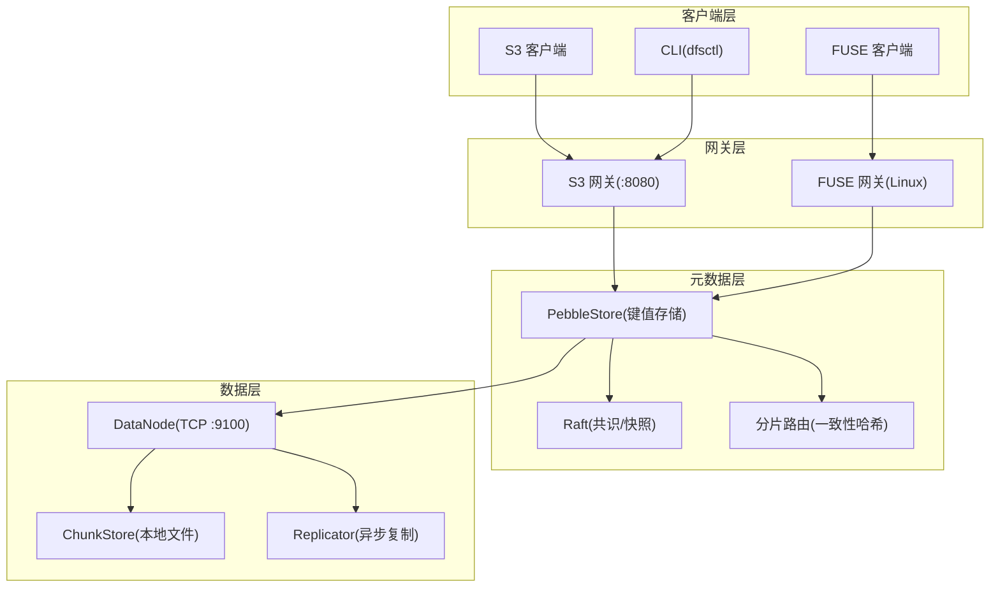
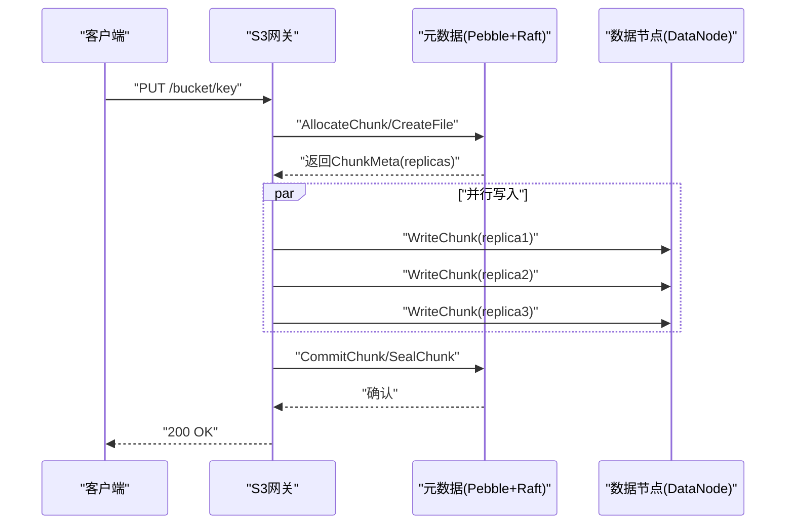
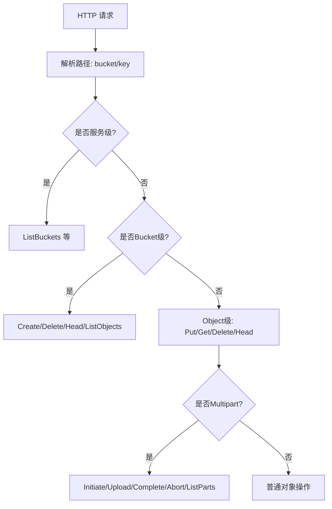
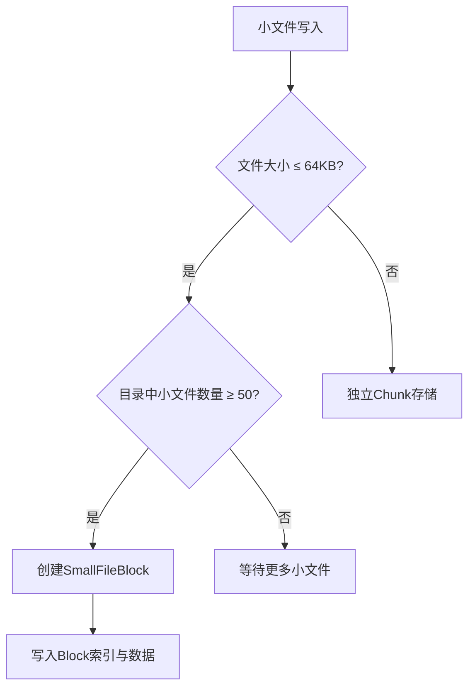
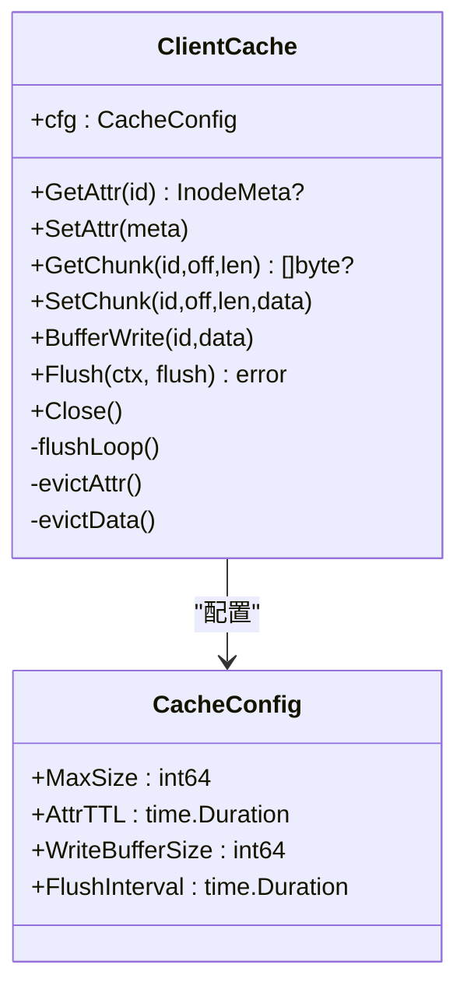
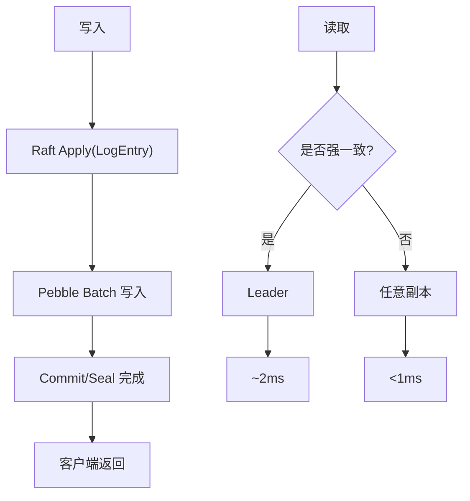
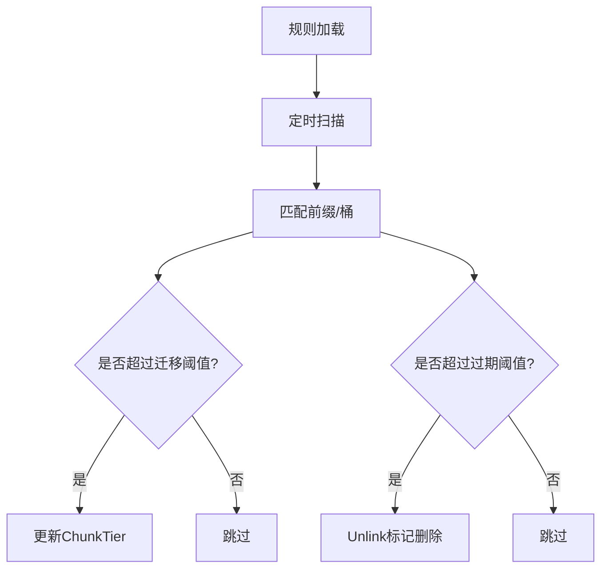
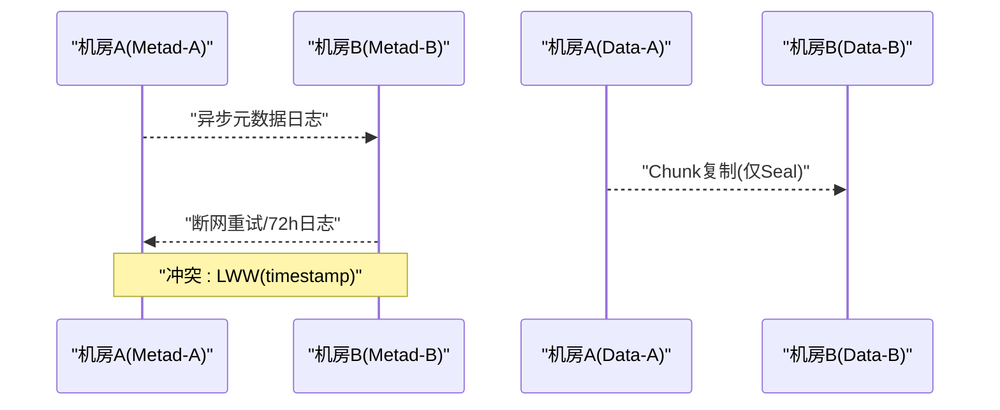
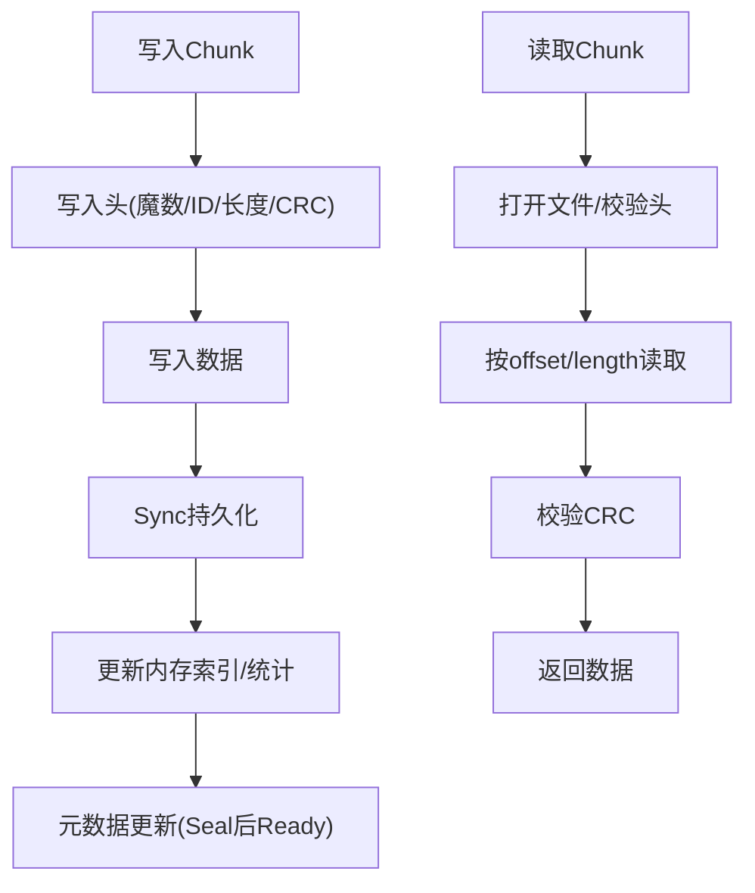
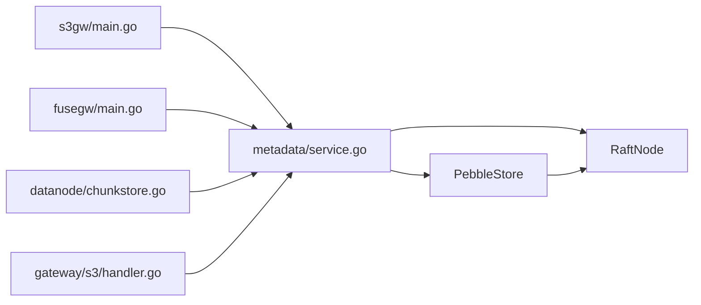

# 核心特性

<cite>
**本文引用的文件**
- [ARCHITECTURE.md](file://nufs-core/ARCHITECTURE.md)
- [go.mod](file://nufs-core/go.mod)
- [cmd/s3gw/main.go](file://nufs-core/cmd/s3gw/main.go)
- [cmd/fusegw/main.go](file://nufs-core/cmd/fusegw/main.go)
- [metadata/service.go](file://nufs-core/metadata/service.go)
- [metadata/smallfile.go](file://nufs-core/metadata/smallfile.go)
- [gateway/cache.go](file://nufs-core/gateway/cache.go)
- [metadata/lifecycle.go](file://nufs-core/metadata/lifecycle.go)
- [datanode/chunkstore.go](file://nufs-core/datanode/chunkstore.go)
- [gateway/s3/handler.go](file://nufs-core/gateway/s3/handler.go)
- [deploy/config/cluster.yaml](file://nufs-core/deploy/config/cluster.yaml)
- [docker-compose.yml](file://nufs-core/docker-compose.yml)
- [metadata/errors.go](file://nufs-core/metadata/errors.go)
- [TODO.md](file://nufs-core/TODO.md)
</cite>

## 目录
1. [简介](#简介)
2. [项目结构](#项目结构)
3. [核心组件](#核心组件)
4. [架构总览](#架构总览)
5. [详细组件分析](#详细组件分析)
6. [依赖关系分析](#依赖关系分析)
7. [性能考量](#性能考量)
8. [故障排查指南](#故障排查指南)
9. [结论](#结论)
10. [附录](#附录)

## 简介
本文件面向NUFS分布式文件系统的核心特性与技术亮点，围绕以下目标展开：  
- 大规模存储能力：百亿文件/PB级容量  
- 高可用性设计：99.99%年度可用性  
- 高性能优化：读取P99延迟<10ms，写入P99延迟<20ms  
- S3 API兼容与Linux FUSE挂载  
- 小文件优化与客户端缓存策略  
- 一致性模型、容错机制、生命周期管理与跨机房复制  
- 配置项与使用场景、性能基准与最佳实践  

## 项目结构
NUFS采用分层架构：客户端层（S3/FUSE/CLI）、网关层（S3/FUSE）、元数据层（Pebble+Raft）、数据层（DataNode），并通过一致性哈希分片与Raft共识保障大规模场景下的可扩展与可靠性。

**图表来源**
- [ARCHITECTURE.md:37-101](file://nufs-core/ARCHITECTURE.md#L37-L101)
- [docker-compose.yml:3-148](file://nufs-core/docker-compose.yml#L3-L148)

**章节来源**
- [ARCHITECTURE.md:25-116](file://nufs-core/ARCHITECTURE.md#L25-L116)
- [docker-compose.yml:3-148](file://nufs-core/docker-compose.yml#L3-L148)

## 核心组件
- 元数据服务接口与生产化组合：统一的MetadataService接口，配合ServiceBundle集成事件总线、指标、健康检查、租约、GC、静默检测、生命周期与可选Raft共识。
- 小文件优化：SmallFileBlock合并存储，阈值与索引结构降低元数据与空间浪费。
- 客户端缓存：属性与数据LRU缓存、写缓冲与异步刷回，显著降低延迟与放大效应。
- 生命周期管理：规则驱动的Tier迁移与过期删除，支持按桶与前缀匹配。
- 数据节点：ChunkStore二进制文件格式、并发读写信号量、异步复制与心跳上报。
- 网关：S3兼容REST与中间件链；FUSE基于go-fuse挂载POSIX文件系统。

**章节来源**
- [metadata/service.go:16-135](file://nufs-core/metadata/service.go#L16-L135)
- [metadata/smallfile.go:9-89](file://nufs-core/metadata/smallfile.go#L9-L89)
- [gateway/cache.go:17-96](file://nufs-core/gateway/cache.go#L17-L96)
- [metadata/lifecycle.go:16-70](file://nufs-core/metadata/lifecycle.go#L16-L70)
- [datanode/chunkstore.go:18-59](file://nufs-core/datanode/chunkstore.go#L18-L59)
- [gateway/s3/handler.go:11-54](file://nufs-core/gateway/s3/handler.go#L11-L54)

## 架构总览
NUFS以“元数据强一致+数据高可用”为核心设计，结合Raft保证元数据写入顺序与多数派确认，Pebble提供LSM-Tree的高吞吐KV存储，并通过一致性哈希分片与拓扑感知放置策略实现水平扩展。数据层采用Chunk复制与就近读策略，配合客户端缓存与小文件合并，达成高性能与高性价比。

**图表来源**
- [ARCHITECTURE.md:349-383](file://nufs-core/ARCHITECTURE.md#L349-L383)
- [gateway/s3/handler.go:70-166](file://nufs-core/gateway/s3/handler.go#L70-L166)
- [metadata/service.go:42-61](file://nufs-core/metadata/service.go#L42-L61)

## 详细组件分析

### S3 API兼容性
- 兼容端点覆盖服务级、Bucket级与Object级操作，支持Multipart上传、批量删除与头部查询。
- 中间件链：Recovery → RequestID → CORS → Logging → Auth(V4签名) → Handler。
- 认证：AWS Signature V4，匿名模式可选。

**图表来源**
- [gateway/s3/handler.go:70-166](file://nufs-core/gateway/s3/handler.go#L70-L166)

**章节来源**
- [gateway/s3/handler.go:11-54](file://nufs-core/gateway/s3/handler.go#L11-L54)
- [cmd/s3gw/main.go:18-90](file://nufs-core/cmd/s3gw/main.go#L18-L90)

### Linux FUSE挂载支持
- 基于go-fuse/v2实现，提供目录、文件、符号链接操作，Inode元信息与POSIX属性映射。
- 支持内核页缓存与用户态ClientCache两级缓存，降低延迟与放大效应。

**章节来源**
- [cmd/fusegw/main.go:17-62](file://nufs-core/cmd/fusegw/main.go#L17-L62)
- [ARCHITECTURE.md:319-331](file://nufs-core/ARCHITECTURE.md#L319-L331)

### 小文件优化
- 合并策略：文件≤64KB合并至1MB Block，Block内索引记录文件偏移、长度与CRC，目录≥50个小文件时创建Block。
- 效果：元数据减少80%，磁盘利用率从25%提升至90%。

**图表来源**
- [metadata/smallfile.go:70-89](file://nufs-core/metadata/smallfile.go#L70-L89)
- [ARCHITECTURE.md:588-638](file://nufs-core/ARCHITECTURE.md#L588-L638)

**章节来源**
- [metadata/smallfile.go:9-89](file://nufs-core/metadata/smallfile.go#L9-L89)
- [ARCHITECTURE.md:588-638](file://nufs-core/ARCHITECTURE.md#L588-L638)

### 客户端缓存策略
- 结构：属性缓存(LRU, TTL 5s)、数据缓存(LRU, TTL 50s)、写缓冲(默认500MB)。
- 行为：命中直接返回；TTL过期后验证；写缓冲定时与阈值触发刷回；后台flush循环。
- 一致性：读TTL内有效；写通过flush回调异步落盘。

**图表来源**
- [gateway/cache.go:29-96](file://nufs-core/gateway/cache.go#L29-L96)

**章节来源**
- [gateway/cache.go:17-325](file://nufs-core/gateway/cache.go#L17-L325)
- [ARCHITECTURE.md:641-684](file://nufs-core/ARCHITECTURE.md#L641-L684)

### 一致性模型与容错
- 写入：Raft多数派确认，Pebble Batch原子更新Inode+ChunkMap；MVCC乐观锁CAS。
- 读取：强一致读走Leader，最终一致读走任意副本；缓存读TTL内近似线性一致。
- 容错：LeaseManager检测离线，Scrubber静默损坏检测，GC清理孤儿Chunk，网络分区自动降级。

**图表来源**
- [ARCHITECTURE.md:537-585](file://nufs-core/ARCHITECTURE.md#L537-L585)
- [metadata/service.go:136-213](file://nufs-core/metadata/service.go#L136-L213)

**章节来源**
- [ARCHITECTURE.md:537-585](file://nufs-core/ARCHITECTURE.md#L537-L585)
- [metadata/service.go:136-213](file://nufs-core/metadata/service.go#L136-L213)

### 生命周期管理
- 规则：按桶与前缀匹配，支持Tier迁移与过期删除。
- 执行：定期扫描，按天数阈值触发迁移或设置NLink=0标记删除。
- 统计：迁移与删除计数器。

**图表来源**
- [metadata/lifecycle.go:35-90](file://nufs-core/metadata/lifecycle.go#L35-L90)
- [metadata/lifecycle.go:115-178](file://nufs-core/metadata/lifecycle.go#L115-L178)

**章节来源**
- [metadata/lifecycle.go:16-191](file://nufs-core/metadata/lifecycle.go#L16-L191)
- [ARCHITECTURE.md:686-727](file://nufs-core/ARCHITECTURE.md#L686-L727)

### 跨机房复制（异步多活+CRDT冲突）
- 元数据：追加日志异步推送，10s延迟；Chunk仅复制已Seal数据。
- 冲突：CRDT Last-Write-Wins（基于时间戳）。
- 故障切换：DNS切换1分钟内，备节点提升为主，原主恢复后增量同步。

**图表来源**
- [ARCHITECTURE.md:729-761](file://nufs-core/ARCHITECTURE.md#L729-L761)

**章节来源**
- [ARCHITECTURE.md:729-761](file://nufs-core/ARCHITECTURE.md#L729-L761)

### 数据节点与Chunk存储
- Chunk文件格式：二进制头+数据体+CRC，支持偏移读写与封顶校验。
- 并发控制：读写信号量限制并发，避免磁盘争用。
- 复制引擎：多Worker并行复制，指数退避重试，修复流程从存活副本读取并写入新目标。

**图表来源**
- [datanode/chunkstore.go:73-127](file://nufs-core/datanode/chunkstore.go#L73-L127)
- [datanode/chunkstore.go:169-227](file://nubits-core/datanode/chunkstore.go#L169-L227)

**章节来源**
- [datanode/chunkstore.go:18-395](file://nufs-core/datanode/chunkstore.go#L18-L395)
- [ARCHITECTURE.md:248-287](file://nufs-core/ARCHITECTURE.md#L248-L287)

### 元数据服务与Raft
- MetadataService统一接口，PebbleStore作为唯一后端，支持可选Raft共识。
- ServiceBundle集成：事件总线、指标、健康检查、租约、GC、静默检测、生命周期、可选Raft。
- Raft日志：二进制编码，支持OpSet/Delete/Batch；快照触发与保留策略。

**章节来源**
- [metadata/service.go:16-135](file://nufs-core/metadata/service.go#L16-L135)
- [metadata/service.go:136-273](file://nufs-core/metadata/service.go#L136-L273)
- [ARCHITECTURE.md:156-174](file://nufs-core/ARCHITECTURE.md#L156-L174)

## 依赖关系分析
- 技术栈：Pebble LSM-Tree、Raft共识、go-fuse、S3兼容HTTP。
- 外部依赖：hashicorp/raft、raft-boltdb、cockroachdb/pebble、hanwen/go-fuse/v2。

**图表来源**
- [go.mod:5-10](file://nufs-core/go.mod#L5-L10)
- [cmd/s3gw/main.go:14-52](file://nufs-core/cmd/s3gw/main.go#L14-L52)
- [cmd/fusegw/main.go:13-44](file://nufs-core/cmd/fusegw/main.go#L13-L44)
- [metadata/service.go:16-70](file://nufs-core/metadata/service.go#L16-L70)
- [datanode/chunkstore.go:18-31](file://nufs-core/datanode/chunkstore.go#L18-L31)
- [gateway/s3/handler.go:13-33](file://nufs-core/gateway/s3/handler.go#L13-L33)

**章节来源**
- [go.mod:1-51](file://nufs-core/go.mod#L1-L51)

## 性能考量
- 目标：读P99<10ms，写P99<20ms；百亿文件/PB级容量；99.99%可用性。
- 优化手段：小文件合并、客户端缓存、就近读、并发信号量、Raft多数派确认、Pebble批量写。
- 基准与测试：TODO中列出小文件100K files/s、大文件10GB/s吞吐与混合负载目标，当前值与目标值见里程碑。

**章节来源**
- [ARCHITECTURE.md:27-36](file://nufs-core/ARCHITECTURE.md#L27-L36)
- [TODO.md:183-194](file://nufs-core/TODO.md#L183-L194)

## 故障排查指南
- 常见错误分类：命名空间、Bucket、Chunk、节点/集群、一致性、系统错误。
- 常见场景：节点离线/租约过期、Chunk未封顶/校验失败、元数据版本冲突、非Leader写入、Raft应用失败。
- 建议：启用健康检查与指标端点，关注GC与静默检测日志，定位离线节点与损坏Chunk。

**章节来源**
- [metadata/errors.go:12-90](file://nufs-core/metadata/errors.go#L12-L90)
- [ARCHITECTURE.md:835-854](file://nufs-core/ARCHITECTURE.md#L835-L854)

## 结论
NUFS通过“强一致元数据+高可用数据层”的双轮驱动，在S3与FUSE双协议栈下实现了高性能、可扩展与高可用的分布式文件系统。小文件优化与客户端缓存显著降低延迟与放大效应；生命周期管理与跨机房复制提供自动化与灾备能力。结合Raft与Pebble的工程化实现，系统具备工程落地与持续演进的良好基础。

## 附录

### 配置与部署要点
- Docker Compose：元数据(Pebble+Raft)、3数据节点、S3网关，端口映射与健康检查。
- 集群配置：节点ID、监听地址、心跳间隔、复制因子、拓扑分布、修复与再平衡参数。
- 网关启动：S3网关支持认证开关与CORS配置；FUSE网关指定挂载点与元数据目录。

**章节来源**
- [docker-compose.yml:3-148](file://nufs-core/docker-compose.yml#L3-L148)
- [deploy/config/cluster.yaml:4-62](file://nufs-core/deploy/config/cluster.yaml#L4-L62)
- [cmd/s3gw/main.go:18-90](file://nufs-core/cmd/s3gw/main.go#L18-L90)
- [cmd/fusegw/main.go:17-62](file://nufs-core/cmd/fusegw/main.go#L17-L62)