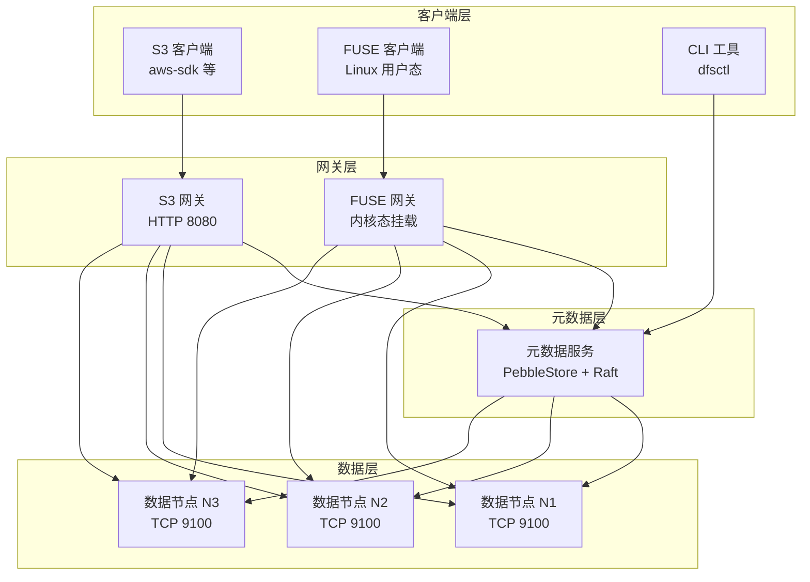
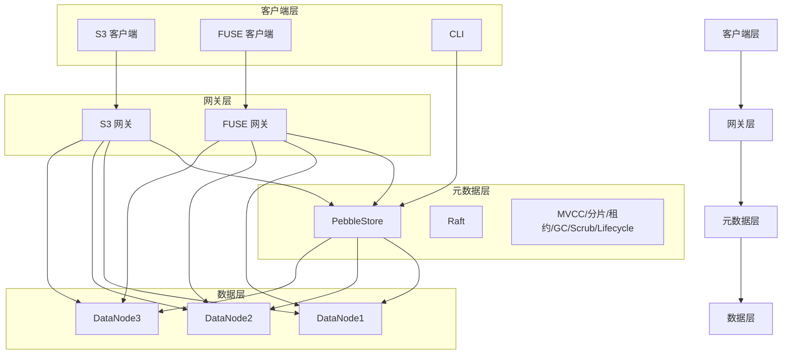
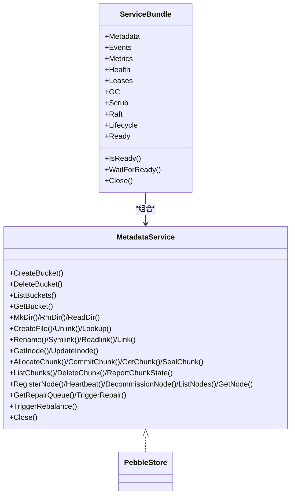
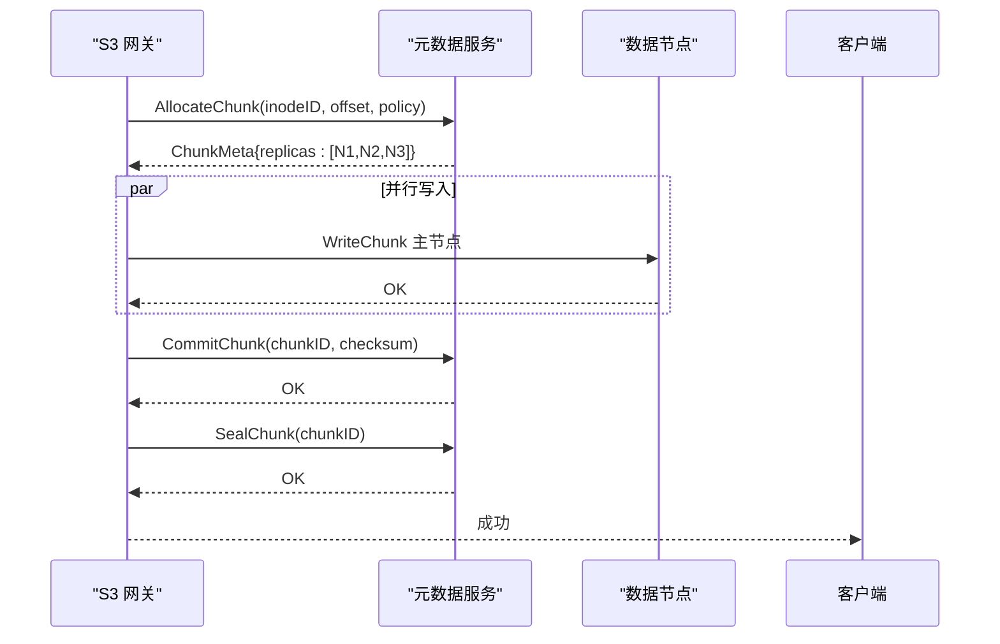
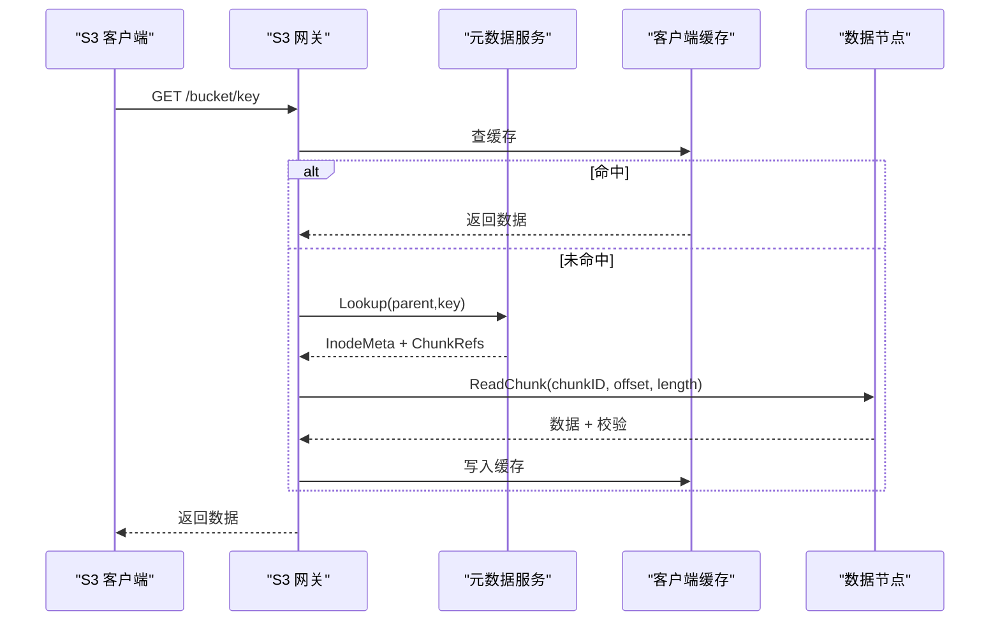
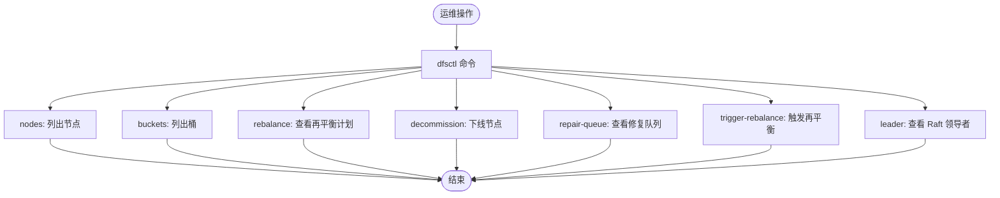
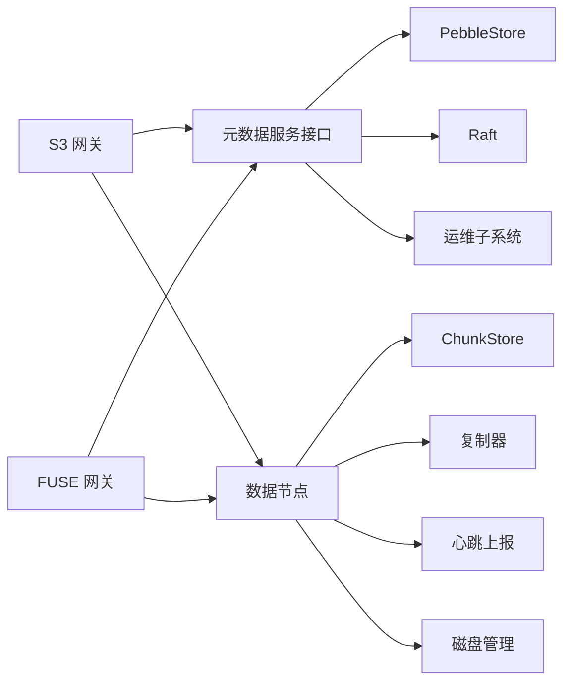

# 系统总览

<cite>
**本文引用的文件**
- [ARCHITECTURE.md](file://nufs-core/ARCHITECTURE.md)
- [s3gw/main.go](file://nufs-core/cmd/s3gw/main.go)
- [fusegw/main.go](file://nufs-core/cmd/fusegw/main.go)
- [metad/main.go](file://nufs-core/cmd/metad/main.go)
- [datanode/main.go](file://nufs-core/cmd/datanode/main.go)
- [service.go](file://nufs-core/metadata/service.go)
- [server.go](file://nufs-core/datanode/server.go)
- [handler.go](file://nufs-core/gateway/s3/handler.go)
- [fs.go](file://nufs-core/gateway/fuse/fs.go)
- [cluster.yaml](file://nufs-core/deploy/config/cluster.yaml)
- [docker-compose.yml](file://nufs-core/docker-compose.yml)
- [health.go](file://nufs-core/metadata/health.go)
- [TODO.md](file://nufs-core/TODO.md)
- [ctl/main.go](file://nufs-core/cmd/ctl/main.go)
</cite>

## 目录
1. [简介](#简介)
2. [项目结构](#项目结构)
3. [核心组件](#核心组件)
4. [架构总览](#架构总览)
5. [详细组件分析](#详细组件分析)
6. [依赖分析](#依赖分析)
7. [性能考虑](#性能考虑)
8. [故障排查指南](#故障排查指南)
9. [结论](#结论)
10. [附录](#附录)

## 简介
NUFS 是一个面向百亿文件与 PB 级存储规模的分布式文件系统，具备以下核心目标：
- 规模：支持百亿文件与 PB 级容量
- 可用性：99.99% 年可用性（停机时间小于 53 分钟）
- 延迟：读 P99 < 10ms，写 P99 < 20ms
- 接口：S3 API 兼容 + Linux FUSE 挂载
- 部署：单机开发、Docker Compose、Kubernetes

系统采用分层架构：客户端层（S3/FUSE/CLI）、网关层（S3/FUSE）、元数据层（Pebble + Raft）、数据层（DataNode）。通过小文件合并、客户端缓存、就近读、链复制与反熵修复等手段，兼顾高可用、高性能与高扩展性。

## 项目结构
仓库分为两大部分：
- nufs-core：核心存储与网关实现，包含元数据、数据节点、网关、命令行工具与部署配置
- nufs-fuse：独立的 FUSE 用户态文件系统实现（与网关层 FUSE 不冲突）

关键目录与职责：
- nufs-core/cmd：各服务入口（s3gw、fusegw、metad、datanode、ctl）
- nufs-core/metadata：元数据服务（PebbleStore、Raft、租约、GC、清洗、生命周期）
- nufs-core/datanode：数据节点（ChunkStore、复制器、心跳、磁盘管理、运维 API）
- nufs-core/gateway：网关层（S3 兼容 HTTP、FUSE 文件系统）
- nufs-core/deploy：集群配置与 Docker Compose 示例
- nufs-core/ARCHITECTURE.md：总体架构、数据流、一致性与容错、性能目标等

**图表来源**
- [s3gw/main.go:18-90](file://nufs-core/cmd/s3gw/main.go#L18-L90)
- [fusegw/main.go:17-62](file://nufs-core/cmd/fusegw/main.go#L17-L62)
- [metad/main.go:21-150](file://nufs-core/cmd/metad/main.go#L21-L150)
- [datanode/main.go:19-135](file://nufs-core/cmd/datanode/main.go#L19-L135)
- [handler.go:26-54](file://nufs-core/gateway/s3/handler.go#L26-L54)
- [fs.go:37-56](file://nufs-core/gateway/fuse/fs.go#L37-L56)

**章节来源**
- [ARCHITECTURE.md:37-116](file://nufs-core/ARCHITECTURE.md#L37-L116)
- [docker-compose.yml:1-148](file://nufs-core/docker-compose.yml#L1-L148)

## 核心组件
- 元数据服务（PebbleStore + Raft）
  - 双存储引擎抽象，当前以 Pebble 作为唯一后端
  - Raft 共识（可选），支持快照与多数派提交
  - MVCC 乐观并发控制（CAS）
  - 分片路由（一致性哈希）
  - 租约管理、孤儿 Chunk GC、静默损坏检测（Scrubber）、生命周期引擎
- 数据节点（DataNode）
  - TCP 协议（读/写/复制/列举/健康）
  - ChunkStore 本地存储（256 分片目录、校验和、并发信号量）
  - 复制器（多 Worker 并行、指数退避重试）
  - 心跳上报、磁盘管理、运维 API
- 网关层
  - S3 网关：S3 兼容 REST API，中间件链（恢复/请求 ID/CORS/日志/鉴权）
  - FUSE 网关：基于 go-fuse/v2 的 Linux POSIX 文件系统
  - 客户端缓存：属性缓存（TTL）、数据缓存（TTL）、写缓冲（异步刷盘）
- 客户端与运维
  - S3 客户端、FUSE 客户端、CLI（dfsctl）
  - 运维 API（/health、/ready、/metrics、/api/v1/*）

**章节来源**
- [service.go:16-135](file://nufs-core/metadata/service.go#L16-L135)
- [server.go:18-126](file://nufs-core/datanode/server.go#L18-L126)
- [handler.go:11-54](file://nufs-core/gateway/s3/handler.go#L11-L54)
- [fs.go:17-71](file://nufs-core/gateway/fuse/fs.go#L17-L71)
- [metad/main.go:44-106](file://nufs-core/cmd/metad/main.go#L44-L106)
- [datanode/main.go:51-123](file://nufs-core/cmd/datanode/main.go#L51-L123)

## 架构总览
系统分四层协作：
- 客户端层：S3 客户端、FUSE 客户端、CLI
- 网关层：S3 网关（HTTP）、FUSE 网关（内核态）
- 元数据层：PebbleStore（KV + LSM）、可选 Raft（共识/快照）、MVCC、分片路由
- 数据层：DataNode（ChunkStore + 复制器 + 心跳 + 磁盘管理）

**图表来源**
- [ARCHITECTURE.md:37-116](file://nufs-core/ARCHITECTURE.md#L37-L116)
- [handler.go:26-54](file://nufs-core/gateway/s3/handler.go#L26-L54)
- [fs.go:37-56](file://nufs-core/gateway/fuse/fs.go#L37-L56)
- [service.go:136-213](file://nufs-core/metadata/service.go#L136-L213)
- [server.go:36-126](file://nufs-core/datanode/server.go#L36-L126)

## 详细组件分析

### 元数据服务（PebbleStore + Raft）
- 双存储引擎抽象：统一 MetadataService 接口，当前以 Pebble 为唯一后端
- Raft 共识：日志条目编码、多数派提交、快照策略（阈值与间隔）、恢复
- MVCC：乐观锁（CAS），写入流程包含版本读取与冲突处理
- 分片路由：一致性哈希分片、RouteN 用于跨分片复制
- 租约管理：节点注册、心跳续租、过期标记、触发修复
- 运维子系统：事件总线、指标、健康检查、Chunk GC、Scrubber、生命周期引擎

**图表来源**
- [service.go:16-135](file://nufs-core/metadata/service.go#L16-L135)
- [service.go:136-213](file://nufs-core/metadata/service.go#L136-L213)

**章节来源**
- [service.go:16-273](file://nufs-core/metadata/service.go#L16-L273)
- [metad/main.go:44-106](file://nufs-core/cmd/metad/main.go#L44-L106)

### 数据节点（DataNode）
- TCP 协议：请求头 + JSON 头 + 身体，支持写/读/复制/列举/健康检查
- ChunkStore：本地文件存储（256 分片目录、二进制头 + 数据体 + 元数据边车、并发信号量）
- 复制器：多 Worker 并行复制、任务队列、指数退避重试、修复流程
- 心跳上报：磁盘使用、Chunk 状态、磁盘 IO
- 磁盘管理：容量监控、WAL、存储分层
- 运维 API：健康检查、统计信息、操作接口

**图表来源**
- [handler.go:70-166](file://nufs-core/gateway/s3/handler.go#L70-L166)
- [server.go:103-126](file://nufs-core/datanode/server.go#L103-L126)
- [server.go:130-156](file://nufs-core/datanode/server.go#L130-L156)

**章节来源**
- [server.go:18-462](file://nufs-core/datanode/server.go#L18-L462)
- [datanode/main.go:51-123](file://nufs-core/cmd/datanode/main.go#L51-L123)

### 网关层（S3 + FUSE）
- S3 网关：S3 兼容 API（服务级/桶级/对象级/分片上传）、中间件链（恢复/请求 ID/CORS/日志/鉴权）、认证（V4 签名/匿名）
- FUSE 网关：基于 go-fuse/v2，根 Inode → 目录/文件/符号链接，属性转换（权限/时间戳），Inode 缓存映射
- 客户端缓存：属性缓存（TTL）、数据缓存（TTL）、写缓冲（异步刷盘）

**图表来源**
- [handler.go:70-166](file://nufs-core/gateway/s3/handler.go#L70-L166)
- [fs.go:88-122](file://nufs-core/gateway/fuse/fs.go#L88-L122)
- [ARCHITECTURE.md:384-411](file://nufs-core/ARCHITECTURE.md#L384-L411)

**章节来源**
- [handler.go:11-184](file://nufs-core/gateway/s3/handler.go#L11-L184)
- [fs.go:17-128](file://nufs-core/gateway/fuse/fs.go#L17-L128)
- [ARCHITECTURE.md:288-344](file://nufs-core/ARCHITECTURE.md#L288-L344)

### 客户端与运维
- CLI（dfsctl）：节点列表、桶列表、再平衡计划、触发再平衡、下线节点、查看修复队列、查看 Raft 领导者
- 运维 API：/health、/ready、/metrics、/api/v1/*（节点、桶、集群状态、指标）
- 部署：Docker Compose（单机开发/小集群）、Kubernetes（待实现）

**图表来源**
- [ctl/main.go:42-221](file://nufs-core/cmd/ctl/main.go#L42-L221)

**章节来源**
- [ctl/main.go:17-228](file://nufs-core/cmd/ctl/main.go#L17-L228)
- [metad/main.go:152-221](file://nufs-core/cmd/metad/main.go#L152-L221)
- [docker-compose.yml:1-148](file://nufs-core/docker-compose.yml#L1-L148)

## 依赖分析
- 组件耦合
  - 网关层依赖元数据服务接口（MetadataService），屏蔽具体后端差异
  - 数据节点依赖元数据服务进行节点注册、心跳上报、Chunk 状态汇报
  - 元数据服务组合多个运维子系统（租约、GC、Scrubber、生命周期）
- 外部依赖
  - 共识：hashicorp/raft
  - 存储：Pebble（LSM-Tree）
  - 网关：net/http（S3）、hanwen/go-fuse/v2（FUSE）
  - 可观测：内置 Metrics + Health

**图表来源**
- [service.go:136-213](file://nufs-core/metadata/service.go#L136-L213)
- [handler.go:26-54](file://nufs-core/gateway/s3/handler.go#L26-L54)
- [fs.go:37-56](file://nufs-core/gateway/fuse/fs.go#L37-L56)
- [server.go:36-126](file://nufs-core/datanode/server.go#L36-L126)

**章节来源**
- [service.go:136-213](file://nufs-core/metadata/service.go#L136-L213)
- [ARCHITECTURE.md:103-115](file://nufs-core/ARCHITECTURE.md#L103-L115)

## 性能考虑
- 元数据层
  - Lookup/ReadDir/CreateFile + AllocateChunk < 5ms；亿级元数据启动 < 30s（待验证）
  - MVCC 冲突率 < 1%
- 数据层
  - 顺序写/读吞吐 > 500MB/s / > 1GB/s；随机读延迟 < 2ms；复制吞吐（4 Worker）> 200MB/s
  - 写/读并发：64/256（信号量控制）
- 网关层
  - S3 PUT（1MB）< 20ms；S3 GET（1MB，缓存命中）< 1ms；FUSE Read（缓存命中）< 100μs
  - S3 QPS（单网关）> 10K（待压测）
- 客户端缓存
  - 属性缓存 TTL=5s，数据缓存 TTL=50s；写缓冲 500MB，定时/阈值刷盘

**章节来源**
- [ARCHITECTURE.md:917-950](file://nufs-core/ARCHITECTURE.md#L917-L950)
- [ARCHITECTURE.md:641-684](file://nufs-core/ARCHITECTURE.md#L641-L684)

## 故障排查指南
- 健康检查
  - 元数据服务：/health、/ready；S3/FUSE 网关：/health；DataNode：/health
- 指标观测
  - /metrics：读/写 P50/P99（微秒）、错误计数、节点在线数、快照次数等
- 常见问题
  - 元数据写入冲突：MVCC 版本冲突导致写入失败，需重试
  - 数据节点不可达：租约过期触发 Offline，Scrubber 标记损坏，触发修复队列
  - 孤儿 Chunk：定期 GC 扫描并删除
  - 网络分区：Raft 无法多数派时自动降级为 Follower
- 运维工具
  - dfsctl nodes/buckets/rebalance/repair-queue/trigger-rebalance/leader
  - metad ops API：/health、/ready、/api/v1/*、/metrics

**章节来源**
- [metad/main.go:152-221](file://nufs-core/cmd/metad/main.go#L152-L221)
- [health.go:67-116](file://nufs-core/metadata/health.go#L67-L116)
- [ctl/main.go:86-221](file://nufs-core/cmd/ctl/main.go#L86-L221)
- [ARCHITECTURE.md:537-586](file://nufs-core/ARCHITECTURE.md#L537-L586)

## 结论
NUFS 通过清晰的分层设计与工程化实现，兼顾了大规模、高可用与高性能。S3 API 与 FUSE 双接口满足多样化使用场景；元数据层的 MVCC + Raft + 分片路由保障了高并发下的强一致写；数据层的链复制与反熵修复确保了数据可靠性；客户端缓存与就近读进一步降低了延迟。结合 CLI 与运维 API，系统具备良好的可运维性与可观测性。

## 附录

### 使用场景示例
- 对象存储场景（S3 客户端）
  - 创建桶：PUT /{bucket}
  - 上传对象：PUT /{bucket}/{key}
  - 下载对象：GET /{bucket}/{key}
  - 分片上传：Initiate/List/Upload/Complete/Abort
- POSIX 文件系统场景（FUSE 客户端）
  - 挂载：mount -t fuse dfs /mnt/dfs
  - 目录/文件操作：mkdir/rm/cat/ls 等
- 运维与管理
  - 查看集群状态：dfsctl nodes/buckets
  - 再平衡与修复：dfsctl rebalance/trigger-rebalance/repair-queue
  - 查看指标：curl http://metad:8091/metrics

**章节来源**
- [handler.go:70-166](file://nufs-core/gateway/s3/handler.go#L70-L166)
- [fs.go:37-56](file://nufs-core/gateway/fuse/fs.go#L37-L56)
- [ctl/main.go:42-221](file://nufs-core/cmd/ctl/main.go#L42-L221)

### 部署与配置
- 单机开发（all-in-one）
  - docker run -p 8080:8080 -p 9001:9001 dfs:latest all-in-one
- Docker Compose（生产小集群）
  - 启动：docker-compose up -d
  - 服务：metad（Pebble+Raft）、datanode1/2/3（跨 Rack）、s3gw
- Kubernetes（待实现）
  - Helm Chart（StatefulSet、PVC、Service/Ingress、ConfigMap、滚动升级）
- 集群配置
  - cluster.yaml：集群名称、区域、元数据/数据节点、S3/FUSE 网关、放置策略、修复与再平衡参数

**章节来源**
- [docker-compose.yml:1-148](file://nufs-core/docker-compose.yml#L1-L148)
- [cluster.yaml:1-62](file://nufs-core/deploy/config/cluster.yaml#L1-L62)

### 技术栈概览
- 元数据-共识：hashicorp/raft
- 元数据-存储：Pebble（LSM-Tree）
- 数据-存储：本地文件系统
- 纠错码：Reed-Solomon（GF256）
- 网关-S3：net/http
- 网关-FUSE：hanwen/go-fuse/v2
- 可观测：内置 Metrics + Health

**章节来源**
- [ARCHITECTURE.md:103-115](file://nufs-core/ARCHITECTURE.md#L103-L115)

### 设计目标与路线图
- 设计目标：百亿文件/PB 级容量、99.99% 可用性、读 P99<10ms、写 P99<20ms、S3+FUSE、多部署模式
- 路线图：跨机房复制（异步多活 + CRDT）、Kubernetes 部署、Dashboard + 告警、性能优化（零拷贝/批量/压缩）、安全加固（TLS/RBAC/KMS）、高级特性（NFS/HDFS/FTP 等）

**章节来源**
- [ARCHITECTURE.md:27-36](file://nufs-core/ARCHITECTURE.md#L27-L36)
- [TODO.md:57-167](file://nufs-core/TODO.md#L57-L167)