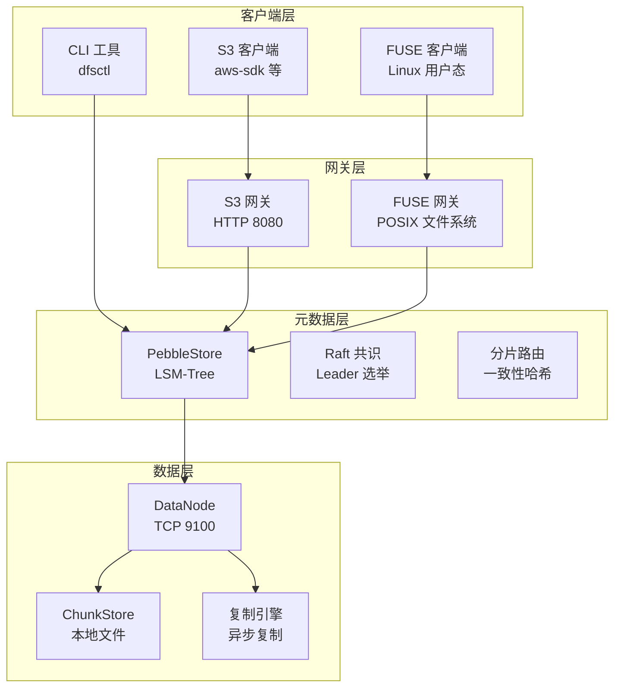
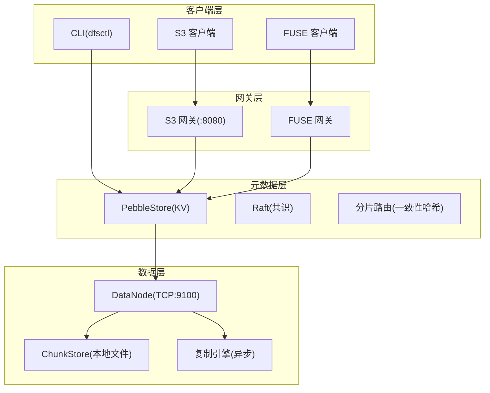
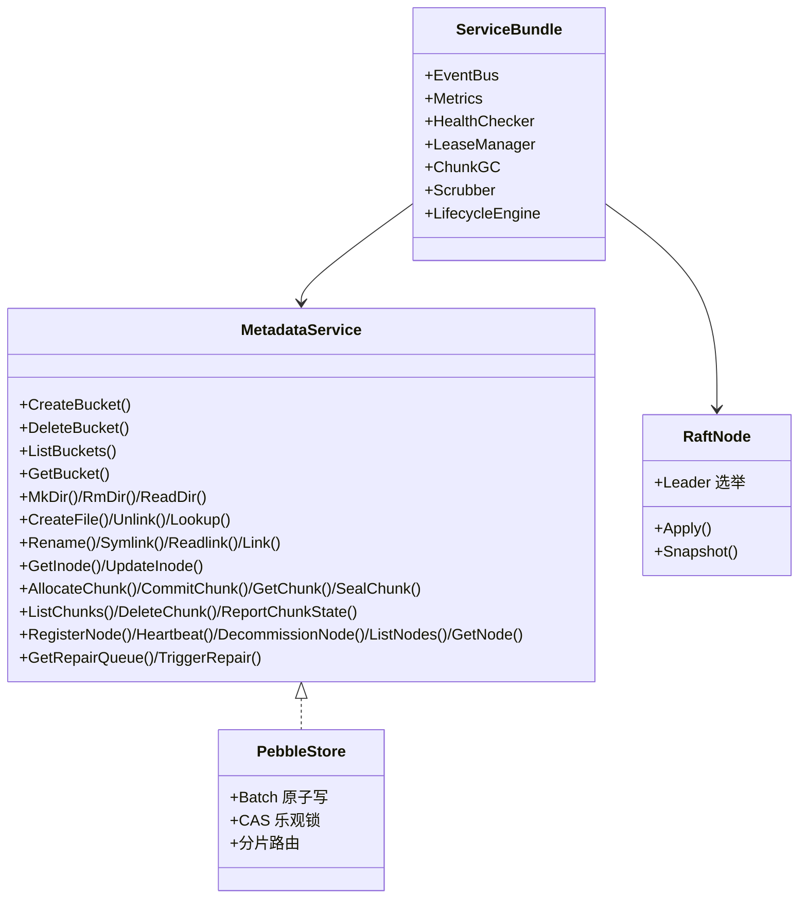
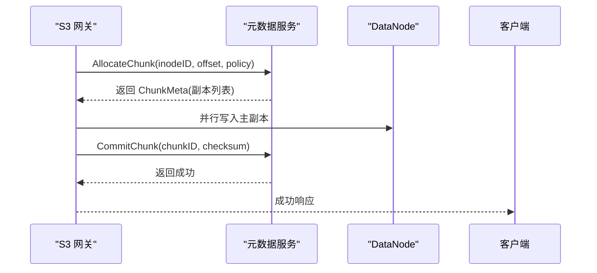
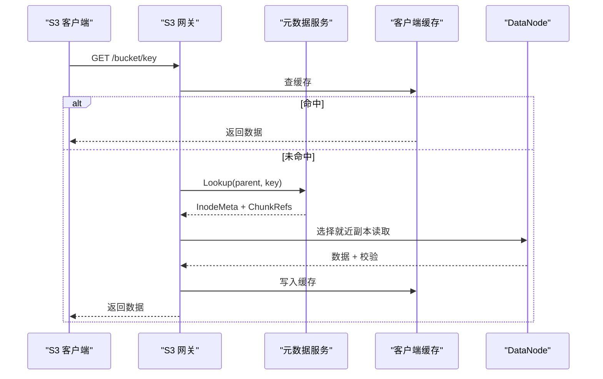
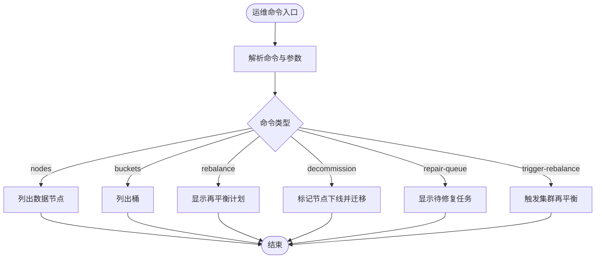
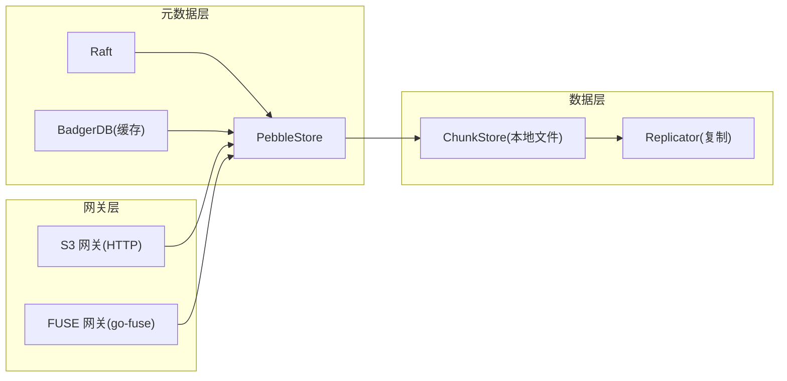

# 项目概述

<cite>
**本文引用的文件**
- [ARCHITECTURE.md](file://nufs-core/ARCHITECTURE.md)
- [go.mod](file://nufs-core/go.mod)
- [cmd/s3gw/main.go](file://nufs-core/cmd/s3gw/main.go)
- [cmd/fusegw/main.go](file://nufs-core/cmd/fusegw/main.go)
- [cmd/metad/main.go](file://nufs-core/cmd/metad/main.go)
- [cmd/datanode/main.go](file://nufs-core/cmd/datanode/main.go)
- [cmd/ctl/main.go](file://nufs-core/cmd/ctl/main.go)
- [gateway/s3/handler.go](file://nufs-core/gateway/s3/handler.go)
- [metadata/service.go](file://nufs-core/metadata/service.go)
- [datanode/server.go](file://nufs-core/datanode/server.go)
- [deploy/config/cluster.yaml](file://nufs-core/deploy/config/cluster.yaml)
- [docker-compose.yml](file://nufs-core/docker-compose.yml)
- [README.md](file://nufs-fuse/README.md)
- [DESIGN.md](file://nufs-fuse/DESIGN.md)
</cite>

## 目录
1. [简介](#简介)
2. [项目结构](#项目结构)
3. [核心组件](#核心组件)
4. [架构总览](#架构总览)
5. [详细组件分析](#详细组件分析)
6. [依赖分析](#依赖分析)
7. [性能考虑](#性能考虑)
8. [故障排查指南](#故障排查指南)
9. [结论](#结论)
10. [附录](#附录)

## 简介
NUFS 是一个面向大规模场景的分布式文件系统，旨在支撑“百亿文件、PB 级存储”规模，提供 S3 API 兼容与 Linux FUSE 挂载双接口，满足高可用（年停机小于 53 分钟，即 99.99%）、低延迟（读 P99 < 10ms，写 P99 < 20ms）等关键目标。系统采用分层架构：客户端层（S3/FUSE/CLI）、网关层（S3/FUSE）、元数据层（PebbleStore + Raft）、数据层（DataNode）。通过一致性哈希分片、多副本与就近读、客户端缓存、小文件合并、纠删码等手段，兼顾性能、扩展性与可靠性。

## 项目结构
仓库由两部分组成：
- nufs-core：核心分布式系统，包含元数据、数据节点、网关、命令行工具与部署配置
- nufs-fuse：FUSE 驱动（历史项目，已冻结），用于将 S3 兼容存储作为本地目录挂载

图表来源
- [ARCHITECTURE.md:37-101](file://nufs-core/ARCHITECTURE.md#L37-L101)
- [cmd/s3gw/main.go:18-52](file://nufs-core/cmd/s3gw/main.go#L18-L52)
- [cmd/fusegw/main.go:17-48](file://nufs-core/cmd/fusegw/main.go#L17-L48)
- [cmd/metad/main.go:44-104](file://nufs-core/cmd/metad/main.go#L44-L104)
- [cmd/datanode/main.go:34-99](file://nufs-core/cmd/datanode/main.go#L34-L99)

章节来源
- [ARCHITECTURE.md:25-116](file://nufs-core/ARCHITECTURE.md#L25-L116)
- [docker-compose.yml:3-124](file://nufs-core/docker-compose.yml#L3-L124)

## 核心组件
- 元数据服务（metadata）
  - 提供统一的 MetadataService 接口，支持 etcd 模式与 Pebble 生产模式
  - 通过 Raft 实现多数派共识与 Leader 选举，结合 Pebble LSM-Tree 实现高吞吐 KV 存储
  - 支持租约管理、孤儿 Chunk GC、静默损坏检测与修复、生命周期管理、跨机房复制等生产特性
- 数据节点（datanode）
  - 提供 TCP 协议的数据读写与复制接口，支持并发读写、心跳上报、本地磁盘管理
  - 内置复制引擎与反熵引擎，保障数据一致性与健康
- 网关层（gateway）
  - S3 网关：实现 S3 兼容 REST API，内置鉴权、中间件链、缓存与错误处理
  - FUSE 网关：基于 go-fuse/v2 提供 POSIX 文件系统挂载，支持目录/文件/符号链接与属性缓存
- 客户端与运维
  - S3/FUSE 客户端与 CLI（dfsctl）用于日常使用与运维管理

章节来源
- [metadata/service.go:15-61](file://nufs-core/metadata/service.go#L15-L61)
- [ARCHITECTURE.md:121-247](file://nufs-core/ARCHITECTURE.md#L121-L247)
- [cmd/s3gw/main.go:30-52](file://nufs-core/cmd/s3gw/main.go#L30-L52)
- [cmd/fusegw/main.go:34-48](file://nufs-core/cmd/fusegw/main.go#L34-L48)
- [cmd/datanode/main.go:51-99](file://nufs-core/cmd/datanode/main.go#L51-L99)

## 架构总览
系统采用四层分层设计，自上而下职责清晰：
- 客户端层：S3 客户端、FUSE 客户端、CLI
- 网关层：S3 网关（HTTP）、FUSE 网关（POSIX）
- 元数据层：PebbleStore + Raft + 分片路由 + 服务子系统（事件总线、指标、健康检查、租约、GC、清洗）
- 数据层：DataNode（TCP）、ChunkStore（本地文件）、复制引擎、磁盘管理、心跳上报

图表来源
- [ARCHITECTURE.md:37-101](file://nufs-core/ARCHITECTURE.md#L37-L101)
- [cmd/s3gw/main.go:18-52](file://nufs-core/cmd/s3gw/main.go#L18-L52)
- [cmd/fusegw/main.go:17-48](file://nufs-core/cmd/fusegw/main.go#L17-L48)
- [cmd/metad/main.go:44-104](file://nufs-core/cmd/metad/main.go#L44-L104)
- [cmd/datanode/main.go:94-122](file://nufs-core/cmd/datanode/main.go#L94-L122)

## 详细组件分析

### 元数据服务（PebbleStore + Raft）
- 双存储引擎
  - etcd 模式：适合开发/测试/迁移，基于 etcd Raft 与 BadgerDB 缓存
  - 生产模式：Pebble LSM-Tree + 内嵌 Raft（hashicorp/raft），支持批量原子写与分片路由
- Raft 共识
  - 日志编码与快照策略，定期触发快照与保留策略，恢复时分批提交以避免 OOM
- 分片路由
  - 基于一致性哈希的 ShardedStore，每物理分片配置多个虚拟节点，变更仅迁移少量键
- 乐观并发控制（MVCC）
  - 通过版本号进行 CAS 更新，冲突时客户端重试
- 租约管理
  - 节点注册获取租约，周期心跳续租；超时标记离线并触发修复
- 清理与修复
  - 孤儿 Chunk GC：两阶段扫描与删除
  - 静默损坏检测：基于校验与状态统计，发布修复事件并进入修复队列

图表来源
- [metadata/service.go:15-61](file://nufs-core/metadata/service.go#L15-L61)
- [metadata/service.go:130-170](file://nufs-core/metadata/service.go#L130-L170)
- [ARCHITECTURE.md:157-247](file://nufs-core/ARCHITECTURE.md#L157-L247)

章节来源
- [metadata/service.go:15-61](file://nufs-core/metadata/service.go#L15-L61)
- [ARCHITECTURE.md:121-247](file://nufs-core/ARCHITECTURE.md#L121-L247)

### 数据节点（DataNode）
- TCP 协议
  - 请求/响应格式：带长度前缀的 JSON 头 + 数据体，支持写/读/删除/复制/信息查询/列表/健康检查
- 复制引擎
  - 多 Worker 并行复制，任务队列缓冲，指数退避重试；修复流程从存活副本读取并写入新目标
- 心跳上报
  - 每 10s 上报磁盘使用、Chunk 数量、IO 利用率与副本状态
- 本地存储与磁盘管理
  - Chunk 文件按 256 个分片目录组织，避免单目录文件过多；支持 BadgerDB 本地缓存

图表来源
- [ARCHITECTURE.md:350-377](file://nufs-core/ARCHITECTURE.md#L350-L377)
- [datanode/server.go:102-126](file://nufs-core/datanode/server.go#L102-L126)

章节来源
- [ARCHITECTURE.md:249-287](file://nufs-core/ARCHITECTURE.md#L249-L287)
- [datanode/server.go:18-126](file://nufs-core/datanode/server.go#L18-L126)

### 网关层（S3/FUSE）
- S3 网关
  - 路由到具体操作：桶级（创建/删除/列举/存在性）、对象级（PUT/GET/DELETE/HEAD）、分段上传（初始化/上传/完成/中止/列举）
  - 中间件链：恢复、请求 ID、CORS、日志、鉴权（AWS V4）
  - 支持匿名模式与凭据配置
- FUSE 网关
  - 基于 go-fuse/v2 提供 POSIX 文件系统，支持目录/文件/符号链接与属性缓存
  - 客户端侧缓存：属性缓存（TTL 5s）、数据缓存（TTL 50s）、写缓冲（异步刷盘）

图表来源
- [ARCHITECTURE.md:385-412](file://nufs-core/ARCHITECTURE.md#L385-L412)
- [gateway/s3/handler.go:70-166](file://nufs-core/gateway/s3/handler.go#L70-L166)
- [cmd/s3gw/main.go:18-52](file://nufs-core/cmd/s3gw/main.go#L18-L52)

章节来源
- [gateway/s3/handler.go:11-68](file://nufs-core/gateway/s3/handler.go#L11-L68)
- [cmd/s3gw/main.go:18-52](file://nufs-core/cmd/s3gw/main.go#L18-L52)
- [cmd/fusegw/main.go:17-48](file://nufs-core/cmd/fusegw/main.go#L17-L48)
- [ARCHITECTURE.md:289-345](file://nufs-core/ARCHITECTURE.md#L289-L345)

### 客户端与运维（CLI）
- dfsctl：集群运维工具，支持节点列表、桶列表、再平衡计划、节点下线、修复队列查看与触发
- 配置与部署：cluster.yaml 定义集群名称、区域、元数据/数据节点、网关、放置策略与维护参数；docker-compose 提供开发/小集群一键部署

图表来源
- [cmd/ctl/main.go:42-63](file://nufs-core/cmd/ctl/main.go#L42-L63)

章节来源
- [cmd/ctl/main.go:17-63](file://nufs-core/cmd/ctl/main.go#L17-L63)
- [deploy/config/cluster.yaml:1-62](file://nufs-core/deploy/config/cluster.yaml#L1-L62)
- [docker-compose.yml:3-124](file://nufs-core/docker-compose.yml#L3-L124)

## 依赖分析
- 技术栈概览（来自架构文档）
  - 元数据-共识：hashicorp/raft
  - 元数据-存储：CockroachDB/Pebble（PebbleStore）
  - 元数据-日志：raft-boltdb
  - 元数据-兼容：etcd/embed + BadgerDB
  - 数据-存储：本地文件系统（ChunkStore）
  - 数据-纠删码：Reed-Solomon (GF256)
  - 网关-S3：net/http
  - 网关-FUSE：hanwen/go-fuse/v2
  - 可观测：内置 Metrics + Health（Prometheus 兼容）

图表来源
- [ARCHITECTURE.md:103-116](file://nufs-core/ARCHITECTURE.md#L103-L116)
- [go.mod:5-11](file://nufs-core/go.mod#L5-L11)

章节来源
- [ARCHITECTURE.md:103-116](file://nufs-core/ARCHITECTURE.md#L103-L116)
- [go.mod:5-11](file://nufs-core/go.mod#L5-L11)

## 性能考虑
- 目标与指标
  - 规模：百亿文件 / PB 级存储
  - 可用性：99.99%（年停机 < 53 分钟）
  - 延迟：读 P99 < 10ms，写 P99 < 20ms
- 关键优化点
  - 客户端缓存：属性缓存（TTL 5s）、数据缓存（TTL 50s）、写缓冲（异步刷盘）
  - 副本就近读：优先选择同机架/同可用区节点
  - 小文件优化：小文件合并存储（SmallFileBlock），显著降低元数据与空间浪费
  - 分片与路由：一致性哈希分片，变更仅迁移少量键
  - 并发与限流：数据节点并发读写信号量控制
  - 纠删码：K+M 编解码（Reed-Solomon GF256）提升存储效率与可靠性

章节来源
- [ARCHITECTURE.md:27-36](file://nufs-core/ARCHITECTURE.md#L27-L36)
- [ARCHITECTURE.md:642-684](file://nufs-core/ARCHITECTURE.md#L642-L684)
- [ARCHITECTURE.md:589-640](file://nufs-core/ARCHITECTURE.md#L589-L640)
- [ARCHITECTURE.md:191-201](file://nufs-core/ARCHITECTURE.md#L191-L201)
- [ARCHITECTURE.md:270-287](file://nufs-core/ARCHITECTURE.md#L270-L287)

## 故障排查指南
- 常见问题定位
  - 元数据不可用：检查元数据服务健康端点与 Raft Leader 状态
  - 数据节点异常：查看心跳上报状态、副本状态与磁盘使用率
  - 写入失败：确认 Chunk 已 Seal、Checksum 校验通过、副本数量满足策略
  - 读取缓慢：检查客户端缓存命中率、就近副本选择与网络路径
- 运维工具
  - dfsctl nodes：查看节点状态（在线/下线/排水中/失败）
  - dfsctl buckets：查看桶与策略
  - dfsctl repair-queue：查看待修复任务
  - dfsctl rebalance：查看再平衡计划
  - dfsctl decommission <node_id>：标记节点下线并触发迁移

章节来源
- [cmd/ctl/main.go:83-120](file://nufs-core/cmd/ctl/main.go#L83-L120)
- [cmd/ctl/main.go:181-201](file://nufs-core/cmd/ctl/main.go#L181-L201)
- [cmd/metad/main.go:152-220](file://nufs-core/cmd/metad/main.go#L152-L220)

## 结论
NUFS 通过清晰的分层架构与多项工程化优化，在保证高可用与强一致性的前提下，实现了面向大规模对象存储的高性能与易用性。S3 API 与 FUSE 双接口满足多样化使用场景，配合完善的运维工具与可观测性，适合从开发环境到生产集群的全场景部署。

## 附录
- 实际使用场景示例
  - 通过 S3 客户端上传/下载对象，利用中间件链与鉴权保障安全
  - 在 Linux 上挂载 FUSE 网关，直接以本地文件方式访问远端桶
  - 使用 dfsctl 进行集群状态巡检、再平衡与节点下线
- 部署参考
  - 单机开发：docker run all-in-one
  - Docker Compose：快速搭建包含元数据、数据节点与网关的小集群
  - Kubernetes：通过 Helm 安装大规模集群

章节来源
- [README.md:1-61](file://nufs-fuse/README.md#L1-L61)
- [DESIGN.md:1-37](file://nufs-fuse/DESIGN.md#L1-L37)
- [docker-compose.yml:769-800](file://nufs-core/docker-compose.yml#L769-L800)
- [deploy/config/cluster.yaml:1-62](file://nufs-core/deploy/config/cluster.yaml#L1-L62)