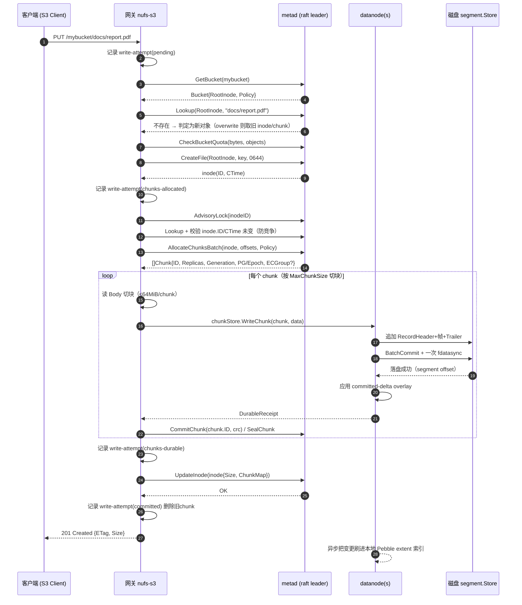

# NUFS 数据组织（Data Organization / On-Disk Layout）

本文档描述 NUFS 的**数据如何落盘与组织**——元数据面（metad 的 Pebble 键空间 + 序列化
格式）与数据面（datanode V2.1 的 segment 引擎）。这是当前引擎的权威描述；更早的
[STORAGE.md](../../STORAGE.md) 描述的是旧路径（JSON 序列化、256-shard chunk 布局、
WAL、小文件 block），**已过时**，以本文为准。

> 相关：数据面运维/故障 drill 见 [datanode/storage/RUNBOOK.md](../../datanode/storage/RUNBOOK.md)；监控指标见
> [monitoring.md](../runbooks/monitoring.md)；KV 查询命令见 [ops-cli.md](../runbooks/ops-cli.md)。

---

## 1. 两个数据面

NUFS 把「元数据」与「数据」严格分离，落盘引擎也完全不同：

| 面 | 组件 | 存储引擎 | 目录（默认） | 一致性 |
|----|------|----------|-------------|--------|
| 元数据 | `metad` | **Pebble**（LSM-tree KV）+ 可选 hashicorp/raft | `--data-dir` 默认 `/var/lib/dfs/metadata`；`--raft-dir` 默认 `/var/lib/dfs/raft` | raft（多副本）/ 单机 |
| 数据 | `datanode` | **V2.1 segment 引擎**（每盘一个 `segment.Store`） | `--dir`（JBOD 多盘） | 多副本 / EC |

- **metad** 把所有命名空间 / inode / chunk / 配额 / 备份 / 审计等元数据写进一个
  Pebble 数据库，值用 msgpack（热路径）或 JSON（冷路径 / 管理）序列化。
- **datanode** 把对象数据以「记录（record）」追加进每个磁盘上的固定大小 **segment**
  文件，每盘一个 Pebble 后端 **extent 索引**定位「extent → segment/offset」。

---

## 2. 元数据面：Pebble 键空间与序列化

### 2.1 键空间（`metadata/keys.go`）

所有键以**前缀**划分命名空间，前缀即隔离单元（`nufs-cli kv scan` 的白名单也来自这里）：

| 前缀 | 内容 |
|------|------|
| `/bucket/` | 桶定义（→ `Bucket`） |
| `/bucket-by-root/` | rootInode → 桶名（反向索引） |
| `/bucket-stats/` | 桶统计 |
| `/ns/` | 命名空间 / 目录树占位 |
| `/inode/` | inode 元数据（`InodeMeta`，含文件/目录属性与 chunk 引用） |
| `/chunk/` | chunk 元数据（`ChunkMeta`，含副本/EC/PG/世代） |
| `/extent-page/`、`/extent-meta/` | 大文件 extent 页索引（Layout=ExtentPages 时使用） |
| `/placement-group/`、`/pg-rebalance/` | 放置组（PG）与再平衡 |
| `/logical-partition/`、`/directory-map/`、`/cross-shard-txn/` | 分区 / 目录 / 跨分片事务 |
| `/gc-bucket/`、`chunk-tombstone/` | GC 队列 / chunk 墓碑 |
| `/node/`、`/policy/`、`/repair/` | 节点 / 策略 / 修复 |
| `/audit/`、`/acl/` | 审计 / ACL |
| `/quota/`、`/quota-usage/` | 桶配额限制与用量 |
| `/freelist/` | 回收的 inode ID |
| `/write-attempt/`、`/write-attempt-state/` | 对象写恢复（两段式提交） |
| `/background-task/`、`/background-task-queue/` | 后台任务（GC/恢复 worker） |
| `backup/task/`、`backup/catalog/`（+ `backup/catalog-state`） | 备份任务与目录 |
| `system/cluster-id`、`system/inode-reference-epoch`、`system/restore-pending` | 系统级元数据 |

### 2.2 值序列化：msgpack + JSON 自动识别（`metadata/codec.go`）

- **新写入默认 msgpack**（热路径，更小更快）；
- **读取自动识别**：首字节是 `{`（0x7B）或 `[`（0x5B）→ 按 JSON 解，否则按 msgpack。
  这保证老数据（JSON）与新数据（msgpack）共存在同一 Pebble 库中依然可读。

### 2.3 关键结构体（`metadata/types.go`）

**InodeMeta**（`/inode/<id>` 的值）：inode 类型（文件/目录/符号链接等）、大小、
nlink、所属桶 root、UID/GID/权限位、ctime/mtime/atime、有序 **ChunkMap**（`ChunkRef`）、
符号链接目标、以及扩展属性 `XAttrs`。

**ChunkRef**（inode 内的 chunk 引用）：`{ID, Offset, Length, Version}`——

| 字段 | 含义 |
|------|------|
| `ID` | ChunkID |
| `Offset` | 该 chunk 在文件内的字节偏移 |
| `Length` | 实际数据长度 |
| `Version` | MVCC 版本（read-your-writes） |

**ChunkMeta**（`/chunk/<id>` 的值）：chunk 大小（≤64MiB）、状态、有序副本
**Replicas**（primary/secondary…）、可选 **ECGroup**、存储 tier、CRC32C、以及
（Metadata V2 路径）**PGID/Epoch/Generation** 与 **ECStripeID**。Generation 由
元数据服务统一签发（写代际时钟，跨副本一致地 fence 过期/重复写）。

**DirEntry**：`{InodeID, Type, Name}`——readdir 的目录条目。

> 文件布局分三种（`Layout` 枚举）：`Empty`、`InlineExtent`（单 extent，内联）、
> `ExtentPages`（大文件页索引）。小文件/内联 extent 见 §3.4。

---

## 3. 数据面：V2.1 segment 引擎

每个磁盘由一个 `segment.Store` 驱动（`--dir`，JBOD 多盘每个盘一个）。每盘目录结构：

```
<disk-dir>/
├── segments/
│   ├── small/      active/<id>.seg     # 小文件流（StreamID 0）
│   ├── data/       active/<id>.seg     # 数据流（StreamID 1）
│   └── ecshard/    active/<id>.seg     # EC 分片流（StreamID 2）
├── index/                               # extent 位置索引（Pebble）
└── index-ecshard/                       # EC 分片流的索引（Pebble）
```

> **流 → 目录**映射（`streamClassDir`）：stream 0 → `small`，2 → `ecshard`，其余 → `data`。
> 各流的 segment 与索引**物理隔离**，EC 分片 extent 与数据流 extent 永不冲突。
> 节点级「变更日志（change journal）」是异步的（默认 `change-<generation>.log`），
> 记录本盘/节点的增量变更供后续 heartbeat/对账重传。

### 3.1 Segment 文件布局

每个 segment 是一个**追加写、固定上限**的文件，结构：

```
SegmentHeader   # 固定头，创建时写入，不可变（22 字节）
Record ...      # 记录头 + 帧索引 + 帧 + 记录尾（密封写）
SegmentFooter   # 固定尾，seal 时写入一次（65 字节）
```

**SegmentHeader（22B）**：`Magic(4)="SEGD" + Version(1) + ID(8) + Class(1) + Reserved(4) + HeaderCRC(4=CRC32C(前18))`

**Record**（一条可变长度记录 = 一次数据写入/删除/重定位）：

```
RecordHeader    # 固定头（55 字节）
FrameIndex      # 帧索引（条目数 = frame_count，每个条目 13B：offset+stored_len+codec+crc）
Frame 0..N      # 数据帧（每帧 payload 默认 64KiB，帧内 CRC32C + 可选 AEAD）
RecordTrailer   # 记录尾（12B：FramingLen + CRC + Reserved）
```

**RecordHeader（55B）** 关键字段：`Magic(4) + Version(1) + Op(1) + ExtentID(8) +
Generation(8) + LogicalLen(4) + StoredLen(4) + Codec(1) + KeyID(8) + FrameSize(2) +
FrameCount(2) + PayloadChecksum(4) + HeaderCRC(4) + FrameIndexCRC(4)`。

**RecordOp**（`Op`）：`RecordPut(1)` / `RecordDelete(2)` / `RecordRelocate(3)`。

**RecordTrailer（12B）**：`FramingLen(4) + TrailerCRC(4) + Reserved(4)`——携带帧总长，
读取端可据以识别截断并跳过记录。

**SegmentFooter（65B）**：`Magic + Version + RecordCount + TotalPayload + MinExtentID +
MaxExtentID + LastCommittedSeq + CreatedAtUnix + SealedAtUnix + SegmentCRC(4)`。
`LastCommittedSeq` 是本 segment 内最后提交的流序列号——恢复时据此精确知道哪些记录
已落地。Footer 的存在区分「已 seal」与「active」。

### 3.2 大小与分档

| 常量 | 值 | 含义 |
|------|----|----|
| `SmallFileThreshold` | 64 KiB | ≤ 此大小的逻辑文件作为**单条记录**落入 small segment |
| `MaxExtentSize` / `MaxInlineExtent` | 16 MiB | 单个 extent / 内联 extent 上限 |
| `DefaultSmallSegmentSize` | 1 GiB | small segment 密封上限 |
| `DefaultDataSegmentSize` | 4 GiB | data segment 密封上限 |
| `DefaultFrameSize` | 64 KiB | 帧 payload 大小 |
| `CompressionNoCompressionThreshold` | 4 KiB | 小于此不压缩 |
| `CompressionMinSavingsRatio` | 0.10 | 采样 zstd 仅在省 ≥10% 时启用 |

压缩码子：`CompressionNone(0)` / `CompressionZstd(1)`。加密通过 `KeyID`（0=明文）与
每个存储配置的密钥注册表（`encryption.KeyRegistry`）挂接，帧级 AEAD。

### 3.3 持久化与恢复模型（V2.1 §6）

写入一个「提交组」的流程图（`segment/store.go` header 注释）：

1. 在 active segment 预留偏移；
2. 追加 记录头 + 帧索引 + 帧 + 记录尾；
3. 为整组追加一个 `BatchCommit`；
4. 对 segment 做**一次** `fdatasync`（每组通常共享同一次 fsync 屏障）；
5. 把已提交位置应用到有界的内存 delta overlay；
6. 为组内每个请求返回 `DurableReceipt`（**提交点在 BatchCommit，不是 Pebble**）；
7. **异步**把变更应用到 Pebble 索引。

> **关键语义**：Pebble 只是**派生索引**，可能滞后于已提交序列但**永不超前**。崩溃恢复
> 重放已提交的 segment 记录；若发现 Pebble 条目超出最后已提交序列，则视为无效并回滚
> （`INDEX_SAFE` 检查点 + 侧载偏移）。这就是「已确认写入在进程崩溃后不丢失、
> 未确认写入绝不表现为成功」的保证来源。

### 3.4 extent ↔ 对象映射

- 每个 datanode 磁盘以 **extent**（16MiB 上限，`ExtentID+Generation` 标识）存数据；
- 一个对象的**大 chunk**（>64KiB）按 16MiB extent 切多个 extent（末 extent 可更小）；
- **小文件**（≤64KiB）作为一条记录整体进入 small segment，也可能以**内联 extent**
  （`MaxInlineExtent` 16MiB）存在元数据侧的 `InlineExtent` 页中；
- **EC 分片**：每个 EC shard 是 `ecshard` 类目录下、独立 class 的专用 extent；
- 索引把 `(extent_id, generation) → (segment, offset)` 记录下来；compact/seal 后索引经
  RELOCATE 原子更新。

extent 状态机（`ExtentState`）：`Durable`（常态）→ `Tombstoned`（世代被 fence 的删除，
物理字节待回收）→ `Corrupt`（索引指向坏数据，segment 隔离）→ `Relocating`（压缩中）。

### 3.5 压缩 / 回收（compaction）

- segment 达到容量或主动 `force-seal` 后 seal：写 Footer、记 manifest；
- **compaction worker** 从 sealed segment 拷贝存活记录到 active、追加 RELOCATE 记录并
  原子更新索引（`StoreSink.Relocate`），从而**回收已删除/被覆盖的 dead bytes**；
- 阈值防线（磁盘水位）：15% 剩余优先回收、10% 拒绝普通写、5% 强制只读
  （见 `datanode/storage/RUNBOOK.md` §3.5）。

---

## 4. 一个文件从上传到落盘（核心写入流程）

**渲染版总览**（含下面的顺序图 + 落盘字节级流程图，静态图见
[write-flow.png](write-flow.png)）：


> 想看可交互的 Mermaid 动态版，浏览器打开 [write-flow.html](write-flow.html)。下方是嵌入
> 本页的 mermaid 源码（GitHub / VS Code Markdown 预览可直接渲染）。

下面以一个 **PUT 对象**（如 `PUT /mybucket/docs/report.pdf`，大小 > 64KiB 走常规 extent
路径）为例，画出完整链路。代码实现在网关侧
`gateway/s3/committer_put.go`（`metadataObjectCommitter.Put`）与数据面
`chunkstore/store.go`（`WriteChunk`）、`datanode/storage/segment/store.go`（Store 提交）。



**分阶段职责（与 §2/§3 对应）：**

| 阶段 | 做什么 | 落盘 / 持久化点 |
|------|--------|----------------|
| ① 鉴权+配额 | 网关校验桶、配额、建 inode | 元数据（Pebble `CreateFile`） |
| ② 分配 | metad 为每个 chunk 定 replicas（+Generation/PG/EC shards） | 元数据 ChunkMeta（副本集合） |
| ③ 数据传输 | 网关把数据 fan-out 到 datanode（复制用 WritePipeline，EC 用直接分片） | 网关→数据面 TCP |
| ④ 数据落盘 | datanode 追加 segment 记录 + group commit **一次 fdatasync** | **segment 文件（提交点在 BatchCommit）** |
| ⑤ 元数据确认 | 网关 `CommitChunk`/`SealChunk` + `UpdateInode`（Size/ChunkMap） | 元数据（Pebble）；chunk 才可读 |
| ⑥ 异步索引 | datanode 把 segment 变更异步刷进本地 Pebble extent 索引 | 数据面 `index` |
| ⑦ 后台恢复兜底 | `write-attempt` 状态机 + 恢复 worker 处理「写分叉/崩溃」 | 元数据 write-attempt 前缀 |

**关键语义（为什么这样设计）：**

- **提交点分层**：数据面先落 segment（fdatasync），元数据面后提交 inode。**对象「可读」以
  `UpdateInode` 成功为准**；若在此之前崩溃，`write-attempt` 会标记 pending/recovery，
  恢复 worker 收敛，绝不把未确认写入当成功（§3.3 的生成 fencing + INDEX_SAFE 保证）。
- **overwrite / multipart 等价**：同一条 `metadataObjectCommitter.Put` 支持覆盖写；
  `write-attempt` 记录 `InodeCTime` 做身份校验，防止锁竞争期间的 inode 漂移。
- **EC 桶**：`WriteChunk` 内按 `ChunkMeta.ECGroup` 路由，直接 K+M 编码、逐分片推到
  各自的 `ecshard` 目录 store（第 2 步 RecordDirect 即已携带 checksum）。
- **异步索引**：Pebble 派生索引永不超前于已提交序列（§3.3），崩溃恢复据此回滚越界条目。

---

## 5. 运维/排障对照

| 想做什么 | 入口 |
|----------|------|
| 直接读某条 KV / 扫某前缀 | `nufs-cli kv get` / `kv scan`（本地直连 Pebble 或远程鉴权） |
| 看文件/目录元数据 | `nufs-cli stat` / `ns` |
| 看某 inode 的 chunk 落盘 | `nufs-cli chunks --inode <id>` |
| 看 datanode 磁盘布局 / 磁盘状态 | `nufs-cli disk`、监控 `nufs_disk_*` |
| segment 级排障 / 强制 seal / 重建索引 | `datanode/storage/RUNBOOK.md`（`inspect-segment`、`force-seal`、`rebuild-index --offline`）[见 runbook](../../datanode/storage/RUNBOOK.md) |

> 序列化细节（字节偏移）以源码为准：segment `record.go` / `segment.go`、元数据
> `codec.go` / `types.go`。本文只做运维可读的抽象描述。
